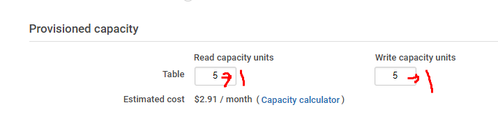
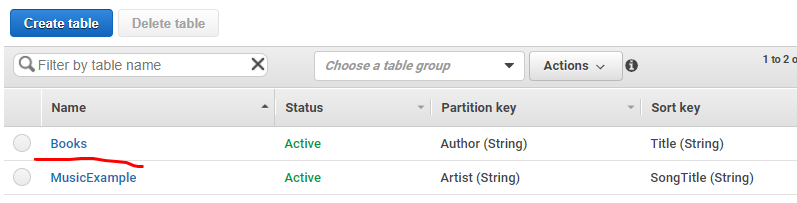
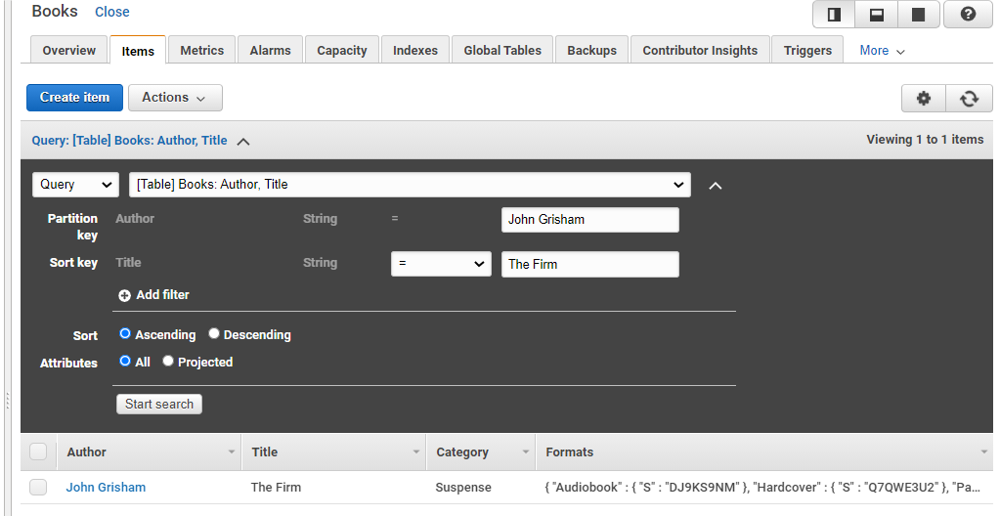
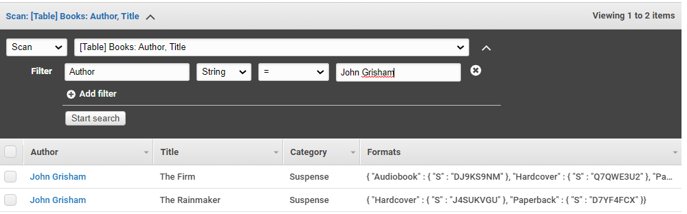

# Managing DNS Records with AWS Route 53

- Record Set Group
  - hosted zone 에서 변경하려는 이름과 ID를 포함하고 사용자가 레코드에서 만드려는 값을 선택 사항으로 가지고 있는 복합적인 타입
  - JSON이나 YAML 문법을 사용한다


연결은 됐는데 페이지가 동작하지 않는다!

=> 서비스가 되지 않는다는 것

로드밸런스 상에서 돌고 있는 인스턴스의 상태 확인

**DynamoDB** 

> 완벽하게 관리되는 NoSQL 데이터베이스 서비스

- 일정 성능을 보장받음

대기시간 보장

운영 상의 오버헤드가 전혀 발생하지 않고 완벽하게 관리된다

운영에 들어갈 인력들을 서비스 개발 인력으로 돌릴 수 있다

- 배포 단순/신속
- 확장 단순/신속
- 데이터를 자동으로 백업
- 빠르고 일관된 응답 시간을 제공
- 보조 인덱스를 통한 빠른 조회 가능
- 사용한만큼 (온디멘드)  요금 지불 => 비용 절감


#### 핵심 구성요소

	- table
	- items (항목)
	- attributes (속성)


#### Person 테이블

- person id/address 라는 속성들로 구성되어 있다
- 테이블에 저장되는 항목의 수는 제한이 없다
- personID가 102인 
- 항목은 속성의 집합
- 기본키를 제외하고는 스키마가 없다
- 대부분의 속성은 스칼라로 문자열 또는 숫자 같이 하나의 값만 가질 수 있으며, address처럼 내포 속성을 가질 수 있음
- Primary 키를 제외하고는 같을 필요 없다
  - Primary key는 반드시 같아야 함!

#### 기본키(Primary Key)

- 테이블의 각 항목을 나타내는 고유한 식별자

  - 고유한 식별자 : 동일한 키를 가질 수 없음

- 단순 기본키

  - 파티션 키 하나로 구성되어있음

- 복합 기본 키

  - 키가 두 개로 구성되어 있는 것
  - 파티션 키와 정렬 키로 구성
  - 일치 뿐만 아니라 부등호, 포함 등의 범위를 지정한 검색 지원

  


두개의 파티션 키 (Artist)가 동일-> Song Title이라는 새로운 정렬키를 추가하여 분류 가능하도록 만든다


##### 보조 인덱스

- 테이블에서는 하나 이상의 보조 인덱스를 생성할 수 있음
- 보조 인덱스를 사용하면 기본 키에 대한 쿼리 외에 대체 키를 사용해서 테이블의 데이터를 쿼리할 수 있음
- DynamoDB에서는 각 테이블에 20개의 Global Secondary Index와 5개의 Local Secondary Index를 제공

##### Global Secondary Index

- 파티션 키 및 정렬 키가 테이블의 파티션 키 및 정렬 키와 다를 수 있는 인덱스

##### Local Secondary Index

- 테이블과 파티션 키는 동일하지만 정렬 키는 다른 인덱스


- Dynamo DB 테이블 생성중

  ​	create_table.py

```python
import boto3 

# boto3 is the AWS SDK library for Python.
# We can use the low-level client to make API calls to DynamoDB.
client = boto3.client('dynamodb', region_name='us-east-1') 

try:
    resp = client.create_table( 
        TableName="Books", <= table
        # Declare your Primary Key in the KeySchema argument
        KeySchema=[
            {
                "AttributeName": "Author",
                "KeyType": "HASH"
            },
            {
                "AttributeName": "Title",
                "KeyType": "RANGE"
            }
        ],
        # Any attributes used in KeySchema or Indexes must be declared in AttributeDefinitions
        AttributeDefinitions=[
            {
                "AttributeName": "Author",
                "AttributeType": "S"
            },
            {
                "AttributeName": "Title",
                "AttributeType": "S"
            }
        ],
        # ProvisionedThroughput controls the amount of data you can read or write to DynamoDB per second.
        # You can control read and write capacity independently.
        ProvisionedThroughput={
            "ReadCapacityUnits": 1,
            "WriteCapacityUnits": 1
        }
    )
    print("Table created successfully!")
except Exception as e:
    print("Error creating table:")
    print(e)


```

- boto3.client 에서 dynamodb 접근하도록 함
- table 생성
  - table 이름은 Books
- Primary Key
  - author 라는 attribute의 속성은 HASH(파티션 키)
  - Title을 RANGE 라는 search key로 만든다
- Attribute
  - Author/Title 모두 문자열이라고 선언
- Provisioning
  - 


			- a cloud guru 에서 바꾼 것 처럼 여기서도 1로 바꿔준것
			- CreateTable을 통해 Books라는 테이블을 만들어준다

```
PS C:\Users\MIN\Desktop\multi_work\dynamodb> python .\create_table.py
Table created successfully!
```

생성된 테이블은

```
PS C:\Users\MIN\Desktop\multi_work\dynamodb> aws dynamodb list-tables
```

해당 커맨드를 통해 확인 가능

```
{
    "TableNames": [
        "Books",
        "MusicExample"
    ]
}
```

"Books"

AWS 창에서도 확인 가능



**Books 테이블에 항목을 로드**

```python

import boto3

# boto3 is the AWS SDK library for Python.
# The "resources" interface allow for a higher-level abstraction than the low-level client interface.
# More details here: http://boto3.readthedocs.io/en/latest/guide/resources.html
dynamodb = boto3.resource('dynamodb', region_name='us-east-1')
table = dynamodb.Table('Books')


# The BatchWriteItem API allows us to write multiple items to a table in one request.
with table.batch_writer() as batch:
    batch.put_item(Item={"Author": "John Grisham", "Title": "The Rainmaker",
        "Category": "Suspense", "Formats": { "Hardcover": "J4SUKVGU", "Paperback": "D7YF4FCX" } })
    batch.put_item(Item={"Author": "John Grisham", "Title": "The Firm",
        "Category": "Suspense", "Formats": { "Hardcover": "Q7QWE3U2",
        "Paperback": "ZVZAYY4F", "Audiobook": "DJ9KS9NM" } })
    batch.put_item(Item={"Author": "James Patterson", "Title": "Along Came a Spider",
        "Category": "Suspense", "Formats": { "Hardcover": "C9NR6RJ7",
        "Paperback": "37JVGDZG", "Audiobook": "6348WX3U" } })
    batch.put_item(Item={"Author": "Dr. Seuss", "Title": "Green Eggs and Ham",
        "Category": "Children", "Formats": { "Hardcover": "GVJZQ7JK",
        "Paperback": "A4TFUR98", "Audiobook": "XWMGHW96" } })
    batch.put_item(Item={"Author": "William Shakespeare", "Title": "Hamlet",
        "Category": "Drama", "Formats": { "Hardcover": "GVJZQ7JK",
        "Paperback": "A4TFUR98", "Audiobook": "XWMGHW96" } })

```

- 테이블 지정
- ```batch_writer()```
  - 여러 개의 항목들을 집어넣을 수 있음
  - ```put_item``` 을 이용해서 하나씩 집어넣고 있다


마찬가지로

```
python .\ < 파일명 >
```

으로 실행


**Books 테이블에 항목 검색**

```get_item.py```

```python
import boto3

# boto3 is the AWS SDK library for Python.
# The "resources" interface allow for a higher-level abstraction than the low-level client interface.
# More details here: http://boto3.readthedocs.io/en/latest/guide/resources.html
dynamodb = boto3.resource('dynamodb', region_name='us-east-1')
table = dynamodb.Table('Books')

# When making a GetItem call, we specify the Primary Key attributes defined on our table for the desired item.
resp = table.get_item(Key={"Author": "John Grisham", "Title": "The Rainmaker"})

print(resp['Item'])

```

- 테이블을 정하고 get_item()을 통해 아이템을 찾는다
  - Key
    - Author=Partition Key로 일치해야 된다
    - "Author": "John Grisham", "Title": "The Rainmaker" 인 데이터를 찾아라!


```
PS C:\Users\MIN\Desktop\multi_work\dynamodb> python .\get_item.py
```

```
{'Title': 'The Rainmaker', 'Formats': {'Hardcover': 'J4SUKVGU', 'Paperback': 'D7YF4FCX'}, 'Author': 'John Grisham', 'Category': 'Suspense'}
```


결과값 따란~



사용자가 입력한 값을 조회하도록 할 수 있다

실제 AWS 페이지에서도 똑같이 가넝


**하나의 쿼리로 여러 항목 검색**

```query_items.py```


```python
import boto3
from boto3.dynamodb.conditions import Key

# boto3 is the AWS SDK library for Python.
# The "resources" interface allows for a higher-level abstraction than the low-level client interface.
# For more details, go to http://boto3.readthedocs.io/en/latest/guide/resources.html
dynamodb = boto3.resource('dynamodb', region_name='us-east-1')
table = dynamodb.Table('Books')

# When making a Query API call, we use the KeyConditionExpression parameter to specify the hash key on which we want to query.
# We're using the Key object from the Boto3 library to specify that we want the attribute name ("Author")
# to equal "John Grisham" by using the ".eq()" method.
resp = table.query(KeyConditionExpression=Key('Author').eq('John Grisham'))

print("The query returned the following items:")
for item in resp['Items']:
    print(item)

```

- table.query()
  - 해당 함수의 KeyConditionExpression을 사용중
  - 조건을 기술해주는 것과 같다
  - 키의 값이 John Grisham인 것을 가져올것
    - 루프를 돌면서 찾아볼것




이 작업과 같은것

```
PS C:\Users\MIN\Desktop\multi_work\dynamodb> python .\query_items.py
```

```
The query returned the following items:
{'Title': 'The Firm', 'Formats': {'Hardcover': 'Q7QWE3U2', 'Paperback': 'ZVZAYY4F', 'Audiobook': 'DJ9KS9NM'}, 'Author': 'John Grisham', 'Category': 'Suspense'}
{'Title': 'The Rainmaker', 'Formats': {'Hardcover': 'J4SUKVGU', 'Paperback': 'D7YF4FCX'}, 'Author': 'John Grisham', 'Category': 'Suspense'}
```


-------------

### 해쉬 키

- Message Digester

- 임의 크기의 입력을 받아서 고정크기의 **유일한** 출력을 만든다

  - 유일: 입력이 다르면 출력이 달라진다

  - A와 B가 같지 않을 때 해쉬ㅣ값 a와b는 일치하지 않는다

  - 크기가 아무리 크거나 작아도 해쉬함수를 통과하면 일정한 크기를 만들어낸다

  - 유일한 특징으로 인해 분류 가능

  - 키가 유니크하다는 것 보장 가능

    


### 파티션 테이블

> 하나의 큰 테이블을 물리적으로 나눠놓은 것

- 물리적으로 나눠놓았지만 논리적으로는 하나의 테이블로 간주
- 파티션 키
  - 파티션을 나눌 때 기준이 되는 키컬럼
  - 분류하는 기준키


### Bastion Host

> 내부 네트워크와 외부 네트워크 사이의 게이트웨이

- 내부 네트워크에 직접 접속하는 것을 방지하기 위해 내부 네트워크의 앞단에 위치하여 보안을 더 강화할 수 있는 역할