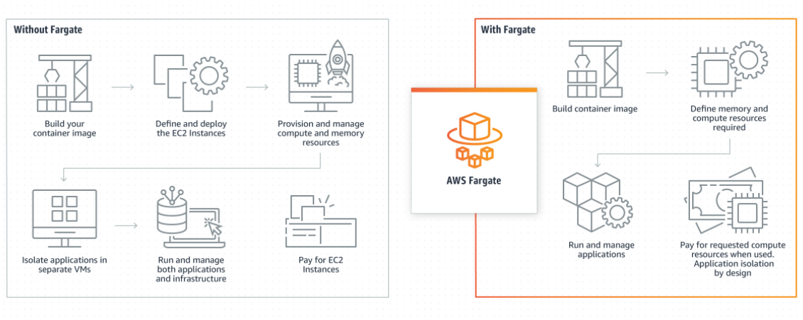

# AWS Fargate

> 서버를 관리하지 않고도 **애플리케이션 구축에 초점을 맞출 수 있도록 지원하는 종량제 서버리스 컴퓨팅 엔진**

- 인프라가 아닌 애플리케이션 배포 및 관리 Fargate는 서버 크기 조정, 패치, 보안 및 관리의 운영 부담을 없애줌
- Amazon CloudWatch Container Insights와 같은 AWS 서비스와의 기본 제공 통합을 통해 **애플리케이션을 모니터링**
- **서드 파티 도구로 지표 및 로그를 수집**
- 설계에 따라 워크로드 격리를 통해 보안을 개선
- Amazon ECS 태스크 및 Amazon EKS 포드는 전용 런타임 환경에서 실행됨
- 요금은 사용한 만큼만 지불
- Fargate는 **지정된 리소스 요구 사항에 가장 근접하도록 컴퓨팅 크기를 조정**
- Fargate를 사용하면 추가 서버를 사용하기 위해 **과도하게 프로비저닝하거나 관련 비용을 지불하지 않아도 됨**
- AWS Fargate**는 [Amazon Elastic Container Service](https://aws.amazon.com/ko/ecs/?pg=ln&sec=hiw)(ECS) 및 [Amazon Elastic Kubernetes Service](https://aws.amazon.com/ko/eks/?pg=ln&sec=hiw)(EKS) 모두와 호환됨**
- **서버리스 서비스인 AWS 람다와 EC2 기반의 ECS 컨테이너의 중간 쯤에 위치한 서비스**
- 도커 컨테이너를 EC2 인스턴스 없이 독립적으로 실행

## 사용 사례

- 컨테이너의 속도 및 불변성을 바탕으로 애**플리케이션, API 및 마이크로서비스 아키텍처를 구축 및 배포**
- Amazon ECS 또는 Amazon EKS와 함께 Fargate를 사용하여 **컨테이너식 데이터 처리 워크로드를 손쉽게 실행 및 크기 조정**
- 유연하고 이식 가능한 AI 및 기계 학습 개발 환경을 구축
- AWS Fargate를 사용하면 선결제 비용이 없으며 **사용한 리소스에 대해서만 비용을 지불**

### Amazon Container

- 컨테이너를 위한 서버리스 컴퓨팅으로 AWS Fargate를 선택하면 **AWS가 인프라 프로비저닝을 관리**
- AWS 컨테이너 서비스는 25개 리전에 걸쳐 있는 80개 이상의 가용 영역(AZ)을 갖춘 방대한 글로벌 인프라에서 실행
- **AWS Copilot 또는 AWS App Runner로 빠르게 시작**하여 운영 오버헤드 및 관리 부담을 줄일 수 있음