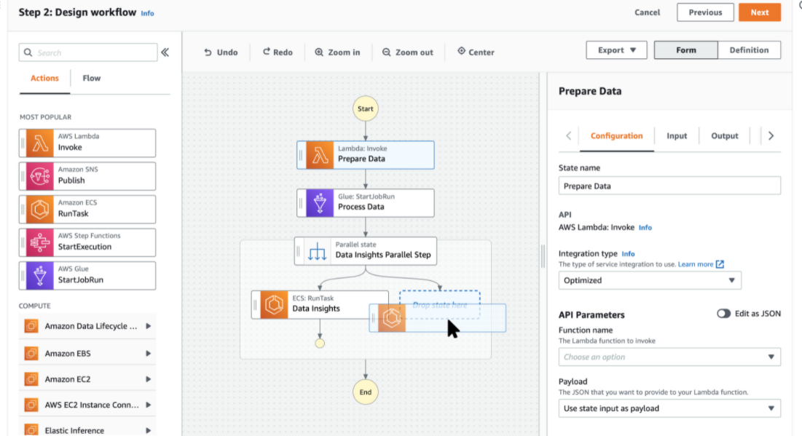

# AWS StepFunctions

> 현대적 애플리케이션을 위한 비주얼 워크플로

- 개발자가 AWS 서비스를 사용하여 **분산 애플리케이션을 구축**하고, **IT 및 비즈니스 프로세스를 자동화**하며, **데이터 및 기계 학습 파이프라인을 구축할 수 있도록 지원**하는 시각적 로우 코드 워크플로 서비스
- 워크플로는 **실패, 재시도, 병렬화, 서비스 통합 및 관찰 가능성을 관리**해 개발자가 고부가가치 비즈니스 로직에 집중하도록 함

## 이점

- 간단한 끌어서 놓기 인터페이스인 [Workflow Studio](https://docs.aws.amazon.com/step-functions/latest/dg/tutorial-workflow-studio-using.html)로 빠르게 시작
- Lambda, ECS, Fargate, Batch, DynamoDB, SNS, SQS, SageMaker, EventBridge 또는 EMR을 포함한 200여 개 서비스의 [AWS 리소스](https://docs.aws.amazon.com/step-functions/latest/dg/concepts-service-integrations.html)를 탄력적인 비즈니스 워크플로, 데이터 파이프라인 또는 애플리케이션으로 구성
- Step Functions는 [상태](https://docs.aws.amazon.com/step-functions/latest/dg/concepts-states.html), 체크포인트 및 재시작을 관리하여 워크플로가 순서에 맞게 예상대로 실행되도록 보장
- Step Functions는 특정 [사용 사례에 따라 사용할 수 있는 두 가지 워크플로 유형(](https://docs.aws.amazon.com/step-functions/latest/dg/use-cases.html)[스탠더드 또는 익스프레스](https://docs.aws.amazon.com/step-functions/latest/dg/concepts-standard-vs-express.html))을 제공

## 사용 사례

- 작업들을 수동으로 조율하거나 별도의 애플리케이션을 유지하는 대신에 장기적으로 진행되는 여러 [ETL 작업들](https://aws.amazon.com/step-functions/use-cases/#Data_Processing_and_ETL_Orchestration)을 순서대로 실행하여 **성공적으로 완료되도록 보장**
- 기계 학습 파이프라인을 자동화하는 데 필요한 단계의 순서를 쉽게 구성
- 여러 AWS Lambda 함수를 응답성이 뛰어난 서버리스 애플리케이션 및 마이크로서비스로 결합
- **Liberty Mutual**은 각 비즈니스 라인의 **데이터 피드가 일련의 이벤트 또는 금융 트랜잭션으로 전환**되는 Step Functions를 사용하여 이벤트 기반 워크플로를 만듬
- 워크플로 로직, 병렬 프로세스, 오류 처리, 제한 시간 또는 재시도를 위한 코드를 작성하지 않고도 **여러 AWS Lambda 함수를 응답성이 뛰어난 서버리스 애플리케이션 및 마이크로서비스로 결합**
- **여러 시스템 간의 데이터 흐름을 조율**하여 수동 계정 삭제 작업에서 기술 팀의 작업 시간을 주 4시간 절약

