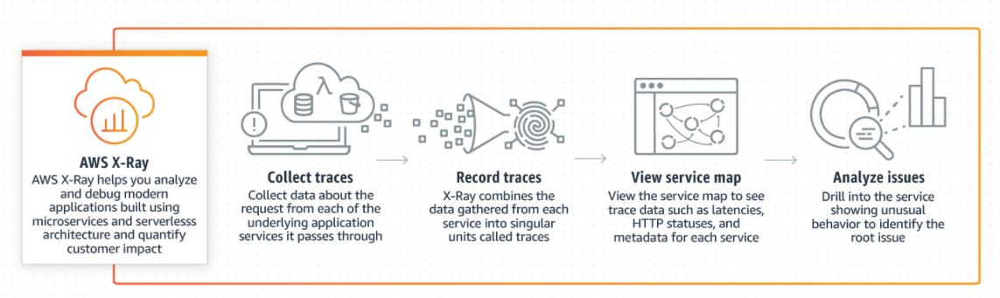
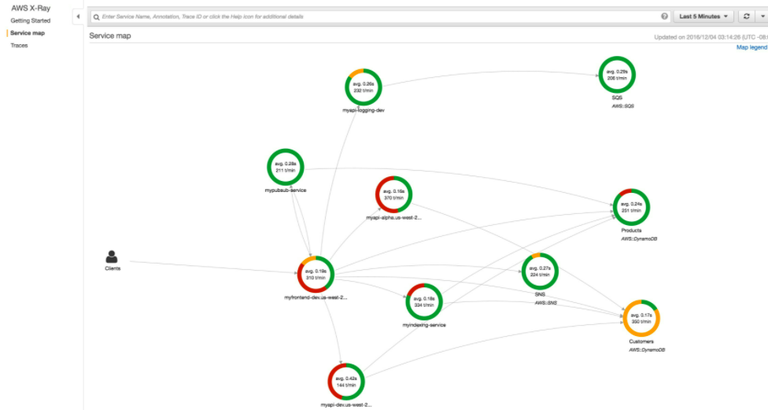

# AWS X-Ray

> 프로덕션 분산 애플리케이션의 분석 및 디버깅 툴로, 개발자가 **엔드 투 엔드 추적 기능을 통해 프로덕션 분산 애플리케이션의 동작을 손쉽게 분석**할 수 있습니다

-  [Amazon Elastic Compute Cloud](https://aws.amazon.com/ko/ec2/)(EC2), [Amazon EC2 Container Service](https://aws.amazon.com/ko/ecs/)(ECS), [AWS Lambda](https://aws.amazon.com/ko/lambda/), [AWS Elastic Beanstalk](https://aws.amazon.com/ko/elasticbeanstalk/)에서 실행되는 애플리케이션에서 사용
- 개발자가 마이크로 서비스 아키텍처를 사용해 구축된 애플리케이션과 같은 프로덕션 분산 애플리케이션을 분석하고 디버그하는 데 도움됨
- X-Ray를 사용해 자신이 개발한 애플리케이션과 **기본 서비스가 성능 문제와 오류의 근본 원인 식별과 문제 해결을 올바로 수행하는지 파악 가능**
- Ray는 요청이 애플리케이션을 통과함에 따라 요청에 대한 **엔드 투 엔드 뷰를 제공**하고 **애플리케이션의 기본 구성 요소를 맵으로 보여줌**

1. X-Ray SDK를 애플리케이션에 통합
2. X-Ray 에이전트를 설치하기

## 이점

- AWS X-Ray는 **사용자 요청이 애플리케이션을 통과하는 전체 과정을 추적**
- 애플리케이션 **작동 상태에 대한 종단간 뷰를 제공**
- 애플리케이션이 **어떻게 작동 중인지에 대한 통찰**을 얻고 **근본 원인을 파악 가능**
-  X-Ray의 추적 기능을 통해 **요청 경로를 따라가며 애플리케이션의 어느 위치에서 무엇이 성능 문제를 유발**하는지 정확히 파악가능
- X-Ray는 사용자가 트레이스에 **메타데이터를 첨부할 수 있도록 주석을 제공**
- **성능 병목 현상을 식별**
- X-Ray의 서비스 맵을 통해 **애플리케이션의 서비스와 리소스 간 관계를 실시간으로 확인**
- AWS X-Ray는 [Amazon EC2](https://aws.amazon.com/ko/ec2/), [Amazon EC2 Container Service(Amazon ECS)](https://aws.amazon.com/ko/ecs/), [AWS Lambda](https://aws.amazon.com/ko/lambda/), [Amazon SQS](https://aws.amazon.com/ko/sqs/), [Amazon SNS](https://aws.amazon.com/ko/sns/) 및 [AWS Elastic Beanstalk](https://aws.amazon.com/ko/elasticbeanstalk/)과 함께 사용 가능
- AWS X-Ray는 **개발 또는 프로덕션 환경에서 간단한 애플리케이션과 복잡한 애플리케이션 모두에서 작동**

### 작동 방식

**작동 페이지**

- 애플리케이션의 특정 구성 요소 또는 서비스에서 내보낸 데이터에 주석을 달 수 있음
- AWS Management Console, AWS CLI 및 AWS SDK를 통해 AWS X-Ray 사용 가능