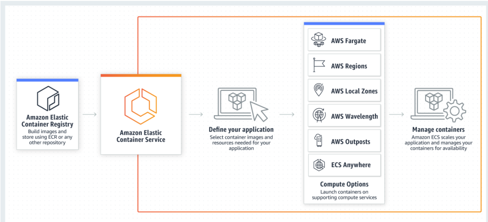

# Amazon ECS 란? :thinking:

> #### Amazon Elastic Container Service의 약자로, 컨테이너화된 애플리케이션의 **손쉬운 배포, 관리 및 크기 조정을 지원하는 완전관리형 컨테이너 오케스트레이션 서비스**입니다.

- 선호하는 지속적 통합 및 지속적 전달(CI/CD)과 자동화 도구를 사용하여 클라우드에서 수천 개의 컨테이너를 시작
- 컨테이너에 맞게 **AWS Fargate 서버리스 서버리스 컴퓨팅을 최적화**하여 제어 영역, 노드 및 인스턴스를 구성하고 관리할 필요가 없음
- **자율 프로비저닝, 자동 크기 조정 및 종량제 요금**을 통해 컴퓨팅 비용을 최대 50% 절감
- 전 세계 거의 모든 규제 기관의 규정을 준수하기 위해 **표준화된 AWS 관리 및 거버넌스 솔루션과 원활하게 통합**

- 나머**지 AWS 플랫폼과 긴밀하게 통합**되므로 Amazon ECS Anywhere를 통해 이제 클라우드와 고객의 인프라에서 컨테이너 워크로드를 안전하고 손쉽게 실행할 수 있습니다.

## 기능

- **AWS Fargate를 통한 기본적인 서버리스**
  -  [AWS Fargate](https://aws.amazon.com/ko/fargate/)는 Amazon ECS에 내장 -> **서버 관리, 용량 계획 처리 또는 보안을 위한 컨테이너 워크로드 격리**에 대해 더 이상 고민할 필요가 없음

- **Amazon ECS Anywhere**
  - 익숙한 Amazon ECS 콘솔 및 운영자 도구를 사용하여 온프레미스 컨테이너 워크로드를 관리
  - 컨테이너 기반 애플리케이션 전체에서 일관된 실행
  - **AWS Systems Manager(SSM)를 통합하면 온프레미스 하드웨어와 AWS 제어 플레인 간의 신뢰가 자동으로 안전하게 설정**됩니다.

- **보안 및 격리를 고려한 설계**
  - 신뢰하는 보안, 자격 증명 및 관리와 거버넌스 도구와 기본적으로 통합되므로 프**로덕션으로 빠르게 전환**하는 데 도움
  - 각 컨테이너에 대한 **세분화된 권한을 할당하여 애플리케이션을 구축**할 때 격리 수준을 개선
- **자율적인 제어 플레인 작업**
  -  구성 및 운영 모범 사례가 포함
  - 완전관리형 컨테이너 오케스트레이션 서비스

**AWS Outposts**

-  온프레미스 시스템에 대한 매우 짧은 지연 시간을 필요로 하는 컨테이너식 애플리케이션을 실행

