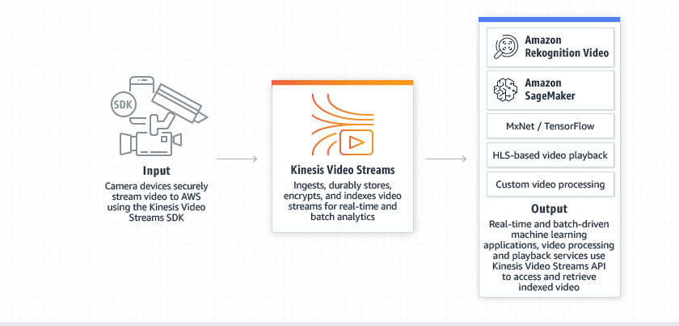
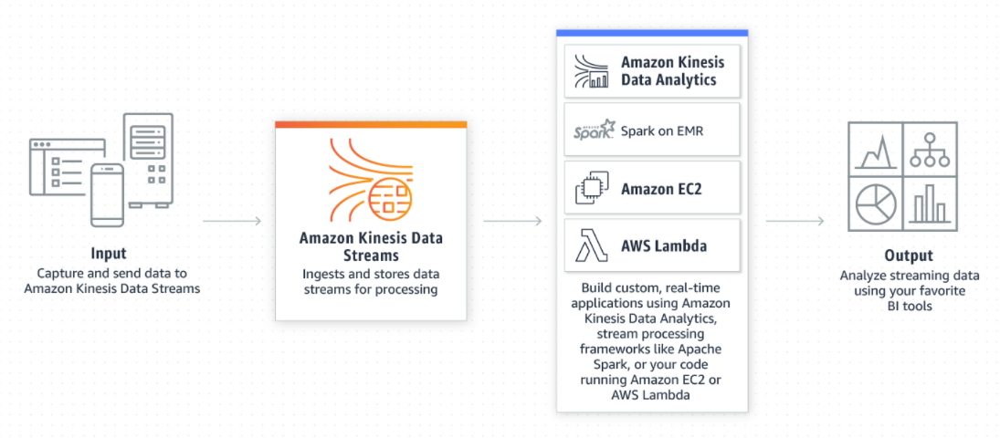
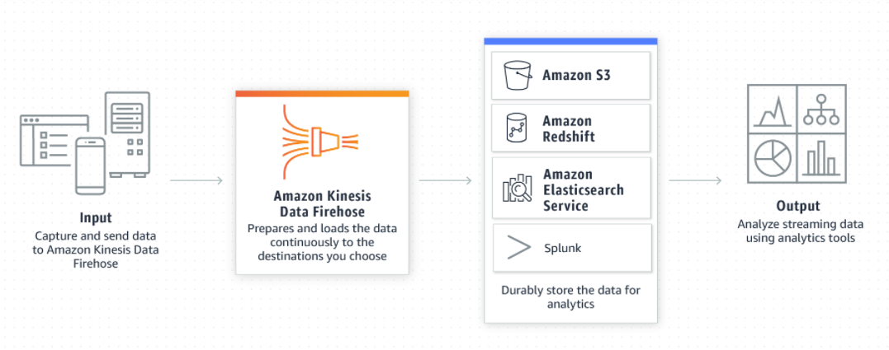
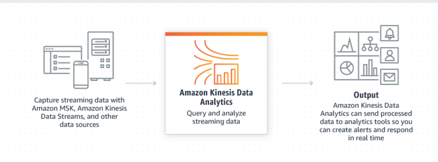

 

# Amazon Kinesis

> 실시간 스트리밍 데이터를 손쉽게 수집, 처리 및 분석하는 서비스

- 규모의 스트리밍 데이터를 비용 효율적으로 처리할 수 있는 핵심 기능과 더불어 **애플리케이션 요구 사항에 가장 적합한 도구를 선택할 수 있는 유연성을 제공**

## 이점

- Amazon Kinesis를 사용하면 실시간으로 스트리밍 데이터를 수집, 버퍼링 및 처리
- 완전관리형으로 스트리밍 애플리케이션을 운영
- 규모의 스트리밍 데이터를 처리하고 매우 짧은 지연 시간으로 수많은 소스의 데이터를 처리

## 기능

- [Kinesis Video Streams](https://aws.amazon.com/ko/kinesis/video-streams/)**비디오 스트림을 캡처, 처리 및 저장**
  -  분석, ML(기계 학습) 및 기타 프로세싱을 위해 커넥티드 디바이스에서 AWS로 비디오를 쉽고 **안전하게 스트리밍**
  - 
- [Kinesis Data Streams](https://aws.amazon.com/ko/kinesis/data-streams/)**데이터 스트림을 캡처, 처리 및 저장**
  - 조정 가능하고 내구성이 뛰어난 **실시간 데이터 스트리밍 서비스**로, 수십 만 개의 소스에서 초당 기가바이트의 데이터를 연속적으로 캡처
  - 
- [Kinesis Data Firehose](https://aws.amazon.com/ko/kinesis/data-firehose/)**데이터 스트림을 AWS 데이터 스토어로 로드**
  - 기존 인텔리전스 도구를 사용해 거의 실시간 분석을 위해 **데이터 스트림을 캡처 및 변환**
  - 
- [Kinesis Data Analytics](https://aws.amazon.com/ko/kinesis/data-analytics/)**SQL 또는 Apache Flink로 데이터 스트림 분석**
  - 새로운 프로그래밍 언어 또는 처리 프레임워크를 배울 필요 없이 SQL 또는 Apache Flink를 통해 실시간으로 데이터 스트림을 처리
  - 