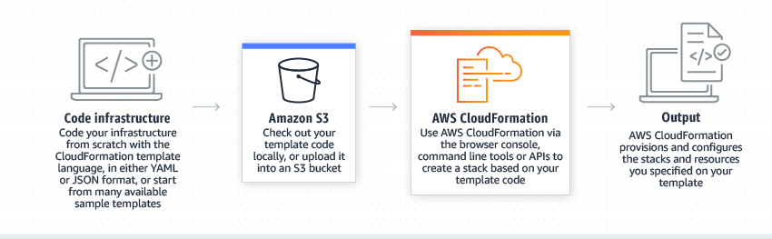

# CloudFormation

> **코드로 인프라를 관리**하는 클라우드 프로비저닝 가속화 툴

- 프라를 코드로 처리하여 **AWS 및 서드 파티 리소스를 모델링, 프로비저닝 및 관리**

- CloudFormation 템플릿에는 원하는 **리소스와 종속성이 설명**되어 있으므로 이를 모두 **하나의 스택으로 구성하고 시작 가능**

- 템플릿을 통해 **전체 스택을 단일 단위로 처리**하여 필요한 만큼 **자주 생성 및 업데이트하고 삭제**

  ## 특징

  1. ### 확장성

     - AWS 파트너 네트워크(APN) 파트너 및 개발자 커뮤니티에서 게시한 **서드 파티 리소스 및 모듈 모델링, 프로비저닝**
     - 로컬 테스트 및 코드 생성 기능을 포함하여 개발 프로세스를 간소화하는 오픈 소스 도구인 [AWS CloudFormation CLI](https://docs.aws.amazon.com/cloudformation-cli/latest/userguide/what-is-cloudformation-cli.html)를 사용하여 리소스 공급자를 직접 구축 가능

  2. ### 교차 계정 및 교차 리전 관리

     - CloudFormation StackSets를 사용하면 **단일 CloudFormation 템플릿**으로 여러 계정과 리전에 걸쳐 **공통된 AWS 리소스 세트 프로비저닝**
     - StackSets에서는 위치에 관계없이 **스택을 자동으로 안전하게 프로비저닝, 업데이트 또는 삭제**

  3. ### JSON/YAML로 작성

     - 텍스트 파일로 전체 클라우드 환경을 모델링
     - **JSON 또는 YAML** 같은 오픈 소스 선언 언어를 사용하여 **생성 및 구성할 AWS 리소스 설명** 가능

  4. ### 친숙한 프로그래밍 언어로 작성

     - **AWS Cloud Development Kit(AWS CDK)**에서 TypeScript, Python, Java 및 .NET을 사용하여 클라우드 환경을 정의 가능
     - 친숙한 프로그래밍 언어를 사용하여 클라우드 애플리케이션 리소스를 모델링한 후 **사용자 IDE에서 직접 CloudFormation을 사용하여 인프라를 프로비저닝**
     - 클라우드 리소스를 미리 구성하는 **개괄적인 구성 요소를 제공**

  5. ### SAM을 통해 서버리스 애플리케이션 구축

     - 원하는 애플리케이션을 정의하고 YAML을 사용하여 모델링
     - SAM은 배포 중에 SAM 구문을 CloudFormation 구문으로 변환 및 확장

  6. ### 안전 제어

     - 오류로 이어질 수 있는 **수동 단계 또는 제어 항목이 없음**
     - 롤백 트리거를 사용하여 스택 생성 및 업데이트 프로세스 동안 **CloudFormation이 모니터링해야 하는 CloudWatch 경보를 지정**
     - **ChangeSets를 사용**하면 CloudFormation이 인프라 및 애플리케이션 리소스에서 변경하도록 제안하는 내용을 실행 전에 **미리 볼 수 있으므로** 배포가 계획한 대로 정확하게 진행
     -  적합한 작업을 결정하고, 리소스를 최대한 효율적으로 프로비저닝하고, 오류가 발생하면 **자동으로 롤백**
     - 드리프트 감지를 사용하면 CloudFormation 외부에 있는 **리소스의 변경 사항을 추적**

  7. ### 환경의 변경 사항 미리 보기

     - 택에 대해 제안된 변경 사항이 실행 중인 리소스에 어떤 영향을 미칠 수 있는지 **미리 확인**하여 변경 사항으로 인해 중요한 리소스가 삭제되거나 교체될지 여부 등을 살펴볼 수 있음
     - **사용자가 변경 세트를 실행하기로 결정한 후에만** CloudFormation이 스택에 변경 사항을 적용

  8. ### 종속성 관리

     - 스택 관리 작업 중에 리**소스 간 종속성을 자동으로 관리**
     - 리소스의 생성, 업데이트 또는 삭제 **순서를 지정하기 위해 고민할 필요 없음**
     - CloudFormation에서 스택 작업을 수행할 때 **각 리소스에 대해 실행할 작업의 올바른 순서를 결정**

