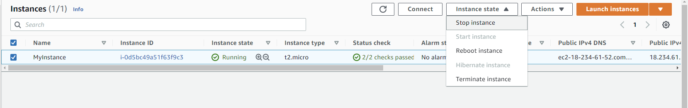

# Amazon EC2

- aws 서비스 중 가장 유명한 서비스
- EC2 = Elastic Compute Cloud = Infrastructure as a Service
- It mainly consists in the capability of :
  - Renting virtual machines (EC2)
  - Storing data on virtual drives (EBS)
  - Distributing load across machines (ELB)
  - Scaling the services using an auto-scaling group (ASG)
- Knowing EC2 is **fundamental to understand how the Cloud works**

### EC2 생성 시 고려해야 할 사항들

- Operating System (OS): Linux, Windows or Mac OS
- How much c**ompute power & cores (CPU)**
- How much random-access memory (RAM)
- How much storage space:
  - Network-attached (EBS & EFS)
  - hardware (EC2 Instance Store)
- Network card: speed of the card, Public IP address
- Firewall rules: security group
- Bootstrap script (configure at first launch): EC2 User Data

### EC2 User Data

- It is possible to bootstrap our instances using an EC2 User data script.
- bootstrapping means **launching commands when a machine starts**
- UserData를 EC2 런칭 시 사용하면 해당 인스턴스가 자원을 할당받아 실행될 때 **UserData에 입력한 커맨드가 같이 실행되어 편리**하다
- That script is only **run once at the instance first start**
- EC2 user data is used to **automate boot tasks** such as:
  - **Installing updates**
  - **Installing software**
  - **Downloading common files from the internet**
  - Anything you can think of
- The EC2 User Data Script runs with the **root user**


-------

# [HandsOn] EC2 실행하기


```sh
#!/bin/bash
# Use this for your user data (script from top to bottom)
# install httpd (Linux 2 version)
yum update -y
yum install -y httpd
systemctl start httpd
systemctl enable httpd
echo "<h1>Hello World from $(hostname -f)</h1>" > /var/www/html/index.html
```

-  `$(hostname -f)`: private ip



- stop 했다가 다시 run 하면 public IPv4의 주소가 바뀐다


------

# EC2 Instance Types

> m5.2xlarge

- `m`: **instance class**
- `5`: **generation** (AWS improves them over time)
- `2xlarge`: **size** within the instance class

###  EC2 Instance Types - General Purpose

- **Great for a diversity of workloads** such as web servers or code repositories
- Balance between:
  - Compute
  - Memory
  - Networking

### EC2 Instance Types - Compute Optimized

- Great for **compute-intensive tasks** that require high performance processors:
  - Batch processing workloads
  - Media transcoding
  - High performance web servers
  - High performance computing (HPC)
  - Scientific modeling & machine learning
  - Dedicated gaming servers