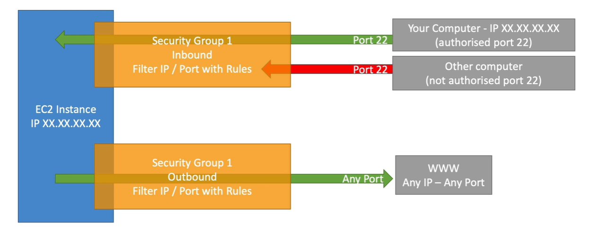

## Introduction to Security Groups

- Security Groups are the **fundamental of network security** in AWS
- They **control how traffic is allowed** into or out of our EC2 Instances.
- Security groups **only contain allow rules**
- Security groups rules **can reference by IP or by security group**

## Security Groups Deeper Dive

- Security groups are **acting as a "firewall" on EC2 instances**
- They regulate:
  - **Access** to Ports
  - Authorised IP ranges - IPV4 and IPV6
  - Control of **inbound network** (from other to the instance)
  - Control of **outbound ** (from the instance to other)

## Security Groups Good to know

- **Can be attached to multiple instances**
- Locked down to a region / VPC combination
- Does live "outside" the EC2 - if traffic is blocked the EC2 instance won't see
  it
- It's good to maintain **one separate security group** for SSH access
- If your application is not accessible (time out), then it's a security group issue
- If your application gives a "connection refused" error, then it's an application error or it's not launched
-  All inbound traffic is blocked by default
-  All outbound traffic is authorised by default

## 보안 그룹(security group)

- 방화벽과 같은 기능을 제공
  - 상태 저장 방화벽 역할
  - 보안 그룹이 트래픽을 한 방향으로 전달되도록 허용할 때 반대 방향의 응답 트래픽을 지능적으로 허용
- 인스턴스의 ENI에서 송수신되는 트래픽을 허가해서 인스턴스를 오가는 트래픽을 제어
- 모든 ENI는 최소 하나 이상의 보안 그룹과 연결되어야 함
  - 보안 그룹과 ENI는 N:N 관계
- 보안 그룹 생성 시 보안 그룹 이름, 설명, 포함될 VPC를 지정하고, 보안 그룹 생성 후에 인바운드, 아웃바운드 규칙을 지정해서 트래픽을 제어

## NACL(Network Access Control List)

- 보안 그룹과 유사
  - 원본(source)/대상(target) 주소 CIDR, 프로토콜, 포트를 기반으로 트래픽을 허용하는 인바운드, 아웃바운드 규칙을 포함 ⇒ 방화벽 기능
  - VPC에는 삭제할 수 없는 기본 NACL이 존재
- NACL은 ENI가 아닌 서브넷에 연결, 해당 서브넷과 송수신하는 트래픽을 제어
- 서브넷 내의 인스턴스 간 트래픽을 제어할 때는 NACL을 사용할 수 없음 ⇒ 보안 그룹
- NACL은 상태를 저장하지 않음 = NACL은 통과하는 연결 상태를 추적하지 않음
  - 모든 인바운드, 아웃바운드 트래픽의 허용 규칙을 별도로 작성해야 함NACL 규칙은 규칙 번호의 오름차순으로 처리