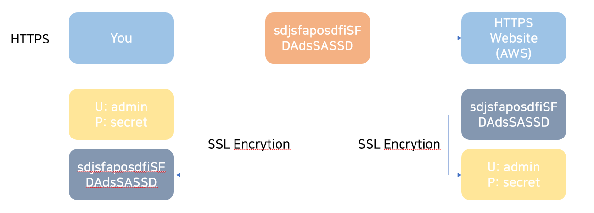

# Encryption

## Why Encryption?

# Encryption in flight(SSL)

- Data is encryted before sending and decrypted after receiving
- SSL certificates help with encryption (HTTPS)
- Encryption in flight ensures no MITM(man in the middle attack can happen)
- 

# Server side encrytion at rest

- Data is encrypted after being received by the server
- Data is decrypted **before being sent**
- It is stored in an encrypted form thanks to a key(usually a data key)
- The encryption / decryption keys must be managed somewhere and the server must have access to it

Client side Encryption