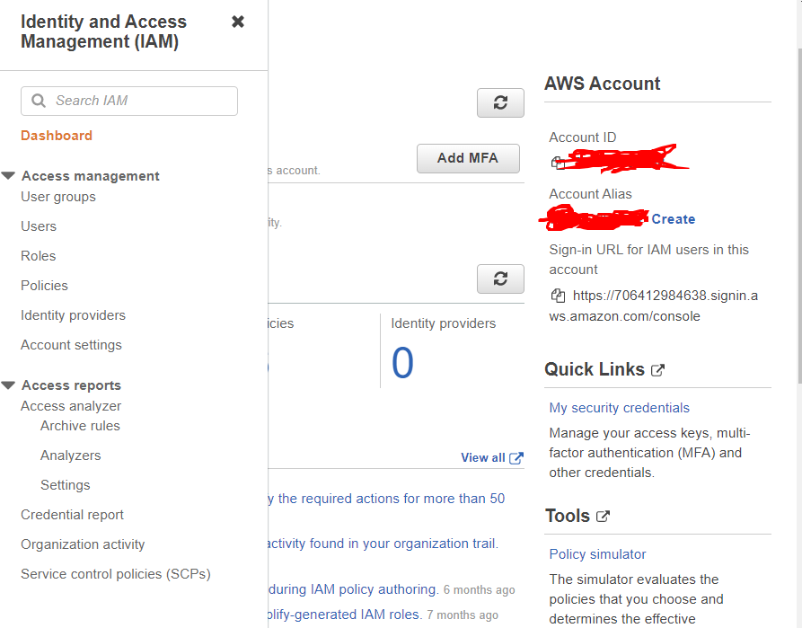
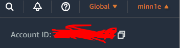
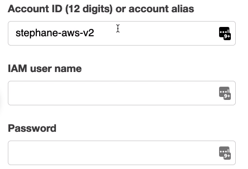

## IAM

- User 조회 시 user가 속해 있는 그룹 조회 가능
- IAM 대시보드 오른 편에는 accountID 가 있다

​	얘처럼!

- 이 ID는 계정 상단에 있는 AccountID와 같은 값임

- ## AccountID

  - AWS 계정을 정의하는 유니크한 값으로, 많은 AWS 리소스들은 ARN에 accountID를 포함하고 있다.
  - IAM에서는 Account Alias 생성을 통해 AccountID 를 번호 대신 이름으로 설정해둘 수 있음
  - 하단에는 URL이 적혀있어서 IAM 유저는 이 주소를 통해 로그인할 수 있음
    - 해당 URL을 통해 들어간다면(만약 루트 유저가 아닐 시)
  - URL을 타고 들어가면
    - 
    - 이런 창을 본다
    - IAM user name
      - 자신이 생성한 user의 name을 작성
    - Password
      - 해당 user의 비밀번호 작성


​																	**가급적 Root User대신 IAM User를 사용하자!!**


## IAM 정책 구조

- ```json
  {
      "version": "2012-10-17",
  	"Id": "53-Account-Permissions"
  	"Statement": [
  	{
          "Sid": "1",
          "Effect": "Allow",
          "Principal": {
         		"AWS": ["arntaws: iam: :123456789012:root"]
  	},		
          "Action": [
              "s3:Getobject",
              "$3: Putobject"
        	],
          "Resource": ["arn:aws: s3: : :mybucket/*"]
  		}
  	]
  }
  ```

  - Version
    - 정책 언어 버전으로, 항상 2012-10-17을 포함
  - Id
    - 정책에 대한 식별자 (옵션)
  - Statement
    - 각각 설명해둔 것 (필수)
    - Sid
      - 해당 스테이트먼트의 식별자 (옵션)
      - 위의 sid는 첫번째라서 그런지 1임!(내생각)
    - Effect
      - 해당 스테이트먼트가 특정 api 대해 허용되는지에 대한 여부 표시
    - Principal
      - 어디에서 할당되었는지 표시
    - Action
      - Effect 에 근거하여 어떤 기능을 가질 수 있는지 표시됨
    - Resource
      - 위의 action이 어디에 적용될 수 있는지 묘사한 항목
  - 여기에는 나와있지 않지만 condition이라는 항목을 통해 해당 정책이 영향을 끼치는 조건에 대해 적혀있음