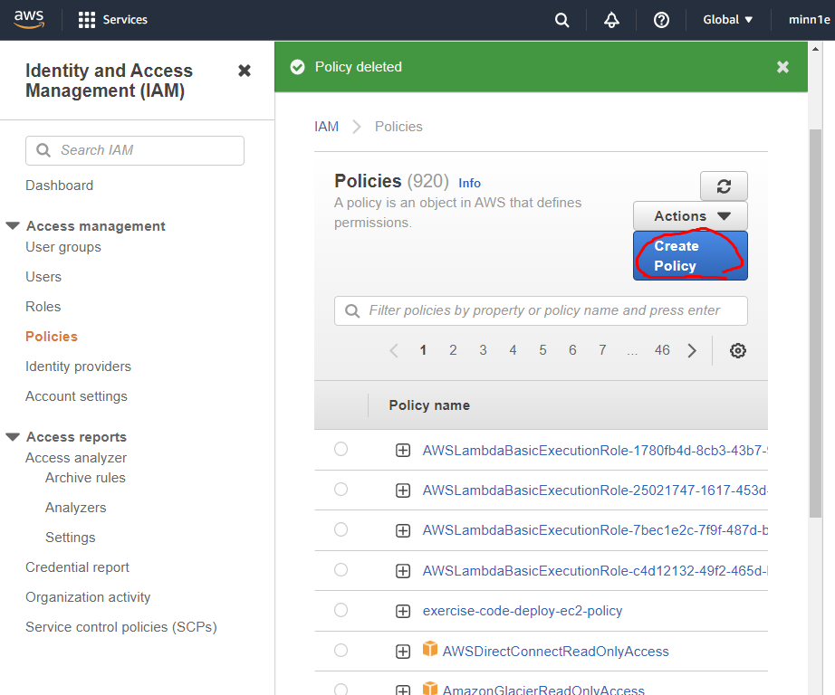
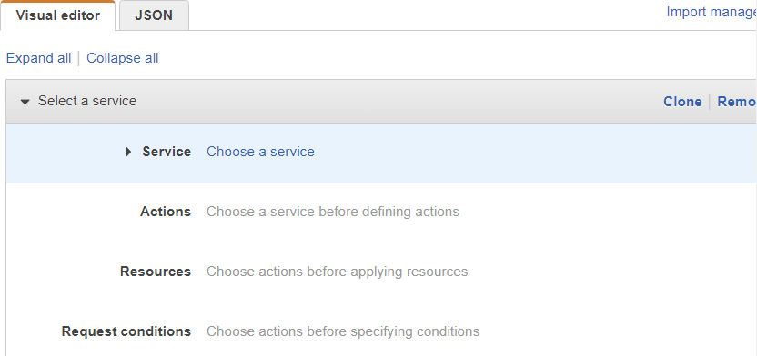
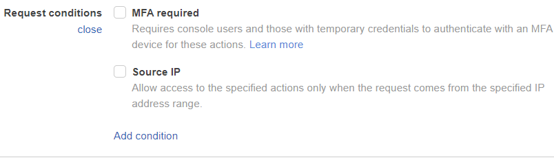

# 1. [실습] IAM 

- IAM policy를 생성할 때 Create Policy를 누르면  VIsual editor를 사용하거나 JSON을 통해 정책 생성 가능
- 

- Visual Editor를 사용할 떄에는 원하는 서비스, 활동, 활동이 적용되는 리소스, Request Condition을 설정할 수 있다.
- 
  - Request Conditions는 리퀘스트가 들어올 떄의 조건을 설정하는 듯 함
  - MFA(다중 인증)란?
    - Multi-factor authentication
    - 임시 보안 자격 증명 검증에 필요한 다중인증 키인듯 하다.

### 깨달은 점

- sid는 statement id로, 해당 정책을 가리키는 아이디이다!
- 지난 번에 보았던 1은 그냥 임의로 만들어둔 듯
- Visual Editor로 생성했다면 VisualEditor + 숫자 로 만들어지는듯

-------------

# 2. IAM - Password Policy

- 보안 매커니즘 두 가지 중 첫 번째

- 안전한 패스워드를 쓸 수록 내 계정의 보안이 높아진다!

- 비밀번호 생성 방법

  1. 최소한의 비밀번호 길이를 설정해둔다
  2. 특정 캐릭터 타입을 설정해둔다.
     - 대문자, 소문자, 숫자, 특수문자
  3. 모든 IAM유저들에게 자신의 패스워드를 변경할 것을 허락한다
  4. 비밀번호 만기일에 따라 유저들에게 자신의 비밀번호를 변경하도록 한다.

- ## MFA

  > Multi Factor Authentication로, 나의 패스워드와 내가 가진 (보안)기기를 합친 것

  - 일반 패스워드보다 더 안전한 보안이 된다.

  - Password + MFA generating token  => 성공적인 로그인

  - 최고의 이점: 만약 비밀번호가 뚫리거나 해킹 당해도 계정은 털리지 않을 것!

    - 물리적인 인증 기기를 가지고 있지 않기 때문

  - ### MFA devices options in AWS

    1. **가상의 MFA 기기 이용하기**
       - Google Authenticator (phone only) / Authy (multi-device)

    2. **범용 U2F 시큐리티 키**

    - Yubico 의 Yubikey를 사용 (서드파티)

    3. **하드웨어 키 장식품**
       - Gemalto에서 제공하는 MFA device (서드파티)

    4. **AWS GovCloud에서 사용하는 하드웨어 키 장식품**
       - SurePassID에서 제공하는 제품 (서드파티)