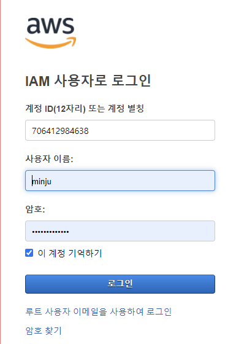

## 1. AWS CLI?

>  쉘의 커맨드를 통해 AWS 서비스를 이용할 수 있게 하는 툴


- AWS 서비스의 퍼블릭한 api들에 직접적인 접근 가능
- 사용자의 리소스를 관리하기 위해 스크립트를 개발할 수 있음
- 오픈소스 (깃허브에 주소 있음)

## 2. AWS SDK?

> AWS Software Development Kit (AWS SDK)

- 라이브러리의 집합체
- 언어별로 있음
- 오늘 할 예제는 boto3로 진행될 예정(파이썬용 AWSCLI를 사용 - 파이썬 쓴다는 뜻)

## 3. 예제 시~작!


1. ### 	먼저, IAM에 등록된 계정으로 로그인한다.

   

   - 로그인하려는 계정의 security credentials에 들어가서 해당 링크에 들어가자

      

   - 해당 링크로 들어가면

   - 

   - 계정 이름이랑 설정해둔 비밀번호 적어두면 로그인 됨

   ### 2. Security Credentials 메뉴 하단에 있는 Access keys에 들어가서 액세스 키를 다운받는다!

   - 이 키는 절대 노출되면 안됨
   - 

   3. ### 콘솔 창에 들어가서 연결한다.

      - `aws configure`를 치면 시크릿 키와 액세스 키 입력창이 차례대로 뜬다.
      - 
        - IAM 계정에서 받았던 시크릿 키와 액세스 키를 차례대로 입력해주자

   3. ### configure 완료

   - `aws iam list-users`를 통해 내 컴퓨터에 등록된 aws 유저들을 araboza
     - 

   - 이와 같은 양식으로 사용자 정보가 저장되어 있는 것을 확인할 수 있다.

   - 이후 group에서 시크릿 키를 등록한 유저를 제외하면 cli에서 없어진 것을 확인할 수 있음
     - 이라고 강의에서 뜨지만

   - ```
     An error occurred (AccessDenied) when calling the ListUsers operation: User: arn:aws:iam::706412984638:user/new-minju is not authorized to perform: iam:ListUsers on resource: arn:aws:iam::706412984638:user/
     ```

     - 이런 메세지 창이 뜬다

   - 유저 창에서도

     -  

     - 이런 이미지가 뜨니 참고

   - 하지만 다시 Root user들어가서 group에 추가해준 뒤 cli에서 확인하면 정상적으로 들어온 것 확인 가능

## 4. AWS CloudShell

- #### 클라우드 쉘이란?

  > AWS의 클라우드에 있는 터미널로, 아래와 같은 아이콘을 통해 접속 가능하다.

  - 

- 접속하기 전에, 액세스 가능 리전이 따로 정리되어 있으니 참고하자!
- 

- 접속하면 aws 콘솔 스크립트가 정상적으로 작동되는 것을 확인할 수 있다
- 

- 클라우드 쉘에서 리전 설정은 현재 로그인 되어있는 계정에 있는 리전이 반영될 예정이니 바꾸고 싶은 사람은 바꾸자

- 

- 파일 생성 이후 새로고침을 해도 ls로 목록을 살펴봐도 그대로 파일이 남아있는 것을 확인할 수 있다

- 클라우드 쉘에서 파일 다운받기

  1. `pwd`로 경로 확인하기

  2. actions> download file

     

  3. 창에 경로 입력하기

     

  4. 

     -  demo.txt에 적어둔 test 가 저장된 것 확인가능


- `Actions`를 활용하면 창을 새로 파거나 split 가능하니 활용하자!