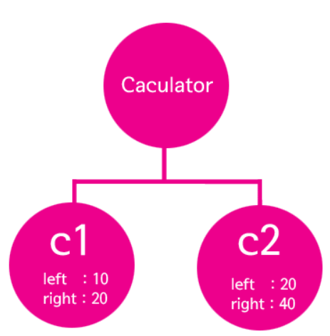

객체지향 프로그래밍 시 두 가지 접근이 필요

1. 문법적인 접근

2. 객체지향을 이용해 현실을 잘 담아낼 수 있는 소프트웨어를 개발하는 것

   :point_right: 설계를 잘하는 법

### 부품화 ⚙️

- #### 객체

  - 하나의 프로그램은 여러 형태의 로직으로 구성돼 있음
  - 로직을 그 로직과 관련된 **변수와 메소드로 그룹화**한 것

  :point_right: 재활용성이 높아짐

  다른 곳 또는 여러 곳에서 부품으로써 사용되는 것

  좋은 객체를 만든다는 것 ➡️**로직을 재활용할 수 있게 부품화**하는 것

- #### 메소드

  - 부품화의 예

  - 기능별로 로직을 묶고 메소드를 조합해서 하나의 완제품인 소프트웨어를 만들게 된다

  - 메소드를 만들면 코드의 양을 극적으로 줄일 수 있고 메소드별로 기능이 분류돼 있음

    :arrow_right: 필요한 코드가 있을 때 그 메소드를 찾으면 필요한 코드를 좀 더 빠르게 찾을 수 있음

  - 소프트웨어의 개선이 필요할 때 메소드만 수정하면 메소드를 사용하고 있는 모든 곳에서 동시다발적으로 개선이 이뤄짐

  :point_right: 이런 것들을 한 단계 발전시킨 것이 객체지향

  - 부품화한다고 해서 모든 곳에서 자신이 만든 코드를 재활용 할 수 있는 것은 :x:

- #### 은닉화, 캡슐화

  - 사용자에게 부품의 사용법만을 노출하는 것을 정보 은닉화, 캡슐화라고 함

    :point_right: 객체가 어떻게 생겼는지 몰라도 객체를 사용할 수 있게하는 것

- #### 인터페이스

  - 좋은 부품의 또 다른 특징
    - 잘 만들어진 부품이라면 부품과 부품을 서로 교환할 수 있어야 함
  - 인터페이스가 존재하므로 각 부품이 부품으로서의 가치가 높아지는 것
  - 서로 사용할 수 없는 관계에 있는 것은 결합되지 않게 강제하는 장치

프로그래밍의 원칙

1. 중복의 제거
   - 중복되는 코드는 제거해야 함
   - 하나의 코드로 중복되는 작업 :arrow_right: 재활용성, 유지보수의 편의성, 가독성 좋아짐 

```java
package study;

public class CalculatorDemo {
	public static void main(String[] args) {
		System.out.println(10+20);
		System.out.println(20+40);
	}
}
```

:point_right: 여기서 중복되는 코드:  **`` +`` ​코드의 매커니즘은 중복됨**

```java
package study;

public class CalculatorDemo2 {
	public static void sum(int left, int right) {
		System.out.println(left+right);
	}
	public static void main(String[] args) {
		sum(10,20);
		sum(20,40);
	}

}
```

- ``CalculatorDemo``와 같은 결과 출력
  - 로직은 똑같은데 중복은 제거됨

:point_right: 리팩터링(Refactoring)이라고 함

#### 📌리펙터링이란?

- 기존 코드와 동일하게 동작하지만 코드의 내용을 개선해서 더 효율적으로 만드는 행위

- 프로그램은 한 번에 만들어지지 않고 여러과정을 거쳐서 만들어지므로 자주 코드를 리팩터링할수록 건강한 코드

  ​	:arrow_right: 건강한 코드는 변화에 유연하게 대처 가능함

  ​	:bug: **버그가 생길 확률이 낮아지는 것**이 리팩터링의 이유!

```java
package study;

public class CalculatorDemo3 {
	public static void avg(int left, int right) {
		System.out.println((left+right)/2);
	}
	public static void sum(int left, int right) {
		System.out.println(left+right);
	}
	public static void main(String[] args) {
		int left,right;
		left=10;
		right=20;
		
		sum(left,right);
		avg(left,right);
		left=20;
		right=40;
		sum(left,right);
		avg(left,right);
	}
}
```

- ``left``+``right`` 변수는 ``sum()``과``avg()``에 데이터를 공급하는 역할을 함

  :point_right: 서로 연관되어 있음

  연관된 것들을 반복해서 사용하고 중복해서 등장시키는 방법 : 메소드로 묶어서 메소드화 하기

  

```java
package study;

class Calculator {
	int left,right;
	
	public void setOperations(int left, int right) {
		this.left = left;
		this.right = right;
	}
	public void sum() {
		System.out.println(this.left+this.right);
	}
	public void avg() {
		System.out.println((this.left+this.right)/2);
	}
public class CalculatorDemo4{
	public static void main(String[] args) {
		Calculator c1=new Calculator();
		c1.setOperations(10, 20);
		c1.sum();
		c1.avg();
	}
	
	}
}
```

- ``Calculator c1=new Calculator();`` -> ``Calculator``라는 메소드 호출

  :arrow_right: ``new``라는 객체 생성

  - ``Calculator``라는 객체 새로 생성

    그렇게 만든 객체 c1이라는 변수에 담음

  - ``c1``변수의 데이터형은 그 객체의 이름을 가지고 있어야 함

    = ``Calculator`` 라는 객체를 새로 만들어서 c1 변수에 담았는데, 그 변수는 ``Calculator``라는 객체를 담을 수 있는 데이터 형식을 가진 변수여야 함

- ``class Calculator`` 등장

  - ``Calculator``은 ``new``를 이용해서 만든 것에 해당

  - ``new``를 이용해 실제 객체를 생성하기 위한 설계도

    = ``class Calculator``안에 있는 로직

- 객체를 바라볼 때 객체를 하나의 독립된 프로그램처럼 볼 필요
  - 프로그램 안에는 변수, 메소드도 있는 것처럼
  - 변수+메소드의 집합 = 객체

- ``this``는 인스턴스 자신을 의미
  - ``this.left=left;``에서 우항의 left에는 매개변수로 전달된 값이 들어오게 됨



- ``Calculator``는 클래스
  - 클래스를 ``new``연산자를 이용해 생성(``new Calculator``)하고 대입 연산자를 사용해 대입 연산자 왼쪽에 ``c1,c2``변수 배치
  - 두 개의 객체: 인스턴스라고 함