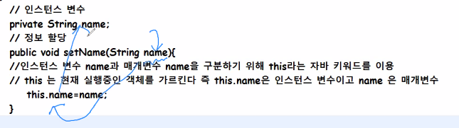
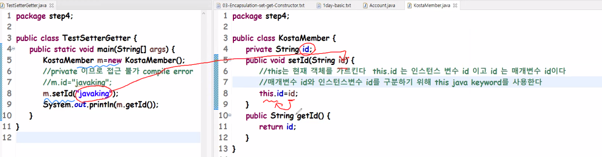
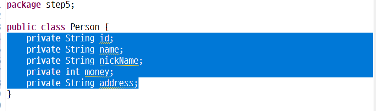
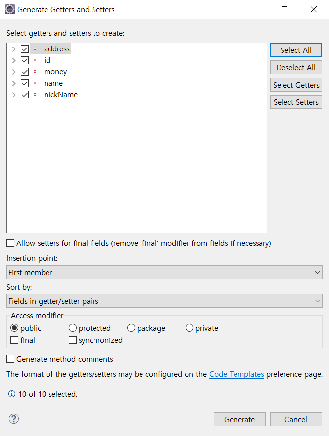
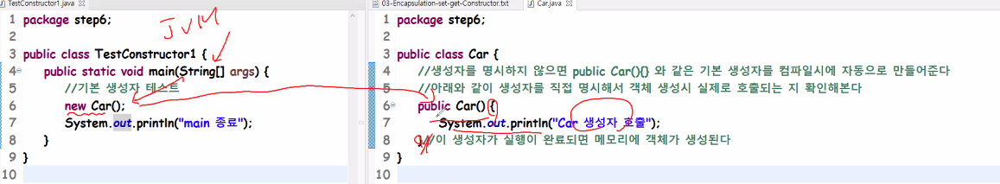

**3일차 주요목차**
- review 
- Object Oriented Concept 객체지향개념 중 Encapsulation 
- access modifier 접근 제어자 중 public , default , private 
- setter/getter method 
- Constructor 생성자 
- UML 중 Class Diagram 연습 ( tool : staruml ) 
- java Data Type ( primitive data type 과 reference data type ) 

-------

# :one: Review

### 	소프트웨어 개발 수명주기

- 요구사항 분석 -> 설계-> 개발-> 테스트 -> 운영(유지보수) 단계로 구성

  ### Milestone

  - 프로젝트를 완수하기위한 주요 진행 단계
  - 워터폴의 관점에서 보면 각 단계가 마일스톤이 될 수 있음

  ### Code Review 🕵️

   - ``main method``
     	- 실행 시 jvm이 해석하는 시작점
  - ``package``
    - 디렉토리 별로 분류
  - ``class``
    - 객체 생성을 위한 툴, 설계도
  - ``instance variable``
    - 객체 속성을 저장하기 위한 공간
  - ``method``
    - 객체의 기능을 정의

  

> 소프트웨어 공학 :arrow_right: 좋은 설계의 지표
>
> "높은 응집도, 낮은 결합도"

- **응집도**
  - **모듈 내부의 역할에 집중**하는 정도
- **결합도**
  - 모듈 간의 **상호 의존도**


# :two: 객체지향 주요개념🔥

- Encapsulation(캡슐화)

  "Public Interface, Private "

  - 인터페이스는 공개하고 구현부는 은닉한다
  - 캡슐화는 인터페이스와 구현부를 분리해서 설계하고 개발한다
  - 장점
    - **정보은닉, 정보보호**
    - 생산성: 구현부를 몰라도 인터페이스만 이해하면 사용할 수 있음

- Inheritance(상속)

- Polymorphism(다형성)


# :three: Access Modifier (접근 제어자) :radio_button:

- 접근 제어자 중 public , default , private 
- Java의 접근 제어자는 총 4가지가 있음
- **Public>Protected>Default>Private**
- **Public**
  - 다른 패키지에서 접근 가능
- **Protected**
  - 다른 패키지에서 접근 가능
  - 단, 상속관계에서는 다른 패키지에서도 접근 가능
- **Default**
  - 같은 패키지에서만 접근 가능
- **Private**
  - **클래스 내**에서만 접근 가능
  - 외부에 공개하지 않음

# :four: Method

- ### setter (set 메서드)

  - 정보를 할당할 때 사용

- ### getter (get 메서드)

  - 정보를 반환할 때 사용

- ```java
  private String name;
  public void SetName(String name){
  	this.name=name;
  }
  public String getName(){
  	return name;
  }
  ```

  ``private String name;``

  - 인스턴스 변수

  ``public void SetName(String name)``

  - setter:정보 할당을 위한 메서드

  ``this.name=name;``

  - **인스턴스 변수 ``name``과 매개변수 ``name``을 구분하기 위해 ``this``라는 자바 키워드 이용**

  - ``this``는 현재 **실행중인 객체**를 가리킴

    :point_right: ``this.name``은 인스턴스 변수이고 ``name``은 매개변수

    

- ``public String getName()`` : 정보 반환을 위한 메서드



- Setter/Getter 를 사용하는 이유?

  - **변수에게는 검증절차를 넣어줄 수 없음**

- 할당과 받환받는 메서드는 합칠 수 없는건가?

  - **나눠서 만들어야 응집도가 높아진다**
  - 자바에서 최대한 기능을 **세부단위로 나눠 만드는것**이 좋음
  - 기능단위별로 만들어서 다음에는 **단위별로 만들면 재사용성이 높아**져 좋음

  

  ## Generator 단축키 사용법 :alarm_clock:

  ```java
  - package step5;
  
    public class Person {
    	private String id;
    	private String name;
    	private String nickName;
    	private int money;
    	private String address;
    }
  
  ```

  

1. 선택하고

​																				2. 	``alt``+``shift``+``s``


3. 이 창이 뜨면



4. 전체선택하고 하단의 ``Generate`` 눌러주면 

```java
package step5;

public class Person {
	public String getId() {
		return id;
	}
	public void setId(String id) {
		this.id = id;
	}
	public String getName() {
		return name;
	}
	public void setName(String name) {
		this.name = name;
	}
	public String getNickName() {
		return nickName;
	}
	public void setNickName(String nickName) {
		this.nickName = nickName;
	}
	public int getMoney() {
		return money;
	}
	public void setMoney(int money) {
		this.money = money;
	}
	public String getAddress() {
		return address;
	}
	public void setAddress(String address) {
		this.address = address;
	}
	private String id;
	private String name;
	private String nickName;
	private int money;
	private String address;
}
```

- **외부에서 객체의 데이터를 읽을 때**도 메소드를 사용하는 것이 좋음

- **객체 외부**에서 객체 필드값을 **사용하기 부적절한 경우**

  :point_right: **메소드로 필드값을 가공 후 외부로 전달**

  📌클래스 선언 시 가능한 필드를 **private로 선언해 외부로부터 보호**하고 필드에 대한 **Setter/Getter 메소드**를 작성해서 **필드값을 안전하게 변경**/**사용하는것이** 좋음


# :five: Construcor **생성자**

- 객체 생성시 호출되는 영역

  - Object Value Setting

- 생성자는 필요한 **객체 초기화 작업을 실행하기 위해 정**의한다

- #### 특징

  - 클래스 내부에 하나 이상의 생성자가 **존재하지 않으면** **자바 컴파일러가 컴파일시에 기본생성자**를 삽입
  - 만약 **하나 이상의 생성자**가 클래스에 존재하면 **기본 생성자를 삽입하지 않는다**.
  - **생성자 명은 클래스명과 동일**해야 함
  - 메서드와 다르게 **리턴값, 리턴타입은 존재하지 않음**

- 예시 코드

- ```java
  package step6;
  
  public class Car {
  // 생성자를 명시하지 않으면 public Car(){}와 같은 기본 생성자를 컴파일시에 자동으로 만들어줌
  //	아래와 같이 생성자를 직접 명시해서 객체 생성시 실제로 호출되는지 확인
  	public Car() {
  		System.out.println("Car 생성자 호출");
  	}//이 생성자가 실행이 완료되면 메모리에 객체가 생성됨
  }
  ```

- ```java
  package step6;
  
  public class TestConstructor1 {
  	public static void main(String[] args) {
  		new Car();
  		System.out.println("main 종료");
  	}
  
  }
  ```

  

- 

- 생성자는 클래스명과 동일함
- 생성자 ``Constructor``명은 클래스명과 동일해야 함

- 생성자는 ``new``연산자와 같이 사용되어 클래스로부터 객체를 생성할 때 호출되어 객체의 초기화 담당
- 인스턴스 변수의 초기화 작업에 주로 사용
- 인스턴스 생성 시에 실행되어야 할 작업을 위해서도 사용됨
  - ``new`` 연산자에 의해 생성자가 성공적으로 실행 :point_right: ``Heap``영역에 객체가 생성 & 객체의 주소가 리턴됨

- 예제2

- ```java
  package step7;
  
  public class CreditCard {
  	private String info;
  	public CreditCard(String info) {
  		this.info=info;
  	}
  
  }
  ```

- ```java
  package step7;
  
  public class TestConstructor2 {
  	public static void main(String[] args) {
  		String info="아이유 개인정보";
  		CreditCard card = new CreditCard(info);
  	}
  
  }
  ```

  

``private String info;``

- 생성자를 직접 명시해 객체 생성시에 정보를 할당받게 한다
- 생성자는 객체 초기화 작업이 필요할 때 직접 명시한다
- 위의 경우는 신용카드 객체를 만들 때 반드시 개인정보를 할당받아서 만들도록 생성자의 매개변수를 정의했음

### Class 정의시 주요 구성요소

1. ``package step1;``	**package** 선언

2. ``import step2.Person;`` :   **import** 선언

3. ``public class School{}`` :  **class** 객체 생성을 위한 설계도, 툴

4. ``private String name;``  :  **instance variable** 객체의 속성 정보를 저장

5. ``public School()``:  **constructor** 객체의 초기화 작업

6. ``public void getStudentList()``**method** 객체의 기능을 정의

   ```java
   package step1;
   
   import step2.Person;
   public class School{
   	private String name;
   	public School(){
   		public void getStudentList(){
   		
   		}
   	}
   }
   ```

   