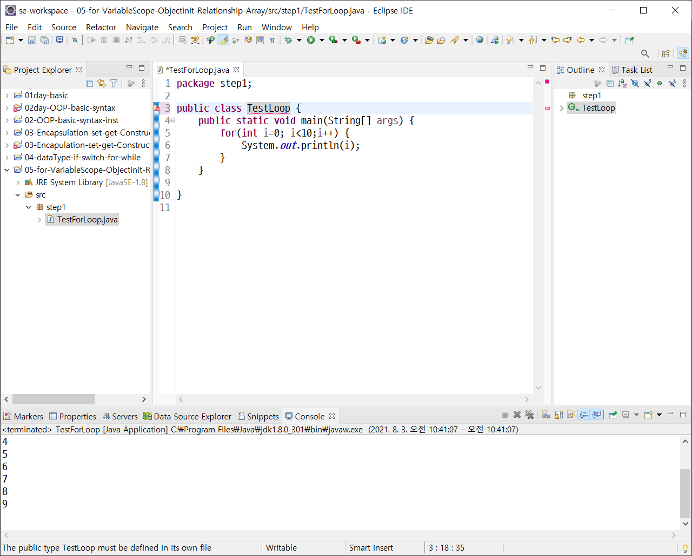
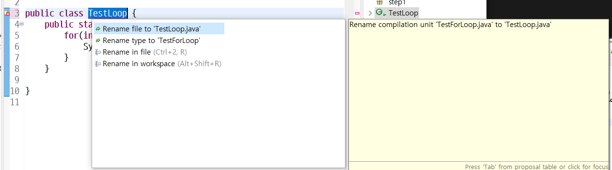
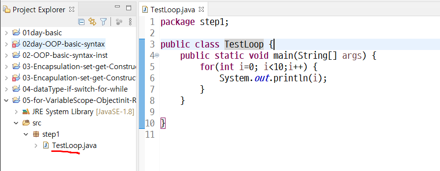
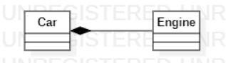

**5일차 수업목차**



- 파일 이름과 클래스명이 다르면 위와 같이 클래스 이름에 빨간 줄이 생김



옆에 있는 폴더 아이콘을 클릭하면 대안을 제시해줌

클릭해주면



파일명도 바뀐다!


Variable Scope 변수 범위

- Instance Variable
- Local Variable

# :one: Java 변수 종류

1. ## Instance Variable

   - 객체의 속성정보를 저장, java memory heap 영역에 저장,,
   - 선언만 해도 기본 초기화 됨(int age; -->0으로 초기화, String name; -->null로 초기화, boolean flag; -->false로 초기화)

2. ## Local Variable

   - 지역변수, 임시로 사용되는 변수, 메서드 또는 생성자에 의해 선언되고 초기화된다
   - 지역변수라고 불리고 메서드 또는 생성자에서 임시로 사용되는 변수
   - instance variable 과 다르게 명시적인 초기화가 필요
     - 선언만 해서는 사용 불가!
   - java memory stack 영역에 저장
   - local variable은 자신이 선언되고 초기화된 영역에서만 사용가능

   

3. ## Static Variable

   - 이후 공부 예정~


## Java 주요 Memory 영역 🖥️

- Stack영역
  - Local Variable이 저장되는 영역
  - LIFO
    - Last In, First Out
- Heap 영역
  - Instance Variable이 저장되는 영역, 객체의 정보가 저장될 때 적재된 후 **주소값을 만들어 참조하게 한다**


## Object 객체 초기화 다계

1. 인스턴스 변수의 기본 초기화
2. 인스턴스 변수의 명시적 초기화
3. 생성자에 의한 초기화
4. 참조변수에 객체의 주소값 할당

### Object Init (객체 초기화)

```java
package step7;
/*
 *  코드 실행 결과를 예상해보기 
 */
public class TestObjectInit2 {
	public static void main(String[] args) {
		ObjectInitExam exam=new ObjectInitExam();
		Food f=new Food("칼국수",7000);		
		// 칼국수 7000 정보를 가진 객체의 주소값을 
		// pass1 메서드의 인자값으로 전달한다 
		exam.pass1(f);
		System.out.println(f.getName()+" "+f.getPrice());
		System.out.println(f.getName()+" "+f.getPrice());
		exam.pass2(f);
		System.out.println(f.getName()+" "+f.getPrice());
	}
}
```

```java
package step7;

public class ObjectInitExam {
	/*
	 * 1.
	 * main 의 호출한 메서드로부터 칼국수 7000 정보를 가진 객체의
	 * 주소값을 매개변수(지역변수)로 전달받는다.
	 * 2. 
	 * pass1 메서드의 매개변수이자 지역변수에 
	 * 새로운 객체(돈까스 9000 정보를 가진 객체)를 생성해서 
	 * 새로운 객체의 주소값을 할당한다 
	 * 3. pass1 메서드가 종료된다
	 * ( 종료되면 stack 영역에 f 지역변수를 메모리에서 삭제되고 
	 * 참조한 새 객체(돈까스 9000)는 Garbage Collection 대상이 된다
	 */
	public void pass1(Food f) {
		f=new Food("돈까스",9000);
		System.out.println(f.getName()+" pass1 "+f.getPrice());
	}
	/* 1.
	 * main 의 호출한 메서드로부터 칼국수 7000 정보를 가진 객체의
	 * 주소값을 매개변수(지역변수)로 전달받는다.
	 * 2. 
	 * 전달받은 객체(칼국수 7000)의 주소값을 가지고 있는 매개변수(지역변수)를
	 * 이용해 setName() 메서드를 실행한다 
	 * 이때 setName() 의 인자값으로 쌀국수 문자열을 전달하는 데 
	 * 이는 메인에서 생성한 객체의 인스턴스 변수 정보를 수정하게 된다 
	 * 즉 TestObjectInit2 의 main 의 f 변수와 ObjectInitExam 의 pass2 의 f 변수는
	 * 각각 다른 지역변수지만 동일한 객체를 참조하고 있으므로 실제 Food의 name이
	 * 수정된다 
	 */
	public void pass2(Food f) {
		f.setName("쌀국수");
		System.out.println(f.getName()+" pass2 "+f.getPrice());
	}
}
```

```java
package step7;

public class Food {
	private String name;
	private int price;
	public Food(String name, int price) {
		super();
		this.name = name;
		this.price = price;
	}
	public String getName() {
		return name;
	}
	public void setName(String name) {
		this.name = name;
	}
	public int getPrice() {
		return price;
	}
	public void setPrice(int price) {
		this.price = price;
	}
	
}
```

결과값

```java
돈까스 pass1 9000
칼국수 7000
칼국수 7000
쌀국수 pass2 7000
쌀국수 7000
```


(처음엔 이해가 잘 안되다가 파이썬으로 돌려서 생각해보니 넘나 당연한 얘기를.,,)


## Object (or Class) Relationship

## : ``use a`` , ``has a ``,`` consist of relationship``

:`` association``> ``aggregation``> ``composition``

- ### ``association``(연관)

  - ``use a`` 관계
  - 사람이 렌트카를 이용하다
  - 

  

- ### aggregation(집합or 집단화)

  - ``has a`` 관계
  - 사람이 스마트폰을 가지고 있다
  - 

- ### ``composition``

  - ``consist of``
  - 자동차가 엔진을 가지고 있다
  - 사람이 뇌를 가지고 있다
  - 

---------

  **6일차 수업목차**
  - Object ( or Class) Relationship : code ( association , aggregation , composition )
  - Array(배열)

  	1. primitive data type 을 저장하는 배열 
  	2. reference data type을 저장하는 배열 
  - Overloading 
  
  - Inheritance 

  	 is a relationship 
  	 extends 
  	 super 	
  	 overriding 