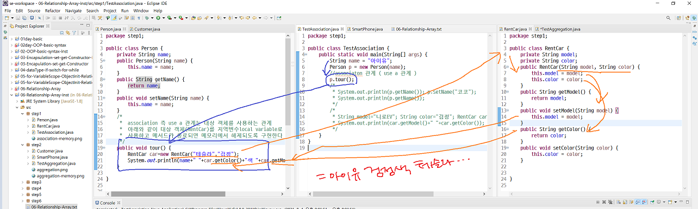
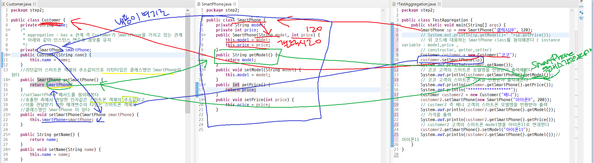
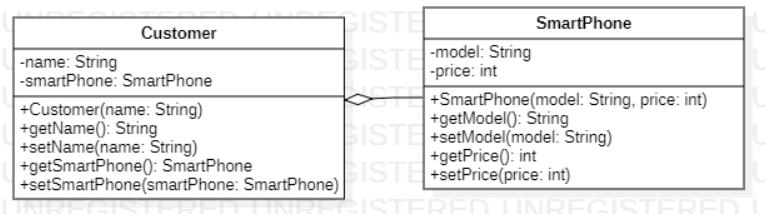
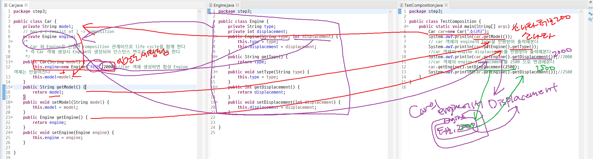

### 주석 처리 단축기

:``ctrl``+``shift``+``/``

- Association 예제

- ### ``association``(연관)

  - ``use a`` 관계
  - 사람이 렌트카를 이용하다



- Aggregation 예제

- ### aggregation(집합or 집단화)

  - ``has a`` 관계
  - 사람이 스마트폰을 가지고 있다





- 위의 코드를 UML화시키기

- Composition 예제

- ### ``composition``

  - ``consist of``
  - 자동차가 엔진을 가지고 있다
  - 사람이 뇌를 가지고 있다



# 💫Array

> 다수의 데이터를 효과적으로 관리하기 위해 사용

1. ## primitive data type의 데이터를 저장하는 배열

   - 배열 선언 ``int[] age; `` or ``int age[];``

   - 배열 생성 ``age=new int[3];`` 

     - 3개의 공간이 있는 배열 객체 생성

   - 배열 요소를 할당 ``age[0]=22;`` ``age[1]=24; age[2]=18;``

     - 배열 인덱스는 0부터 시작

     ``age.length;``: 배열의 사이즈 반환

자동완성: ``ctrl``+``space``

```java
package step5;

public class TestArray4 {
	public static void main(String[] args) {
		String food[]= {"고기국수","참이슬","테라"};
		for(int i=0; i<food.length;i++)
			System.out.println(food[i]);
	}

}
```

- 실행문이 한 줄이면 **중괄호 생략가능**


2. ## reference data type 의 데이터를 저장하는 배열

   - 배열 선언: ``Person[] pa; `` or ``Person pa[];``

   - 배열 생성: ``pa=new Person[3];``

   - 배열 요소 할당: ``pa[0]=new Person("아이유",28);``

     

--------

미리미리 예습하기!

# 상속:moneybag:

> 새로운 객체가 기존 객체가 갖고 있는 **변수나 메소드를 그대로 물려받으면서** 필요에 따라 자신만의 새로운 변수와 **메소드를 추가하거나 기존의 변수와 메소드를 변경해서 사용**할 수 있게 하는 것

- 부모 클래스

  = 상위 클래스

  = 기초 클래스

- 자식 클래스

  = 하위 클래스

  = 유도 클래스

```java
package org.opentutorials.javatutorials.Inheritance.example1;
 
class Calculator {
    int left, right;
 
    public void setOprands(int left, int right) {
        this.left = left;
        this.right = right;
    }
 
    public void sum() {
        System.out.println(this.left + this.right);
    }
 
    public void avg() {
        System.out.println((this.left + this.right) / 2);
    }
}
 
class SubstractionableCalculator extends Calculator {
    public void substract() {
        System.out.println(this.left - this.right);
    }
}
 
public class CalculatorDemo1 {
 
    public static void main(String[] args) {
 
        SubstractionableCalculator c1 = new SubstractionableCalculator();
        c1.setOprands(10, 20);
        c1.sum();
        c1.avg();
        c1.substract();
    }
 
}
```

```java
public class CalculatorDemo1 {
 
    public static void main(String[] args) {
 
        SubstractionableCalculator c1 = new SubstractionableCalculator();
        c1.setOprands(10, 20);
        c1.sum();
        c1.avg();
        c1.substract();
    }
 
}
```

- ``subtract`` 말고도 ``setOperands()``, ``sum()``,``avg()`` 세 개의 메소드를 ``SubstractionableCalculator()``클래스에서 사용할 수 있는 이유

  :point_right: ``class SubstractionableCalculator extends Calculator`` 때문

  이 같은 관계를 **``SubstractionableCalculator``가 Calculator 클래스를 상속**한다

- 상속은 끊임없이 할 수 있음

- 상위 클래스와 하위 클래스에 각각 생성자가 있음

  - 생성자가 하는 역할이 같다면 

  - 하위 클래스에서 상위 클래스에 있는 생성자와 똑같은 코드를 복사하는 대신 **하위 클래스가 생성될 때 상위 클래스의 생성자를 호출**

    :point_right: ``super``

```java
package org.opentutorials.javatutorials.Inheritance.example2;
 
class Calculator {
    int left, right;
 
    public void setOprands(int left, int right) {
        this.left = left;
        this.right = right;
    }
 
    public void sum() {
        System.out.println(this.left + this.right);
    }
 
    public void avg() {
        System.out.println((this.left + this.right) / 2);
    }
}
 
class SubstractionableCalculator extends Calculator {
    public SubstractionableCalculator(int left, int right) {
        this.left = left;
        this.right = right;
    }
 
    public void substract() {
        System.out.println(this.left - this.right);
    }
}
 
public class CalculatorConstructorDemo4 {
    public static void main(String[] args) {
        SubstractionableCalculator c1 = new SubstractionableCalculator(10, 20);
        c1.sum();
        c1.avg();
        c1.substract();
    }
```

```java
package org.opentutorials.javatutorials.Inheritance.example3;
 
class Calculator {
    int left, right;
     
    public Calculator(){}
     
    public Calculator(int left, int right){
        this.left = left;
        this.right = right;
    }
     
    public void setOprands(int left, int right) {
        this.left = left;
        this.right = right;
    }
 
    public void sum() {
        System.out.println(this.left + this.right);
    }
 
    public void avg() {
        System.out.println((this.left + this.right) / 2);
    }
}
class SubstractionableCalculator extends Calculator {
    public SubstractionableCalculator(int left, int right) {
        super(left, right);
    }
 
    public void substract() {
        System.out.println(this.left - this.right);
    }
}
 
public class CalculatorConstructorDemo5 {
    public static void main(String[] args) {
        SubstractionableCalculator c1 = new SubstractionableCalculator(10, 20);
        c1.sum();
        c1.avg();
        c1.substract();
    }
}
```

### ``super``는 상위 클래스를 가리키는 키워드

- super 키워드는 부모 클래스를 의미
- 여기에 ()붙이면 **부모 클래스의 생성자**를 의미
- 하위 클래스의 생성자에서 super를 사용할 때 주의할 점은 **super가 가장 먼저 나타나야 한다는 점**