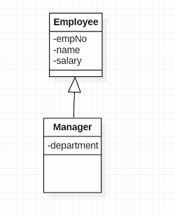
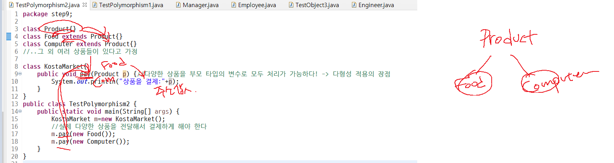

**8일차 주요목차**

review

single inheritance

overriding

java.lang.Object

polymorphism

Object Casting

--------

복습 1

```java
package step1;

class Animal{
	int age;
	Animal(int age){
		this.age=age;
	}
}

class Person extends Animal{
	String name;
	Person(){
		super();
	}
}


public class TestSuper3 {
	public static void main(String[] args) {
		
	}
}

```

- ``class Person extends Animal``의 **에러 이유**:
  - 기본으로 삽입되는 생성자의 ``super()``는 **부모의 매개변수가 없는 기본 생성자를 호출**하기때문
  - ``Animal ``부모 클래스는 **기본 생성자가 존재하지 않으므로** 아래 클래스는 compile error가 난다
- **해결방법**
  1. 자식 클래스의 생성자에서`` super()``를 명시할 때 **부모 생성자의 매개변수에 알맞는 인자값을 전달**
     - 주로 1번 선호됨! 부모를 바꾸는 것 보다는 자식 바꾸는 것이 더 효율적(다른 자식에까지 영향을 미칠 수 있음)
  2. 부모 클래스의 생성자를 **오버로딩하여 기본 생성자를 추가**

```java
class Person extends Animal{
	String name;
//	아래 생성자는 compile error가 나는 케이스
//	Person(){
//		super();
//	}
// 생성자를 명시하고 적절한 인자값을 전달하는 super(인자값)을 명시하면 됨
	Person(int age, String name){
		super(age);//반드시 첫라인에 배치되어야 함
		this.name=name;
	}
}
```




- 자식 객체 생성 시 자식 객체의 생성자 첫라인에 배치되는 ``super()`` 에 의해  **부모 -> 자식 순으로 객체가 생성**된다 


## Single Inheritance :person_frowning:

- 자바는 **단일 상속**을 채택
- 자바 **인터페이스로 다중 상속의 장점**을 가진다
- 이후 공부 예정
  - 자바 인터페이스를 이용하면 다중 상속의 장점인 **다양한 계층 구조 형성을 통한 다형성(Polymorphism)을 적용**할 수 있음

## Overriding :bike:

- **메서드 오버라이딩**
  - 부모 메서드를 자신에 맞게 재정의
  - 상속받은 부모 클래스의 메서드를 자식 객체에 알맞게 구현부를 업데이트해서 사용하게 하는 것
- **오버라이딩 문법**
  - 접근제어자는 하위(자식) 클래스의 메서드에서 더 좁아지면 안됨
  - 리턴타입, 메서드명, 매개변수 리스트는 동일해야 함
  - 이후 공부예정
    - 상위(부모) 메서드에서 선언한 Exception 또는 그 하위 Exception만 throws 가능

- 오버로딩은 동일한 메소드명으로 매개변수를 다양하게 해서 다양한 데이터 적재 가능
- 오버라이딩은 부모메소드를 자신에 맞게 재정의 -> 최대한 인터페이스를 간결하게 해서 사용자에게 편의성 제공 가능

## java.lang.Object

- 모든 자바 클래스의 **최상위 부모 클래스** , **모든 자바 객체는 부모로써 Object를 가지게 된다** 
  - Class Object is the root of the class hierarchy. Every class has Object as a superclass.
- java.lang.Object에 있는 **모든 기능을 자바 클래스(or java Object)는 상속**받게 된다 
- 필요시 **Object에 있는 메서드를 오버라이딩**해서 사용하기도 한다 


## Polymorphism :earth_asia:

- 객체지향 주요개념

  - Encapsulation, Inheritance, Polymorphism

- 하나의 메세지 방식으로 **다양한 객체들이 각자의 방식으로 동작하게 하는 성질**

  - One Interface, Multiple Implements

- 하나의 객체가 **다양한 타입의 변수로 참조**되는 성질

- 다형성 적용을 위해서는 **계층구조 형성**이 필요

- 자식 객체는 부모 타입의 변수로 참조 될 수 있음

  ```java
  Animal a = new Person();//가능
  Object o = new Person();//가능
  ```

  



