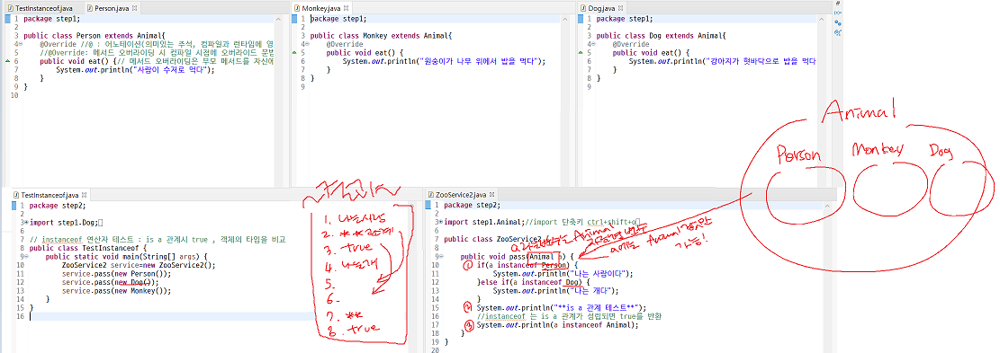
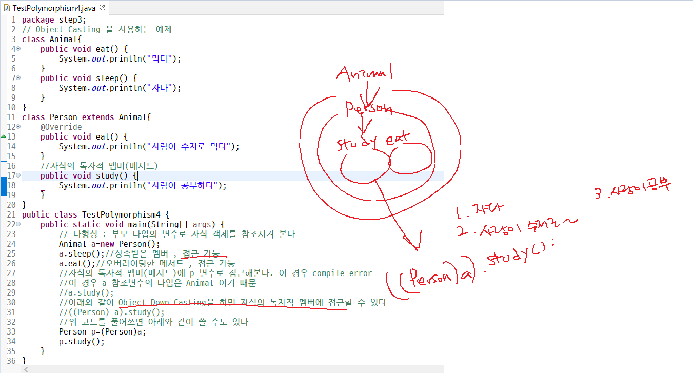
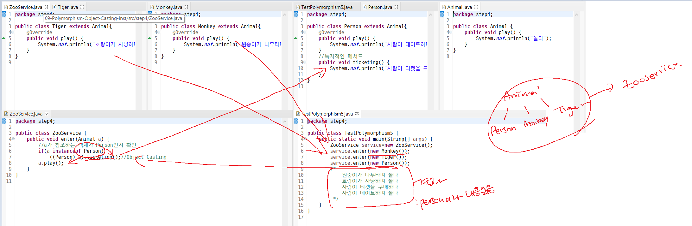
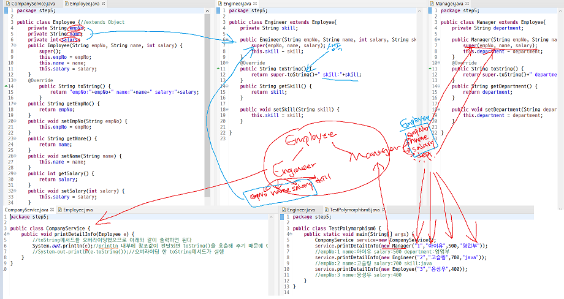
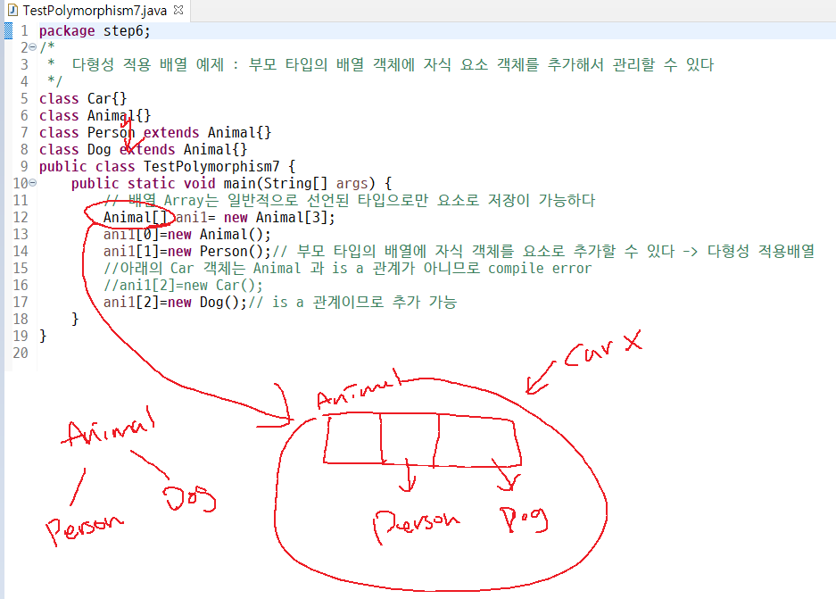
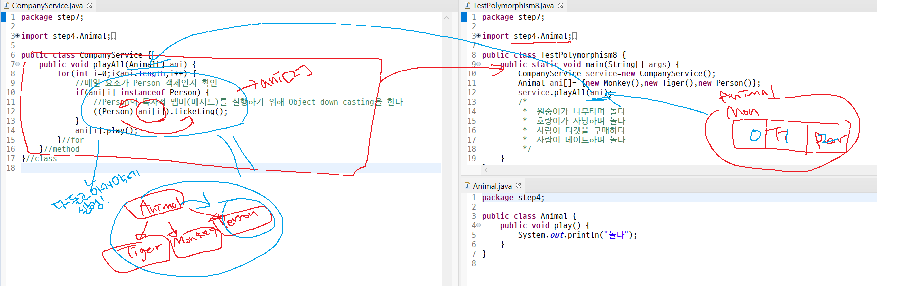
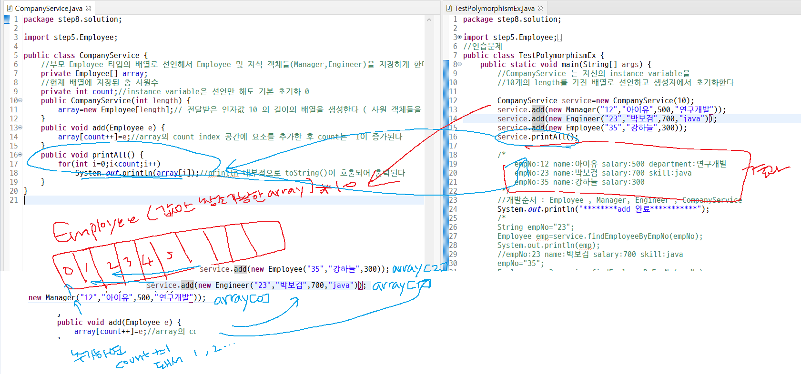

**9일차 주요목차**

- Polymorphism
- Instance of연산자
- Object casting


--------


## Polymorphism(다형성)

- 객체지향 주요개념

  - Encapsulation , Inheritance , Polymorphism

- 하나의 메세지 방식으로 다양한 객체들이 **각자의 방식으로 동작**하게 하는 성질 

  > One Interface , Multiple Implements 

- **하나의 객체가 다양한 타입의 변수로 참조**되는 성질

:point_right: 다형성(Polymorphism) 적용을 위해서는 **계층구조(hierarchy) 형성이 필요**

- **자식 객체는 부모 타입의 변수로 참조 될 수 있다** 

- 특정한 클래스 멤버를 모두 물려받아 재사용-> **자신의 특징적인 부분만 더 추가해서 생산적으로 개발**하는 것

```java
Animal a=new Person(); // 가능 
Object o=new Person(); // 가능
```


```java
package step9;

class Product{}
class Food extends Product{}
class Computer extends Product{}
//..그 외 여러 상품들이 있다고 가정 

class KostaMarket{
	public void pay(Product p) {
		System.out.println("상품을 결제:"+p);
	}
}
public class TestPolymorphism2 {
	public static void main(String[] args) {
		KostaMarket m=new KostaMarket();
		//실제 다양한 상품을 전달해서 결제하게 해야 한다 
		m.pay(new Food());
		m.pay(new Computer());
	}
}

```

- ``public void pay(Product p)``

  - 다양한 상품을 **부모 타입의 변수로 모두 처리가 가능**하다! 

    **:point_right: 다형성 적용의 장점** 


## Instance of 연산자

- 객체의 타입을 비교하기 위한 연산자 ``true`` or ``false`` 반환

- ``isarelation``일 경우에는 ``true``를 반환

- ```java
  class Animal{}
  class Person extends Animal{}
   Person p=new Person();
   sysout(p instanceof Person) -> true 
   sysout(p instanceof Animal) -> true : is a 관계이므로 true 반환  
  ```


## Object Casting

- **객체 캐스팅, 형변환**
- 부모 타입의 변수로 **자식 객체를 참조**할 경우
- 접근 가능한 영역은 **부모의 멤버, 오버라이드한 자식 객체의 메서드**이다
- 만약 자식의 독자적 멤버(인스턴스 변수, 메서드)에 접근하여 사용하려고 할 경우에는
- Object Casting(Object down casting)이 필요하다

```
Animal a= new Person();
```

- 위 코드는 부모 타입의 변수로 **자식 객체를 참조**한다

이 때 Person 객체의 독자적 멤버``(study())``에 접근하기 위해서는 아래와 같이 객체 캐스팅이 필요

```
((Person).a).study();
or
Person p = (Person)a;
p.study();
```

---------

급 궁금해져서 찾아보는 민주의 혼자공부

## toString()

- 기본 상속된 **Object 클래스의 메소드**
- **객체 정보를 문자열**로 출력
- 인스턴스 출력 시`` Object.hashCode()``로 **생성된 해시값을 문자열**로 반환
- 인스턴스 값 출력 시 만들어 둔 인스턴스의 정보를 편하게 출력하기 위해 **``toString()``메소드를 오버라이딩** 해두면 편리

```java
package step7;

public class Engineer extends Employee{
	private String skill;
	public Engineer(String empNo, String name, int salary, String skill) {
		super(empNo, name, salary);
		this.skill = skill;
	}
	@Override
	public String toString() {		
		return super.toString()+" skill:"+skill;
	}
}

```

- ``@Override``
  - 어노테이션
  - **의미있는 주석** 
  - 컴파일과 런타임시 영향을 준다 
  - ``@Override`` 어노테이션은 **컴파일시에 오버라이드 문법을 체크**해줌

- ``return super.toString()+" skill:"+skill;``
  - ``toString()`` 오버라이딩 메소드를 통해 정보를 편하게 출력할 수 있음


## 사용자 정의 자료형

```java
class Animal {
}
Animal cat;
```

:point_right: ``cat ``이라는 변수는 **``Animal`` 자료형 변수**

- ``cat``이라는 변수에는**``Animal``자료형에 해당되는 값**만 담을 수 있다.

  -----------

  

## 코드 복습하기






```java
package step3;
// Object Casting 을 사용하는 예제 
class Animal{
	public void eat() {
		System.out.println("먹다");
	}
	public void sleep() {
		System.out.println("자다");
	}
}
class Person extends Animal{
	@Override
	public void eat() {
		System.out.println("사람이 수저로 먹다");
	}
	//자식의 독자적 멤버(메서드) 
	public void study() {
		System.out.println("사람이 공부하다");
	}
}
public class TestPolymorphism4 {
	public static void main(String[] args) {
		Animal a=new Person();
		a.sleep(); 
		a.eat(); 
		Person p=(Person)a;
		p.study(); 
	}
}

```

- ``Animal a=new Person();``
  - 다형성 : 부모 타입의 변수로 **자식 객체를 참조**시켜 본다

- ``a.sleep();``
  - 상속받은 멤버 , 접근 가능 
- ``a.eat();``
  - 오버라이딩한 메서드 , 접근 가능 

- ``a.study();``

  - 자식의 독자적 멤버(메서드)에`` p ``변수로 접근해본다. 이 경우 ``compile error``

  - 이 경우 ``a`` 참조변수의 타입은 ``Animal`` 이기 때문 

  - 아래와 같이 **Object Down Casting**을 하면 자식의 독자적 멤버에 접근할 수 있다 

    ``((Person) a).study();``

    - 위 코드를 풀어쓰면 아래와 같이 쓸 수도 있다 

    - ```java
      Person p=(Person)a;
      p.study(); 
      ```










