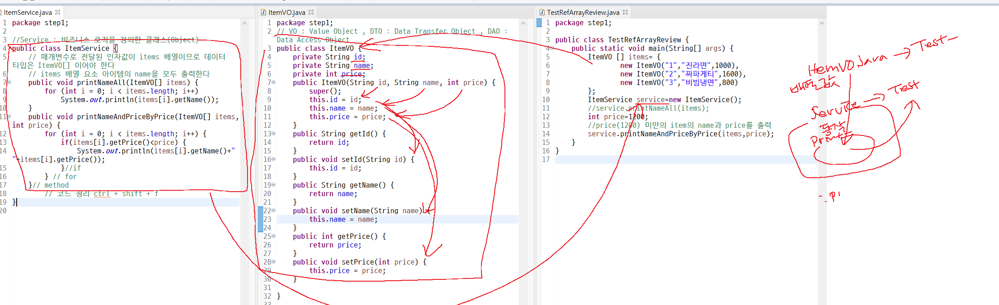
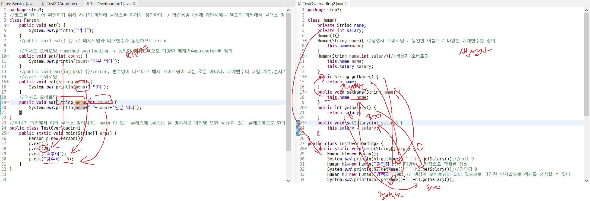
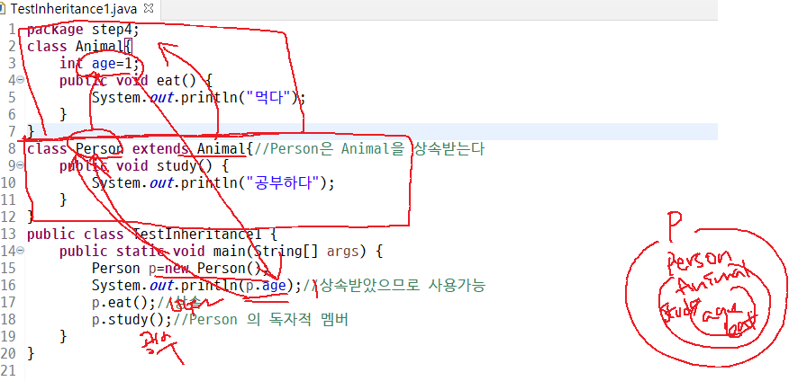
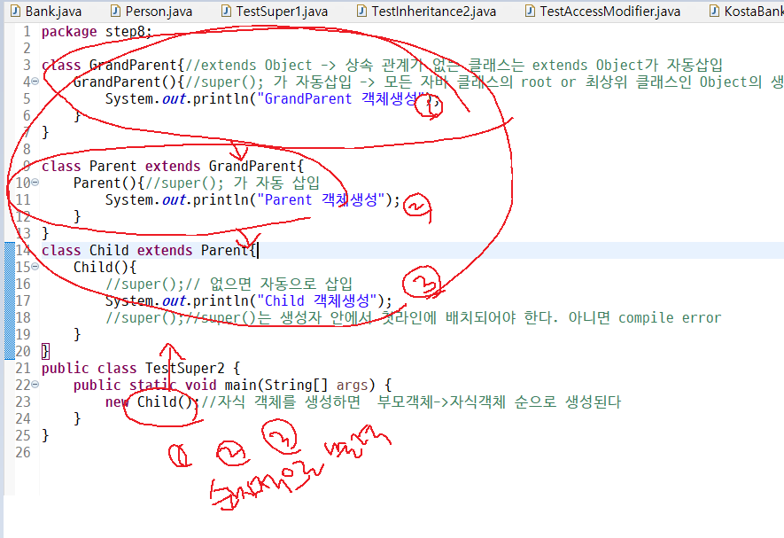
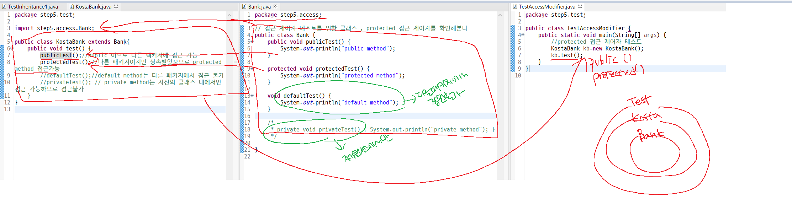
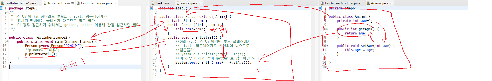
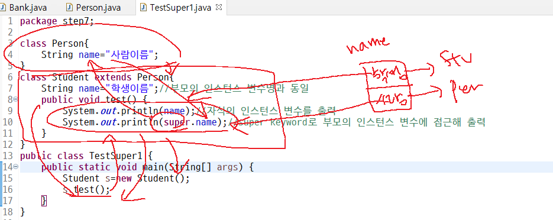
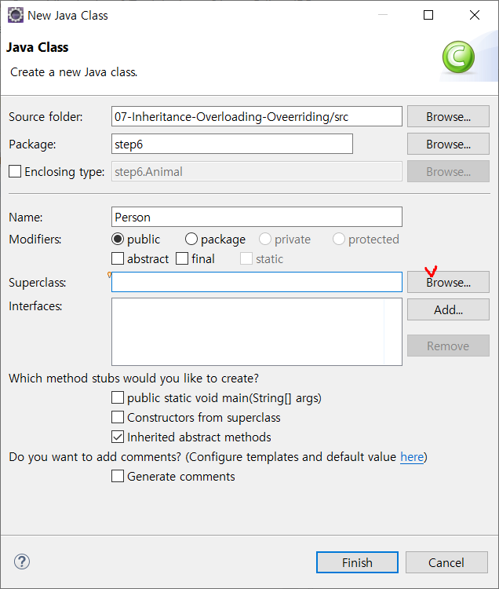

7일차 주요목차**

- Array
- Overloading
- Inheritance
  - is a relationship
  - extends
  - super
  - overriding
- Polymorphism

--------------------

- Array 배열: 다수의 데이터를 효과적으로 관리하기 위한 객체

  - 참조형 데이터를저장하는 배열

  - HOW 🤷

    1. 배열 선언:`` Person[] p;``

       - p는 배열 **객체를 참조하는 변수**, 데이터 타입은 ``Person[]``**배열 타입**
    2. 배열 생성: ``p=new Person[3];``
       - length 3 **배열을 생성**
    3. 배열 요소에 **정보를 할당**: ``p[0] = new Person("아이유",30);``

- 1.2.3 배열 **생성 할당을 동시**에

  ``person [ ] p = {new Person("아이유",30),new Person("이강인",20)};``

  - 2개 요소를 저장한 배열 생성
  
  
  
  



코드정리


``ctrl``+``shift``+``f``

- ``VO`` : Value Object 
- `` DTO`` : Data Transfer Object 
- `` DAO`` : Data Access Object

## Overloading

- 동일한 이름으로 다양한 데이터(매개변수)를 정의

- 인터페이스를 간결하게 하며 사용자(client system or client code)의 편의성 증대 

  - ex) java se API: ``System.out.println() ``메서드

  

  ### Method Overloading

  > - 동일한 메서드명으로 다양한 매개변수를 정의
  > - 다양한 데이터를 적재/로드
  > - 매개변수의 타입의 개수나 순서 둘중에 하나만 달라도 메소드 오버로딩에 해당

  ```java
  public void eat(){}
  public void eat(String menu){}//오버로딩
  public void eat(String menu,int count){}//오버로딩
  ```

  ```java
  package step3;
  //코드를 한 눈에 확인하기 위해 하나의 파일에 클래스를 여러개 정의 (학습용도로 하는것)
  //실제 개발 시에는 별도의 파일에서 클래스 정의 권장
  
  class Person{
  	public void eat() {
  		
  	}
  //	메서드 오버로딩
  	public void eat(int count) {
  		System.out.println(count+"인분");
  	}
  //	메서드 오버로딩
  	public void eat(String menu) {
  		System.out.println(menu+"먹다");
  	}
  	public void eat(String menu, int count) {
  		System.out.println(menu+" "+count+"인분 먹었습니다");
  	}
  }
  
  public class TestOverloading1 {
  	public static void main(String[] args) {
  		Person p=new Person();
  		p.eat(1);
  		p.eat(2);
  		p.eat("tomato marinade");
  		p.eat("basil pasta",2);
  	}
  	
  
  }
  ```

  - 하나의 파일에서 여러 클래스 정의시에는 **main이있는 클래스에 public을 명시**하고 **파일명 또한 main**이 있는 클래스명으로 한다

  

  ### Constructor Overloading

  - 생성자 오버로딩은 매개변수가 다른 생성자를 여러개 만들어내는 것

  
  
  ```java
  public Person(){}
  public Person(String name){}//생성자 오버로딩
  public Person(String name, int salary)//생성자 오버로딩
  ```
  
  ```java
  package step3;
  
  class Human{
  	private String name;
  	private int salary;
  
  	Human(){}
  	
  	
  	Human(String name){// 생성자 오버로딩: 동일한 이름으로 다양한 매개변수를 정의
  		this.name=name;
  	}
  	Human(String name, int salary){//생성자 오버로딩
  		this.name=name;
  		this.salary=salary;
  	}	
  	
  	public String getName() {
  		return name;
  	}
  	public void setName(String name) {
  		this.name = name;
  	}
  	public int getSalary() {
  		return salary;
  	}
  	public void setSalary(int salary) {
  		this.salary = salary;
  	}
  }
  
  public class TestOverloading2 {
  	public static void main (String[] args) {
  		Human h1=new Human();
  		System.out.println(h1.getName()+" "+h1.getSalary());
  		Human h2 = new Human("김연경");
  		System.out.println(h2.getName()+" "+h1.getSalary());
  		Human h3 = new Human("강백호",300);
  		System.out.println(h3.getName()+" "+h3.getSalary());
  	}
  }
  ```
  
  


# Inheritance :family:

### 객체지향 주요 개념

- Encapsulation , Inheritance , Polymorphism 

> 부모(super class) 멤버(인스턴스 변수, 메서드)를 물려받아 **자식(sub class)이 재사용**

- ## ``Is a relationship``
  
  - 사람은 동물이다. 개는 동물이다. 고양이는 동물이다
  - 매니저는 사원이다. 엔지니어는 사원이다. 비서는 사원이다.
  - UML의 Class diagram에서는 generalization으로 is a 관계를 표현
  
- ## ``extends``
  
  - 상속받을 때 사용하는 자바 메서드
  
- ## ``super``

  - ``super``: 부모를 가리키는 자바 키워드(예약어)

  - ``super.멤버(변수 및 메서드)``:  부모의 멤버에 접근

  - **``super()``: 부모 생성자 호출**

    - ``super()``는 생성자 **첫 라인**에 위치, **부모 생성자를 호출하여 부모 객체를 생성**하게 한다
    - 만약 명시하지 않으면 **자동으로 삽입**
    - 자식 객체 생성하면 부모 객체가 함께 생성되어 메모리에 적재되고 이를 사용하게 될 수 있는 원리
      - **생성자에 ``super()``가 적용되기 때문**
    - 자식 객체를 생성하면 자식 객체의 생성자 첫라인에 배치되는 ``super()``에 의해 **부모-> 자식 순으로 객체 생성**

    

    ```java
    GrandParent 객체생성
    Parent 객체생성
    Child 객체생성
    ```

    

- ## ``overriding``


## ``protected Access Modifier``:

>  **패키지 내에서 접근**가능, 단 상속관계에서는 **다른 패키지에서 접근 가능**

``public``>``protected``>``defult``>``private``

```java
package step5.access;

// 접근 제어자 테스트를 위한 클래스 , protected 접근 제어자를 확인해본다 
public class Bank {
	public void publicTest() {
		System.out.println("public method");
	}

	protected void protectedTest() {
		System.out.println("protected method");
	}

	void defaultTest() {
		System.out.println("default method");
	}

	/*
	 * private void privateTest() { System.out.println("private method"); }
	 */

}
```

- public 은 ``public``

- protected는 ``protected``

- defult는 앞에 아무것도 적지 않으면 됨

- private는 ``private``

  - 사용하지 않으면 경고메세지창이 뜬다

- ```java
  public method
  protected method
  ```

  결과값!

- 





``ctrl``+``shift``+``5``: import 단축키

---------


**8일차 주요목차**

review

single inheritance

overriding

java.lang.Object

polymorphism

Object Casting





-------

## extends 와 import의 차이점 ?🤷

(급 궁금해짐)

- ``import``
  - 단순히 사용하고자 하는 **다른 클래스를 명시적으로 적어주거나 선언**하는 것
- ``extends``
  - 클래스와 클래스간의 1대1 관계에 대한 선언
  - 상위 클래스를 통해 새로운 클래스/인터페이스를 만드는 경우에 해당됨
  - 클래스간의 부모-자식 관계를 만들어주면서 **부모의 함수/멤버들을 자식이 그대로 사용이 가능**하도록 하는 것


### 오버라이딩

- 상속 관계에 있는 부모 클래스에서 이미 정의된 메소드를 자식 클래스에서 같은 시그니처를 갖는 메소드로 다시 정의하는 것

  - 자식 클래스는 부모 클래스의 ``private``멤버를 제외한 모든 메소드를 상속받는다
  - 이렇게 상속받은 메소드는?
    - 그대로 사용
    - 필요한 동작을 위해 재정의하여 사용 가능

  :point_right: **상속받은 부모 클래스의 메소드를 재정의하여 사용하는 것이 *메소드 오버라이딩***

- 오버라이딩 하기 위한 조건
  - 메소드의 선언부는 **기존 메소드와 완전히 같아야 함**
  - 메소드의 반환 타입은 **부모 클래스의 반환 타입**으로 **타입 변환할 수 있는 타입이라면 변경 가능**
  - 부모 클래스의 메소드보다 **더 큰 범위의 예외를 선언할 수 없음**


### 오버로딩? 오버라이딩? 🤷

- ``오버로딩(overloading)``은 **새로운 메소드**를 정의
- ``오버라이딩(overriding)``은 상속받은 **기존의 메소드를 재정의**