### Flask로 msa 구축하기

- MSA 에서 구축하려는 어플리케이션은 큰 리소스를 차지하지 않는다

  => 간단한 어플리케이션을 위해서는 flask가 필요!

- conda 가상환경을 사용해서 플라스크 라이브러리 설치
  - json을 파싱할 목적으로 플라스크 레스트풀도 설치
  - jsonify를 설치하면 전환가능 (json파일로)


- rest1.py

  

```python
import flask
import flask_restful
from flask_restful import reqparse
from flask import Flask,jsonify, request

app = Flask(__name__)
#app.config["DEBUG"] = True #디버깅모드 켜기 -> 안됨
#실행 파일을 변경하려면 설정변수에 FLASK_APP=new_file.py로 설정하면됨
# 디버그로 하려면 CMD창에서 set FLASK_DEBUG=True -> auto refresh 
# 디버깅 모드는 개발자 모드에서만 사용!

api = flask_restful.Api(app)


@app.route('/')  #위의 api를 가져오는것
def index():
    return "Hello, Flask!"

def multiply(param1, param2): # 상태값을 갖는 것이 아니라 단순연산이기때문에 클래스 필요없음
    return param1 * param2


class HelloWorld(flask_restful.Resource): # 클래스 생성 시 레스트풀의 리소스 상속받아서 정의하면 됨
    def get(self): # 플라스크 안의 인스턴스는 반드시 셀프를 가짐/일반적 펑션이 아니라 method라고 부른다
        #전달하는 방법을 쿼리 스트링이라고 부른다. &가 들어오면 여러가지 파라미터를 넣을 수 있음
        # 많은 클래스가 해당 메소드 안으로만 들어간다
        parser = reqparse.RequestParser()

        parser.add_argument('param1')
        parser.add_argument('param2')
        args = parser.parse_args()
        # 주소값의 파라미터들 추가

        param1 = args['param1']
        param2 = args['param2']

        if (not param1) or (not param2):
            return {
                'state': 0,
                'response': None
            }

        param1 = int(param1)
        param2 = int(param2)

        result = multiply(param1,param2)

        return{
            'state':1,
            'response': result
        }

# api/multiply => GET지원, POST도 지원
# 하나의 클래스로 만들고 그 안에 리소스 넣는것도 괜찮음
# 주문 목록 /orders ( GET)
# 주문하기 / orders(POST)
# 주문 상세보기 /orders/ID (GET)
# 주문 수정하기 /orders/ID (PUT)
# 주문 삭제하기 /orders/ID (DELETE)


# 얘를 포스트 방식으로 호출하ㅏ면 에러남(포스트방식으로 만들지 않았기때문)
api.add_resource(HelloWorld,'/api/multiply') #수동으로 리소스 추가

if __name__ =='__main__':
    app.run()
```


- rest-test1.py

  ```python
  import unittest #중요한 부분. 잘 만들었는지 판단할 수 있는 기준. 단위테스트를 위한 코드
  import json
  import rest1
  
  class FlaskTest(unittest.TestCase):#사용자 요구사항을 위해 만든것
      def setUp(self): # db연동 등등의 작업
          rest1.app.testing = True
          self.client = rest1.app.test_client()
          
      #def tearDown(self): # 리소스 반환작업
      #/api/multiply?param1=3&param2=4
      # 결과로 12나와야됨
  
  
      def test_index(self): 
          #setup을 위한 준비작업. 티어다운을 통해 작업마무리(옵션임)
          response = self.client.get('/')
          self.assertEqual(response.status_code,200)
          # self.assertEqual(call, 12) #실제 값이 12면 성공
          #self.assertEqual(response.content_type,"text/html; charset")
          self.assertIn("text/html",response.content_type)
          self.assertEqual(response.charset, 'utf-8')
  
          content = response.data
          # 반환 데이터 확인
          self.assertEqual(content.decode('utf-8'), 'Hello, Flask!')
  
      def test_multiply(self):
          response = self.client.get('/api/multiply?param1=3&param2=4')
          self.assertEqual(response.status_code, 200)
          self.assertIn('application/json',response.content_type )
          # TDD 테스트코드로 정상적으로 만들어졌나 실험
          json_result = json.loads(response.data)
          self.assertEqual(json_result.get('state'),1)
          self.assertEqual(json_result.get('response'),12)
  
  if __name__ == '__main__':
      unittest.main()
  ```

  


- 일반적으로 사용하는 기능에 대해 미리 만들어놓는 것이 좋음

- 테스트케이스의 갯수는 피쳐의 갯수 * n 하는 것이 좋음

- 기능은 100개인데...테스트케이스는 300개인것이 좋음


이런 식으로

- 우리가 직접 테스트케이스를 만들고 직접 검증해봐야 함

- 하나의 처리에 대해 테스트 케이스를 2개로 만들어야됨
  - 1번에서 3번/ 2번에서 3번 이런 방식


- 위와 같은 방식으로 정상용 테스트와 비정상용 테스트 둘 다 해주어야 한다

- 정상 테스트
  - 데이터가 잘 들어감

- 비정상 테스트
  - 데이터베이스 커넥션이 안됨 --> 이 부분을 확인해서 적절한 에러 메세지 출력 여부와 사용자로부터 우회할 수 있는 가이드가 제공되어 있는지 등을 테스트 해보아야 함

- 새롭게 추가된 기능은 다시 시도해 볼 필요가 있다

  - 중간에 수정작업을 하면서 코드가 변경되었을 것

  - 단 한 줄이라고 바꿨으면 처음부터 시행해야 하는 것

  - 개발하는 모듈이 있을 때마다 자리에서 개발자들이 직접 단위 테스트하고 한꺼번에 통합 테스트

  - 개발자들이 각각 작업했을 때는 그렇지 않지만 통합 테스트에서는 다시 해보아야 함

    => ALL PASS 되면 유저 테스트로 넘어간다

- 유저 테스트로 넘어가면 UAT 라고 부름

  - User Accepted Test -> 실제 환경과 같게 테스트

- 테스트의 일정은 20~30% 정도는 할당해야 함

  - 프로젝트를 진행하면 필수항목이 될 것! 
  - 테스트 케이스는 미리미리 만들어준다. 

- 테스트 케이스는 처음에는 무조건 실패 -> 성공으로 바꾸는 과정: TDD(Test Driven Development)


- #### 테스트 케이스 코드 1

```python
    def test_index(self): 
        #setup을 위한 준비작업. 티어다운을 통해 작업마무리(옵션임)
        response = self.client.get('/')
        self.assertEqual(response.status_code,200)
        # self.assertEqual(call, 12) #실제 값이 12면 성공
        #self.assertEqual(response.content_type,"text/html; charset")
        self.assertIn("text/html",response.content_type)
        self.assertEqual(response.charset, 'utf-8')

        content = response.data
        # 반환 데이터 확인
        self.assertEqual(content.decode('utf-8'), 'Hello, Flask!')
```

- #### 테스트 케이스 코드2

```python
    def test_multiply(self):
        response = self.client.get('/api/multiply?param1=3&param2=4')
        self.assertEqual(response.status_code, 200)
        self.assertIn('application/json',response.content_type )
        # TDD 테스트코드로 정상적으로 만들어졌나 실험
        json_result = json.loads(response.data)
        self.assertEqual(json_result.get('state'),1)
        self.assertEqual(json_result.get('response'),12)
```

-> state code 1번과 응답 12번이 출력되어야 한다!

- 테스트 코드를 먼저 만들어두어야 나중에 개발할 때 수월하게 할 수 있다!

모듈 프로젝트나 파이널 프로젝트를 만들 때 개발하는 과정에 있어서 테스트케이스를 잘 만족했는지 따져보는 것도 중요하다!

```
conda activate msa

C:\Users\i\Desktop\multi_work\flask_demo2

set FLASK_APP=order_ms.py

set FLASK_DEBUG=True
```


- get 이기 때문에 반환값이 없음


- POST 하고 코드 

```python
  def post(self, user_id):
       # parser = reqparse.RequestParser()
      #  parser.add_argument('coffee_name')
       # parser.add_argument('coffee_price')
       # parser.add_argument('coffee_qty')
       # args = parser.parse.args()

        json_data = request.get_json()
        json_data['user_id'] = user_id
        json_data['order_id'] = str(uuid.uuid4())
        json_data['order_at'] = str(datetime.today())

        response = jsonify(json_data)
        response.status_code =201 #생성 성공 코드
        return response

        #coffee_name = json_data['coffee_name']
        #coffee_price = json_data['coffee_price']
        #coffee_qty = json_data['coffee_qty'] # 얻어올 파라미터 3개
        
        #return jsonify(json_data),201
        #{'coffee_name': coffee_name, 'coffee_price':coffee_price},201
```

생성 성공 코드 명시해둔 부분 볼 수 있음!


```python
class Order(flask_restful.Resource):
    def __init__(self):
        self.conn = mariadb.connect(**config)
        self.cursor = self.conn.cursor()

```

__init__ 을 생성하고 내용 수정!


```python
def post(self, user_id):
       # parser = reqparse.RequestParser()
      #  parser.add_argument('coffee_name')
       # parser.add_argument('coffee_price')
       # parser.add_argument('coffee_qty')
       # args = parser.parse.args()

        json_data = request.get_json()
        json_data['user_id'] = user_id
        json_data['order_id'] = str(uuid.uuid4())
        json_data['ordered_at'] = str(datetime.today())

        #DB 삽입
        sql = '''INSERT INTO mydb(user_id, order_id, coffee_name, coffee_price, coffee_qty, ordered_at)
                    VALUES(?,?,?,?,?,?)
        '''
        self.cursor.execute(sql,[user_id,
                                json_data['order_id'],
                                json_data['coffee_name'],
                                json_data['coffee_price'],
                                json_data['coffee_qty'],
                                json_data['ordered_at']])
        self.conn.commit()
        # kafka message send

        response = jsonify(json_data)
        response.status_code =201 #생성 성공 코드
        return response
```

post 함수도 수정해준다!


포스트맨에서도 확인가능


```python
def get(self, user_id):
        sql = "select * from mydb where user_id=? order by id desc"
        self.cursor.execute(sql,['user_id']) #최신 데이터를 가져와서 반환
        result_set = self.cursor.fetchall()

        json_data = []
        for result in result_set:
            json_data.append(result)
        
        return jsonify(json_data)

        #return {'payload': user_id}
        #return {'user_id': user_id}

        sql = '''select user_id, order_id, coffee_name, coffee_price, coffee_qty, ordered_at
                from orders where user_id=? order by id desc '''
        
        self.cursor.execute(sql,[user_id])
        result_set = self.cursor.fetchall()

        row_headers = [x[0]for x in self.cursor.description]


        json_data =[]
        for result in result_set:
            json_data.append(dict(zip(result)))

        return jsonify(json_data)

```

GET함수 수정

```python
def post(self, user_id):
        json_data = request.get_json()
        json_data['user_id'] = user_id
        json_data['order_id'] = str(uuid.uuid4())
        json_data['ordered_at'] = str(datetime.today())

        #DB 삽입
        sql = '''INSERT INTO mydb(user_id, order_id, coffee_name, coffee_price, coffee_qty, ordered_at)
                    VALUES(?,?,?,?,?,?)
        '''
        self.cursor.execute(sql,[user_id,
                                json_data['order_id'],
                                json_data['coffee_name'],
                                json_data['coffee_price'],
                                json_data['coffee_qty'],
                                json_data['ordered_at']])
        self.conn.commit()
        # kafka message send

        response = jsonify(json_data)
        response.status_code =201 #생성 성공 코드
        return response

```

post 함수도 수정


POSTMAN으로 수정하면

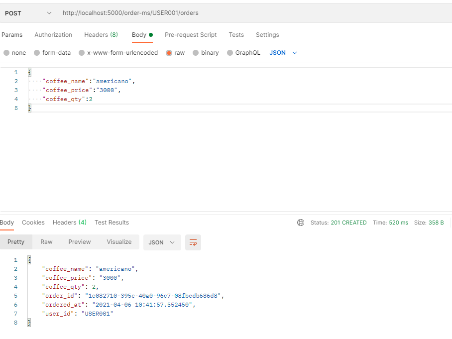

잘 돌아감


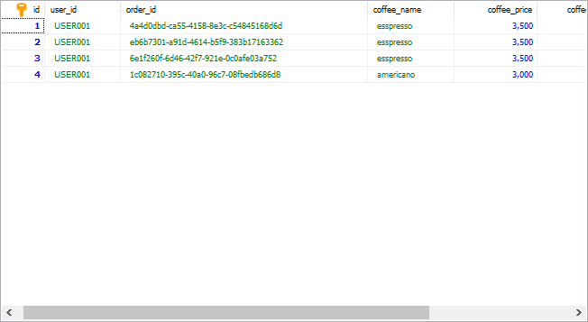

sql에서도 확인 가능


<order-ms.py>

```python
import flask
from flask import jsonify,request
from datetime import datetime
from flask_restful import Resource,reqparse,Api
from flask import Flask

import uuid
import flask_restful
import mariadb
import json


app = Flask(__name__)
app.config["DEBUG"] = True
api = flask_restful.Api(app)

config = {
    'host':'127.0.0.1',
    'port': 3306,
    'user': 'root',
    'password': '1234',
    'database': 'mysql'
}

@app.route('/order-ms')
def index():
    return "Welcome to ORDER Microservice!"

class Order(flask_restful.Resource):
    def __init__(self):
        self.conn = mariadb.connect(**config)
        self.cursor = self.conn.cursor()

    def get(self, user_id):
        sql = "select * from mydb where user_id=? order by id desc"
        self.cursor.execute(sql,['user_id']) #최신 데이터를 가져와서 반환
        result_set = self.cursor.fetchall()

        json_data = []
        for result in result_set:
            json_data.append(result)
        
        return jsonify(json_data)

        #return {'payload': user_id}
        #return {'user_id': user_id}

        sql = '''select user_id, order_id, coffee_name, coffee_price, coffee_qty, ordered_at
                from orders where user_id=? order by id desc '''
        
        self.cursor.execute(sql,[user_id])
        result_set = self.cursor.fetchall()

        row_headers = [x[0]for x in self.cursor.description]


        json_data =[]
        for result in result_set:
            json_data.append(dict(zip(result)))

        return jsonify(json_data)

    def post(self, user_id):
        json_data = request.get_json()
        json_data['user_id'] = user_id
        json_data['order_id'] = str(uuid.uuid4())
        json_data['ordered_at'] = str(datetime.today())

        #DB 삽입
        sql = '''INSERT INTO mydb(user_id, order_id, coffee_name, coffee_price, coffee_qty, ordered_at)
                    VALUES(?,?,?,?,?,?)
        '''
        self.cursor.execute(sql,[user_id,
                                json_data['order_id'],
                                json_data['coffee_name'],
                                json_data['coffee_price'],
                                json_data['coffee_qty'],
                                json_data['ordered_at']])
        self.conn.commit()
        # kafka message send

        response = jsonify(json_data)
        response.status_code =201 #생성 성공 코드
        return response

        #coffee_name = json_data['coffee_name']
        #coffee_price = json_data['coffee_price']
        #coffee_qty = json_data['coffee_qty'] # 얻어올 파라미터 3개
        
        #return jsonify(json_data),201
        #{'coffee_name': coffee_name, 'coffee_price':coffee_price},201

class OrderDetail(flask_restful.Resource):
    def get(self, user_id,order_id):
        return {'user_id':user_id, 'order_id': order_id}


api.add_resource(Order,'/order-ms/<string:user_id>/orders') #주소값은 하나지만 GET과 POST 모두 가능
#GET 방식에는 사용자 아이디 검색 가능한지 json으로 반환 가능한지 확인/POST에서는 유저네임 읽어들인 후에 주문날짜와 오더네임 추가 후 201번 출력
#201번 코드를 통해 정상작동 여부 판단 가능
api.add_resource(OrderDetail,'/order-ms/<string:user_id>/orders/<string:order_id>')

if __name__ == "__main__":
    app.run()
```


```
pip install kafka-python
```


```python
import flask
from flask import jsonify,request
from datetime import datetime
from flask_restful import Resource,reqparse,Api
from flask import Flask

import uuid
import flask_restful
import mariadb
import json

# 1. KafkaProducer() -> 생성자에 추가
from kafka import KafkaProducer


app = Flask(__name__)
app.config["DEBUG"] = True
api = flask_restful.Api(app)

config = {
    'host':'127.0.0.1',
    'port': 3306,
    'user': 'root',
    'password': '1234',
    'database': 'mysql'
}

@app.route('/order-ms')
def index():
    return "Welcome to ORDER Microservice!"

class Order(flask_restful.Resource):
    def __init__(self):
        self.conn = mariadb.connect(**config)
        self.cursor = self.conn.cursor()
        # 1. KafkaProducer() -> 생성자에 추가
        self.producer = KafkaProducer(bootstrap_servers=['localhost:9092'])
        


    def get(self, user_id):
        sql = "select * from mydb where user_id=? order by id desc"
        self.cursor.execute(sql,['user_id']) #최신 데이터를 가져와서 반환
        result_set = self.cursor.fetchall()

        json_data = []
        for result in result_set:
            json_data.append(result)
        
        return jsonify(json_data)


        sql = '''select user_id, order_id, coffee_name, coffee_price, coffee_qty, ordered_at
                from orders where user_id=? order by id desc '''
        
        self.cursor.execute(sql,[user_id])
        result_set = self.cursor.fetchall()

        row_headers = [x[0]for x in self.cursor.description]


        json_data =[]
        for result in result_set:
            json_data.append(dict(zip(result)))

        return jsonify(json_data)

    def post(self, user_id):
        json_data = request.get_json()
        json_data['user_id'] = user_id
        json_data['order_id'] = str(uuid.uuid4())
        json_data['ordered_at'] = str(datetime.today())

        #DB 삽입
        sql = '''INSERT INTO mydb(user_id, order_id, coffee_name, coffee_price, coffee_qty, ordered_at)
                    VALUES(?,?,?,?,?,?)
        '''
        self.cursor.execute(sql,[user_id,
                                json_data['order_id'],
                                json_data['coffee_name'],
                                json_data['coffee_price'],
                                json_data['coffee_qty'],
                                json_data['ordered_at']])
        self.conn.commit()
        # kafka message send
        
        # 2. producer 인스턴스의 send() 메소드로 json 데이터 전송

        self.producer.send('new_orders',value=json.dumps(json_data).encode())
        self.producer.flush()

        response = jsonify(json_data)
        response.status_code =201 #생성 성공 코드
        return response


class OrderDetail(flask_restful.Resource):
    def get(self, user_id,order_id):
        return {'user_id':user_id, 'order_id': order_id}


api.add_resource(Order,'/order-ms/<string:user_id>/orders') 
api.add_resource(OrderDetail,'/order-ms/<string:user_id>/orders/<string:order_id>')

if __name__ == "__main__":
    app.run()
```

코드 수정 후 

```
cd C:\Users\i\Desktop\multi_work\kafka # 카프카 디렉토리로 이동

bin/windows/zookeeper-server-start.bat config/zookeeper.properties #주키퍼 서버 실행

bin/windows/kafka-server-start.bat config/server.properties # 카프카 서버 실행

bin/windows/kafka-topics.bat --create --topic new_orders --bootstrap-server localhost:9092 # 카프카 토픽 생성

bin/windows/kafka-topics.bat --list --bootstrap-server localhost:9092 # 카프카 토픽 리스트 조회
```

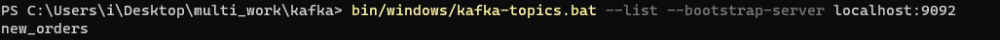

생성 확인!

새 창에서

```shell
bin/windows/kafka-console-consumer.bat --topic new_orders --from-beginning --bootstrap-server localhost:9092
```

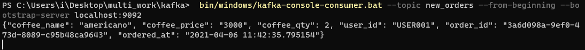

내용 확인!

중간에 WARN 문구가 떠서 


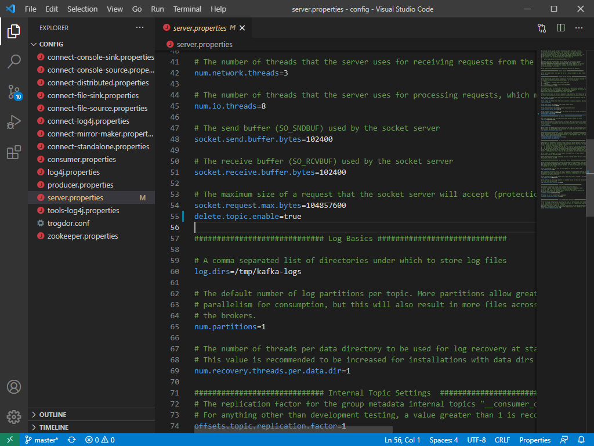

카프카 내의 ```server.properties```에서 ```delete.topic.enable=true``` 추가 해줬음!


- json데이터는 문자데이터로 db에 넣는다

- delivery status로 만들어서 저장

메세지에서 바로 처리하는 작업 말고..메세지에서 읽어 와서 확인하고 데베에 저장

소스의 변화를 가져와서 데이터를 넣는 것: 소스 커넥트

토픽에 업데이트 된 새로운 데이터를 감지해서 넘기는 것 : 싱크 커넥트

- delivery_ms.py

```python
from kafka import KafkaConsumer
import time
import json
import threading
from datetime import datetime
consumer = KafkaConsumer('new_orders',
                        bootstrap_servers=["localhost:9092"],
                        auto_offset_reset='earliest',
                        enable_auto_commit=True,
                        auto_commit_interval_ms=1000,
                        consumer_timeout_ms=1000
                        )

# kafka-client로 작업했었음

start = time.time()

#for message in consumer:
#    topic = message.topic
#    partition = message.partition
 #   offset = message.offset
  #  value = message.value
   # print("Topic:{},Partition:{}, Offset:{}, Value:{}".format(topic,partition,
    #offset,value))

def fetch_latest_orders(next_call_in):

    next_call_in += 5

    batch = consumer.poll(timeout_ms=100)
    if len(batch) > 0:
        for message in list(batch.values())[0]:
            print(message)

    threading.Timer(next_call_in - time.time(),
                    fetch_latest_orders,
                    [next_call_in]).start()

next_call_in = time.time()
fetch_latest_orders(next_call_in)


```

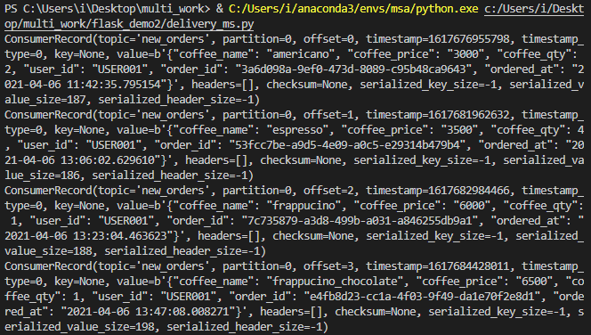

메세지 출력!


delivery_ms.py에  해당 내용을 추가한다

```python
    if len(batch) > 0:
        for message in list(batch.values())[0]:
            value = message.value.decode()
            order_dict=json.loads(value) #json데이터를 dict로 바꿔주는 함수 :loads
            print(order_dict["ordered_at"])
```

```python
from kafka import KafkaConsumer
import time
import json
import threading
from datetime import datetime
consumer = KafkaConsumer('new_orders',
                        bootstrap_servers=["localhost:9092"],
                        auto_offset_reset='earliest',
                        enable_auto_commit=True,
                        auto_commit_interval_ms=1000,
                        consumer_timeout_ms=1000
                        )

# kafka-client로 작업했었음

start = time.time()

#for message in consumer:
#    topic = message.topic
#    partition = message.partition
 #   offset = message.offset
  #  value = message.value
   # print("Topic:{},Partition:{}, Offset:{}, Value:{}".format(topic,partition,
    #offset,value))

def fetch_latest_orders(next_call_in):

    next_call_in += 5

    batch = consumer.poll(timeout_ms=100)
    if len(batch) > 0:
        for message in list(batch.values())[0]:
            value = message.value.decode()
            order_dict=json.loads(value) #json데이터를 dict로 바꿔주는 함수 :loads
            print(order_dict["ordered_at"])

    threading.Timer(next_call_in - time.time(),
                    fetch_latest_orders,
                    [next_call_in]).start()

next_call_in = time.time()
fetch_latest_orders(next_call_in)


```

그리고 다시 실행!

이렇게 역직렬화 시켜주어야 디코드 되어서 원하는 내용을 받을 수 있다!

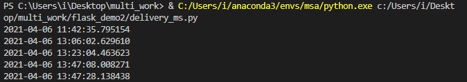

데이터가 저장된 시간이 출력된다!

인코드와 디코드 한 쌍이 맞아야 한다!


sql 내 db 수정!

```sql
create table delivery_status (
	id int auto_increment primary key,
	order_json text,
	created_at datetime default now()
);


alter table delivery_status 
	add column delivery_id varchar(50) after id;
alter table delivery_status 
	add column status varchar(50) after order_json;
```


```delivery_ms.py -> kafka_consumer.py```

```python
from kafka import KafkaConsumer
import time
import json
import threading
from datetime import datetime


import uuid
import flask_restful
import mariadb
import json
import mariadb


config = {
    'host':'127.0.0.1',
    'port':3306, 
    'user':'root',
    'password':'1234', 
    'database':'mysql'
}


consumer = KafkaConsumer('new_orders',
                        bootstrap_servers=["localhost:9092"],
                        auto_offset_reset='earliest',
                        enable_auto_commit=True,
                        auto_commit_interval_ms=1000,
                        consumer_timeout_ms=1000
                        )

# kafka-client로 작업했었음

start = time.time()

#for message in consumer:
#    topic = message.topic
#    partition = message.partition
 #   offset = message.offset
  #  value = message.value
   # print("Topic:{},Partition:{}, Offset:{}, Value:{}".format(topic,partition,
    #offset,value))


conn = mariadb.connect(**config)
cursor = conn.cursor()

sql = '''INSERT INTO delivery_status(delivery_id, order_json, status)
        VALUES(?,?,?)'''

def fetch_latest_orders(next_call_in):

    next_call_in += 5
    batch = consumer.poll(timeout_ms=100)
    if len(batch) > 0:
        for message in list(batch.values())[0]:
            value = message.value.decode()
            #order_dict=json.loads(value) #json데이터를 dict로 바꿔주는 함수 :loads
            #print(order_dict["ordered_at"])
            delivery_id = str(uuid.uuid4())

            status = 'CONFIRMED'
            cursor.execute(sql,[delivery_id,value,status])
            conn.commit()
       
    threading.Timer(next_call_in - time.time(),
                    fetch_latest_orders,
                    [next_call_in]).start()


next_call_in = time.time()
fetch_latest_orders(next_call_in)


```

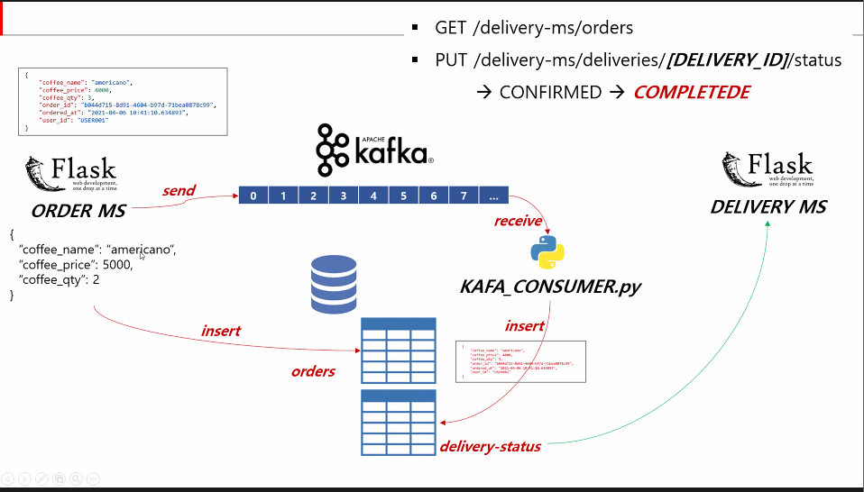

이렇게 만들어줄것

1. GET 
2. status바꾸기


- delivery_ms.py 만들기

  

```python
import flask
from flask import jsonify,request
from datetime import datetime
from flask_restful import Resource,reqparse,Api
from flask import Flask

import uuid
import flask_restful
import mariadb
import json

# 1. KafkaProducer() -> 생성자에 추가


app = Flask(__name__)
app.config["DEBUG"] = True
api = flask_restful.Api(app)

config = {
    'host':'127.0.0.1',
    'port': 3306,
    'user': 'root',
    'password': '1234',
    'database': 'mysql'
}

@app.route('/order-ms')
def index():
    return "Welcome to DELIVERY Microservice!"

class Delivery(flask_restful.Resource):
    def __init__(self):
        self.conn = mariadb.connect(**config)
        self.cursor = self.conn.cursor()
   
    def get(self):
        sql = "select delivery_id, order_json, status,created_at from delivery_status order by id desc"
        self.cursor.execute(sql)
        result_set = self.cursor.fetchall()

        json_data = []
        for result in result_set:
            json_data.append(result)
        
        return jsonify(json_data)


        sql = '''select user_id, order_id, coffee_name, coffee_price, coffee_qty, ordered_at
                from orders where user_id=? order by id desc '''
        
        self.cursor.execute(sql,[user_id])
        result_set = self.cursor.fetchall()

        row_headers = [x[0]for x in self.cursor.description]


        json_data =[]
        for result in result_set:
            json_data.append(dict(zip(result)))

        return jsonify(json_data)


class DeliveryStatus(flask_restful.Resource):
    def __init__(self):
        self.conn = mariadb.connect(**config)
        self.cursor = self.conn.cursor()

    def put(self, delivery_id):
        json_data = request.get_json()
        status = json_data['status']
        #DB 삽입
        sql = 'UPDATE delivery_status SET status=? WHERE delivery_id=?'
        self.cursor.execute(sql,[status,delivery_id])
        self.conn.commit()
        
        json_data['updated_at'] = str(datetime.today())
        response = jsonify(json_data)
        response.status_code =201 #생성 성공 코드

        return response


api.add_resource(Delivery,'/delivery-ms/deliveries') 
api.add_resource(DeliveryStatus,'/delivery-ms/deliveries/<string:delivery_id>') 

if __name__ == "__main__":
    app.run(port=6000)
```

기존 order_ms.py 와 비슷한 부분이 많아서 복붙한다음에 수정함

```set  FLASK_APP=delivery_ms.py```

```flask run --port 6000```

↑

얘랑

↓

```python delivery_ms.py```

둘 다 같은것!


수정 후 

플라스크를 돌리고 난 뒤

GET 

확인

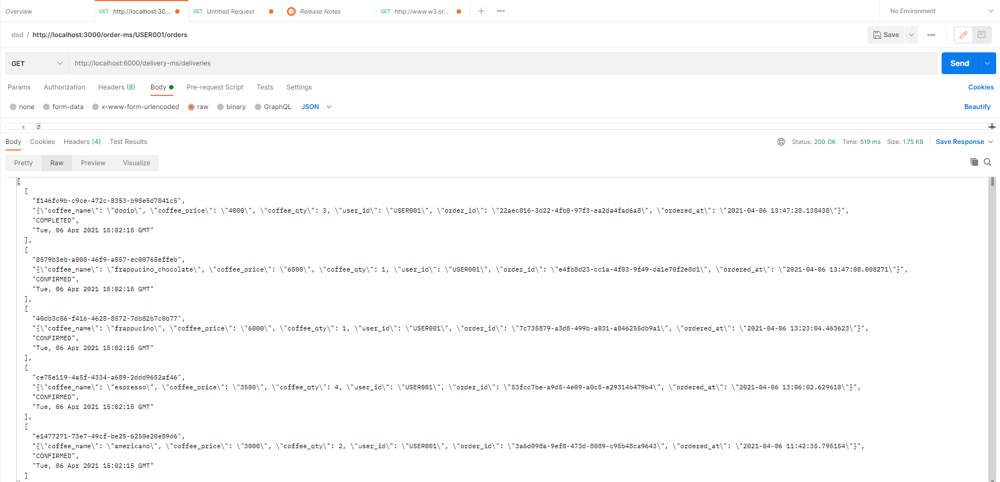


PUT 결과 확인하기!


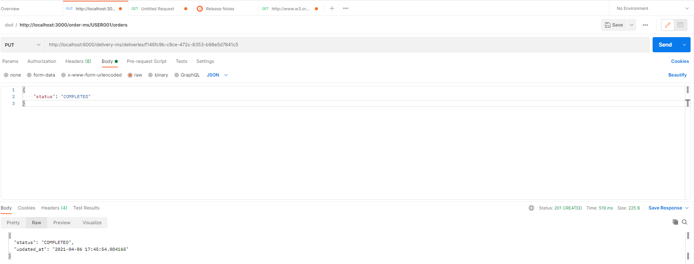


상태를 확인해준다

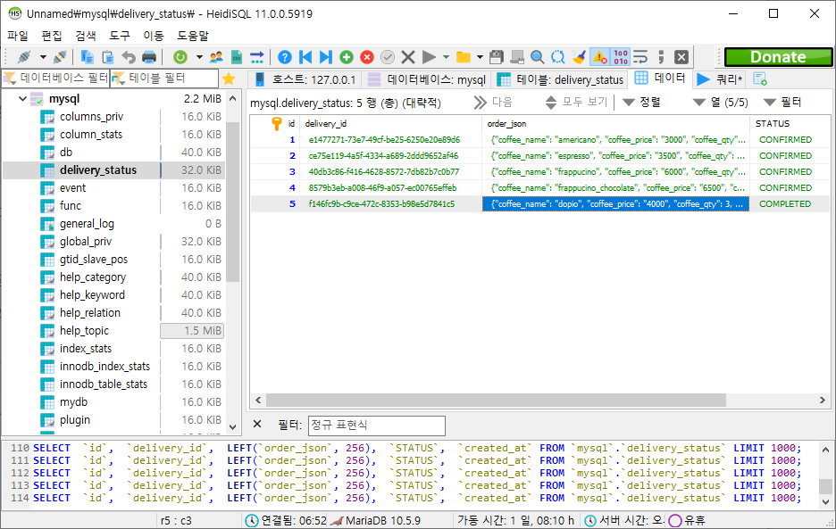

데이터베이스에서도 확인해주기!


끝~