```dockerfile
FROM python:3.7.9-stretch

WORKDIR /mydata # 컨테이너 내부 리눅스에 생기는 폴더
RUN pip install numpy
COPY ./test.py ./test.py
CMD ["python", "test.py"] 
#도커 실행 시 test 파일이 실행된다
#CMD python ${EXEC_FILE} # 실행시켜 종료되지 않도록 함

```

### 어제의 작업 내용

- 카프카라는 메세지 큐잉 서버 이용
- 주키퍼는 한 세트
  - 카프카-주키퍼로 한 세트 구성
  - 카프카 서버: 브로커라고 부름
  - 우리는 카프카 서버를 싱글로 사용하였다!
  - order-delivery/db
- order-ms.py -> db에 인서트
- 카프카에는 스케줄러가 있었음 (파이썬의 스레드로 생성)
- 스레드는 db에 저장
- db는 delivery-ms.py로 전달되어 읽고 업데이트 됨
- 30

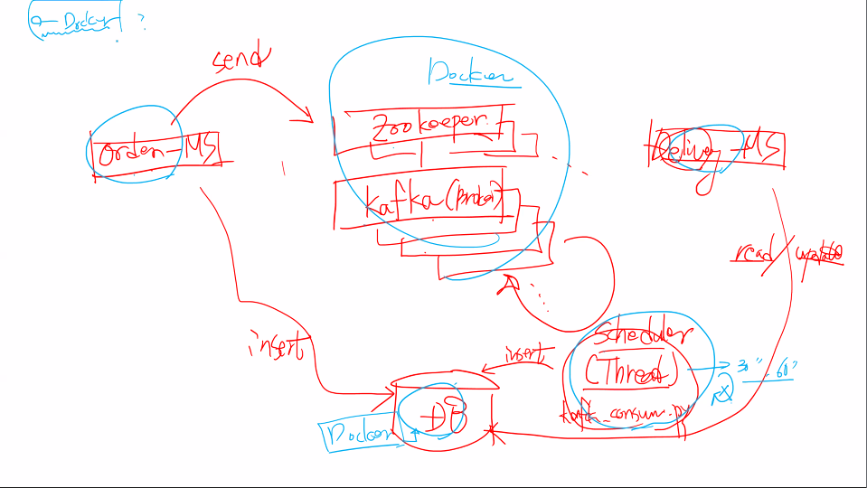

컨테이너 가상화로 이렇게 설치됩니다!

- 도커 컨테이너 사용 시 통합설치 가능(맥/윈도우 구분 없이)

- 클라우드 회사들이 가지는 컨테이너 환경에 우리의 이미지를 그대로 배포할 수 있음!

--> 최소 3가지의 도커파일 생성할 것!

```order-ms.py / Delivery-ms.py / Kafka_consumer.py```

--> DB는 도커파일로 생성 가능

- 로컬db나 AWS
- Zookeeper + Kafka 이미지는 제공될 것


```docker system prune```

컨테이너 다 지우기

```docker run -d -p 13306:3306 -e MYSQL_ALLOW_EMPTY_PASSWORD=true --name mydb mysql:5.7```

mysql 먼저 실행하기!


- delivery 먼저 실행
  - 하이디 먼저 접속

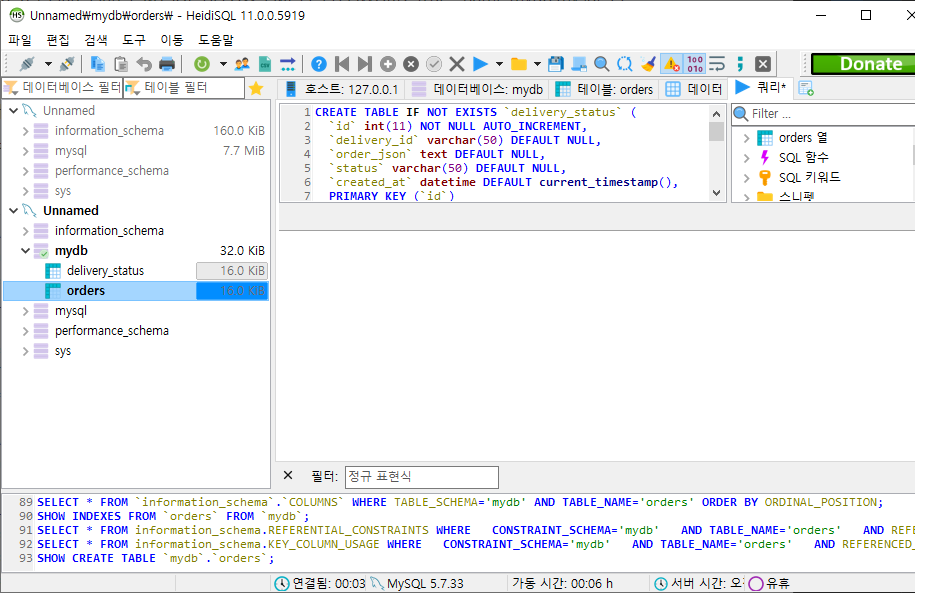

```sql
CREATE TABLE IF NOT EXISTS `delivery_status` (
  `id` int(11) NOT NULL AUTO_INCREMENT,
  `delivery_id` varchar(50) DEFAULT NULL,
  `order_json` text DEFAULT NULL,
  `status` varchar(50) DEFAULT NULL,
  `created_at` datetime DEFAULT current_timestamp(),
  PRIMARY KEY (`id`)
) ENGINE=InnoDB AUTO_INCREMENT=18 DEFAULT CHARSET=utf8;

CREATE TABLE IF NOT EXISTS `orders` (
  `id` int(11) NOT NULL AUTO_INCREMENT,
  `user_id` varchar(100) NOT NULL,
  `order_id` varchar(100) NOT NULL,
  `coffee_name` varchar(100) NOT NULL,
  `coffee_price` int(11) NOT NULL,
  `coffee_qty` int(11) DEFAULT 1,
  `ordered_at` varchar(50) DEFAULT NULL,
  PRIMARY KEY (`id`)
) ENGINE=InnoDB AUTO_INCREMENT=21 DEFAULT CHARSET=utf8;
```


- delivery-ms.py

```python
import flask
from flask import jsonify,request
from datetime import datetime
from flask_restful import Resource,reqparse,Api
from flask import Flask

import uuid
import flask_restful
import pymysql
import json

# 1. KafkaProducer() -> 생성자에 추가


app = Flask(__name__)
app.config["DEBUG"] = True
api = flask_restful.Api(app)

config = {
    'host':'127.0.0.1',
    'port': 3306,
    'user': 'root',
    'password': '1234',
    'database': 'mysql'
}

@app.route('/order-ms')
def index():
    return "Welcome to DELIVERY Microservice!"

class Delivery(flask_restful.Resource):
    def __init__(self):
        self.conn = pymysql.connect(**config)
        self.cursor = self.conn.cursor()
   
    def get(self):
        sql = "select delivery_id, order_json, status,created_at from delivery_status order by id desc"
        self.cursor.execute(sql)
        result_set = self.cursor.fetchall()

        json_data = []
        for result in result_set:
            json_data.append(result)
        
        return jsonify(json_data)


        sql = '''select user_id, order_id, coffee_name, coffee_price, coffee_qty, ordered_at
                from orders where user_id=? order by id desc '''
        
        self.cursor.execute(sql,[user_id])
        result_set = self.cursor.fetchall()

        row_headers = [x[0]for x in self.cursor.description]


        json_data =[]
        for result in result_set:
            json_data.append(dict(zip(result)))

        return jsonify(json_data)


class DeliveryStatus(flask_restful.Resource):
    def __init__(self):
        self.conn = pymysql.connect(**config)
        self.cursor = self.conn.cursor()

    def put(self, delivery_id):
        json_data = request.get_json()
        status = json_data['status']
        #DB 삽입
        sql = 'UPDATE delivery_status SET status=%s WHERE delivery_id=?'
        self.cursor.execute(sql,[status,delivery_id])
        self.conn.commit()
        
        json_data['updated_at'] = str(datetime.today())
        response = jsonify(json_data)
        response.status_code =201 #생성 성공 코드

        return response


api.add_resource(Delivery,'/delivery-ms/deliveries') 
api.add_resource(DeliveryStatus,'/delivery-ms/deliveries/<string:delivery_id>') 

if __name__ == "__main__":
    app.run(port=6000)
```

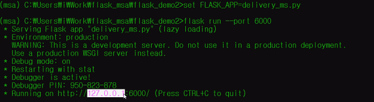

- 플라스크 서버가 127.0.0.1 만 허락한다는 뜻

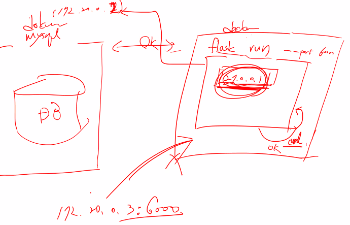

=> 그렇기 때문에 다른 호스트나 포트번호로 접속하는 것이 안됨

=> **다른 호스트가 접근할 수 있도록 허용해주어야 한다!**


도커파일 생성

```Dockerfile_delivery```

```dockerfile
FROM python:3.7.9-stretch

WORKDIR /myflask

RUN pip install flask
RUN pip install flask_restful
RUN pip install pymysql


COPY  ./delivery_ms.py /myflask/app.py

CMD ["flask","run","--host","0.0.0.0","--port","6000"]
```

``` build -t 6democratickim9/flask_delivery_ms -f Dockerfile .```

```docker run -d -p 16000:6000 6democratickim9/flask_delivery_ms```

- 명령어로 도커파일 이미지 생성 및 컨테이너화 해주기

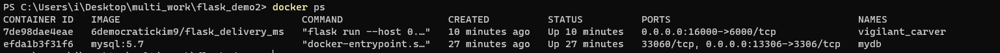

확인!


- 카프카와 도커 연결하기
- ```git clone https://github.com/wurstmeister/kafka-docker.git```

clone 하고 난 상태로 docker-compose-single-brocker.yml 파일을 열고 난 뒤 내용 적어줌

```yml
version: '2'
services:
  zookeeper:
    image: wurstmeister/zookeeper
    ports:
      - "2181:2181"
  kafka:
    build: wurstmeister/kafka
    ports:
      - "9092:9092"
    environment:
      KAFKA_ADVERTISED_HOST_NAME: 192.168.99.100
      KAFKA_CREATE_TOPICS: "test:1:1"
      KAFKA_ZOOKEEPER_CONNECT: zookeeper:2181
    volumes:
      - /var/run/docker.sock:/var/run/docker.sock

```

카프카 ip주소

컨테이너 내부의 자료가 되기 때문에 외부에서 사용할 수 없음

딜리버리 - 플라스크 설치 후 실행. 옵션없이 실행 시 127.0.01 로 실행됨

exec -it  <딜리버리 서비스> bash -> 컨테이너 내부로 설치

curl로 127.0.0.1로 요청 시 컨테이너 내부이기 때문에 정상작동

윈도우 호스트로 접속 시 딜리버리 접속 안됨

카프카로 기동 -> 주키퍼와 세트

서버를 띄우고 난 뒤 오더로 로컬에서 시동

부트스트랩에 서버정보를 남긴다 (로컬호스트:9092)

로컬호스트라는 것은 하나의 윈도우 시스템에서 자기 자신이 가지고 있는 전체 아이피 대역대

그렇기 때문에 별도의 실행 환경을 가지고 있음

도커와 카프카 / 오더 서비스: 도커

어제와 마찬가지로 로컬호스트를 불러오면 9092가 안됨

즉, 왼 쪽의 도커 서비스로 가고싶은것...

도커라는 하나의 컨테이너

도커는 가상의 네트워크 사용

브릿지 네트워크(디폴트) 172.20.0.2(mysql)

172.20.0.1(mysql)

docker 

docker inspect <network id>

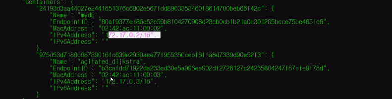

같은 네트워크 대역에 묶여있기 때문에 보인다

오더 서비스나 컨슈머에는 브로커 서버 번호를 입력해야 함

```yml
version: '2'
services:
  zookeeper:
    image: wurstmeister/zookeeper
    ports:
      - "2181:2181"
    networks:
      my-network:
        ipv4_address: 172.19.0.100
  kafka:
    image: wurstmeister/kafka
    ports:
      - "9092:9092"
    environment:
      KAFKA_ADVERTISED_HOST_NAME: 172.19.0.101
      KAFKA_CREATE_TOPICS: "test:1:1"
      KAFKA_ZOOKEEPER_CONNECT: zookeeper:2181
    volumes:
      - /var/run/docker.sock:/var/run/docker.sock
    depends_on:
      - zookeeper
    networks:
      my-network:
        ipv4_address: 172.19.0.101

networks:
  my-network:
    name: my-coffee-network

```

###### ```docker-compose -f docker-compose-single-broker.yml up -d```

```docker network create --gateway 172.19.0.1 --subnet 172.19.0.0/24 my-coffee-network```

```docker network inspect my-coffee-network```

```docker-compose -f docker-compose-single-broker.yml up -d```


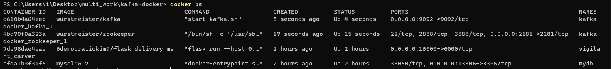

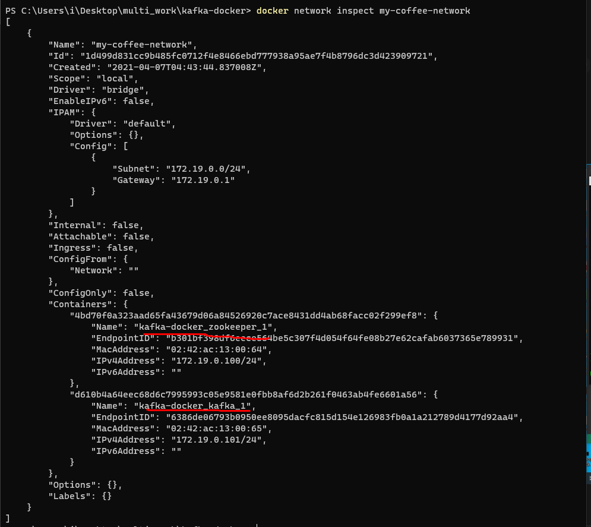

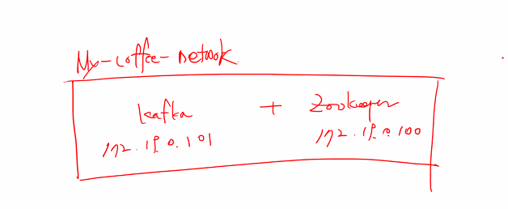

현재 이렇게 되어 있음

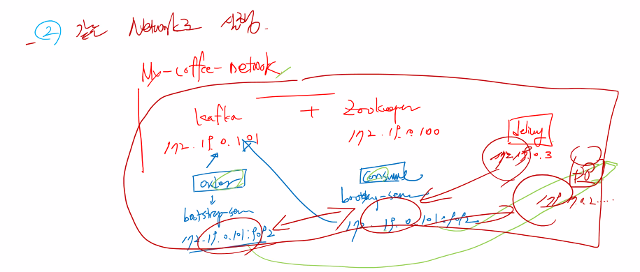

같은 네트워크로 묶어주기!

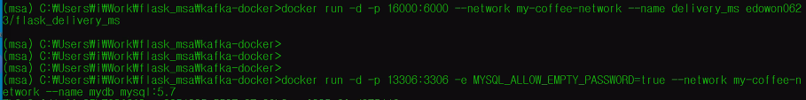


기존 카프카 관련 컨테이너 2개 빼고 삭제

그리고 다시 올려줌


###### ```PS C:\Users\i\Desktop\multi_work\flask_demo2> docker build -t 6democratickim9/flask_delivery_ms -f Dockerfile .```

도커파일 있는 디렉토리로 다시 넘어가서 도커파일 생성하기...(원래 컨테이너만 삭제하면 됐었는데 실수함ㅎ)

```docker run -d -p 16000:6000 --network my-coffee-network --name delivery_ms 6democratickim9/flask_delivery_ms```

```docker run -d -p 13306:3306 -e MYSQL_ALLOW_EMPTY_PASSWORD=true --network my-coffee-network --name mydb mysql:5.7```


delivery-ms.py 부분 수정

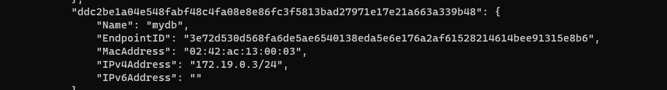

```python
config = {
    'host':'172.19.0.3/24', #현재 가지고있는 네트워크 ip주소 참고하고 수정하기 -> mydb
    'port': 3306,
    'user': 'root',
    'password': '1234',
    'database': 'mysql'
}
```

현재 my-coffee-network에 해당되는 컨테이너들 리스트를 보자!

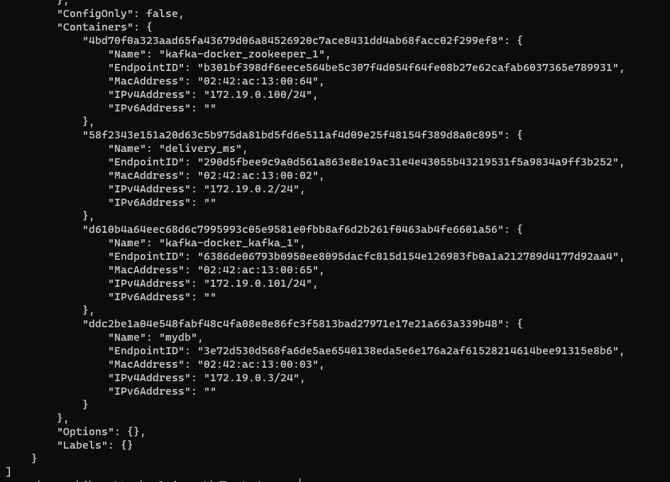


데이터베이스와 카프카 서비스 변경/order-ms도 로컬호스트에서 변경

mysql부분도 %s로 매개변수 변경


--------------------

```kafka-consumer.py```

```python
from kafka import KafkaConsumer
import time
import json
import threading
from datetime import datetime
import pymysql

import uuid
import json


consumer = KafkaConsumer('new_orders',
                        bootstrap_servers=["172.19.0.101:9092"],
                        auto_offset_reset='earliest',
                        enable_auto_commit=True,
                        auto_commit_interval_ms=1000,
                        consumer_timeout_ms=1000
                        )

config = {
    'host':'172.19.0.3/24',
    'port':3306, 
    'user':'root',
    'password':'', 
    'database':'mydb'
}

# kafka-client로 작업했었음


conn = pymysql.connect(**config)
cursor = conn.cursor()

sql = '''INSERT INTO delivery_status(delivery_id, order_json, status)
        VALUES(%s, %s, %s)'''

def fetch_latest_orders(next_call_in):

    next_call_in += 30
    batch = consumer.poll(timeout_ms=100)
    if len(batch) > 0:
        for message in list(batch.values())[0]:
            value = message.value.decode()
            #order_dict=json.loads(value) #json데이터를 dict로 바꿔주는 함수 :loads
            #print(order_dict["ordered_at"])
            delivery_id = str(uuid.uuid4())

            status = 'CONFIRMED'
            cursor.execute(sql,[delivery_id,value,status])
            conn.commit()
       
    threading.Timer(next_call_in - time.time(),
                    fetch_latest_orders,
                    [next_call_in]).start()


next_call_in = time.time()
fetch_latest_orders(next_call_in)


```

```order_ms.py```

```python
import flask
from flask import jsonify,request
from datetime import datetime
from flask_restful import Resource,reqparse,Api
from flask import Flask
import pymysql
import uuid
import flask_restful
import json

# 1. KafkaProducer() -> 생성자에 추가
from kafka import KafkaProducer


app = Flask(__name__)
app.config["DEBUG"] = True
api = flask_restful.Api(app)

config = {
    'host':'172.19.0.3',
    'port': 3306,
    'user': 'root',
    'password': '',
    'database': 'mydb'
}

@app.route('/order-ms')
def index():
    return "Welcome to ORDER Microservice!"

class Order(flask_restful.Resource):
    def __init__(self):
        self.conn = pymysql.connect(**config)
        self.cursor = self.conn.cursor()
        # 1. KafkaProducer() -> 생성자에 추가
        self.producer = KafkaProducer(bootstrap_servers=['172.19.0.101:9092'])
        


    def get(self, user_id):
        sql = '''select user_id, order_id, coffee_name, coffee_price, coffee_qty, ordered_at from orders where user_id=%s order by id desc'''
        self.cursor.execute(sql,['user_id']) #최신 데이터를 가져와서 반환
        result_set = self.cursor.fetchall()

        json_data = []
        for result in result_set:
            json_data.append(result)
        
        return jsonify(json_data)


        sql = '''select user_id, order_id, coffee_name, coffee_price, coffee_qty, ordered_at
                from orders where user_id=? order by id desc '''
        
        self.cursor.execute(sql,[user_id])
        result_set = self.cursor.fetchall()

        row_headers = [x[0]for x in self.cursor.description]


        json_data =[]
        for result in result_set:
            json_data.append(dict(zip(result)))

        return jsonify(json_data)

    def post(self, user_id):
        json_data = request.get_json()
        json_data['user_id'] = user_id
        json_data['order_id'] = str(uuid.uuid4())
        json_data['ordered_at'] = str(datetime.today())

        #DB 삽입
        sql = '''INSERT INTO orders(user_id, order_id, coffee_name, coffee_price, coffee_qty, ordered_at)
                    VALUES(%s,%s,%s,%s,%s,%s)
        '''
        self.cursor.execute(sql,[user_id,
                                json_data['order_id'],
                                json_data['coffee_name'],
                                json_data['coffee_price'],
                                json_data['coffee_qty'],
                                json_data['ordered_at']])
        self.conn.commit()
        # kafka message send
        
        # 2. producer 인스턴스의 send() 메소드로 json 데이터 전송
        
        self.producer.send('new_orders',value=json.dumps(json_data).encode())
        self.producer.flush()

        response = jsonify(json_data)
        response.status_code =201 #생성 성공 코드
        return response


class OrderDetail(flask_restful.Resource):
    def get(self, user_id,order_id):
        return {'user_id':user_id, 'order_id': order_id}


api.add_resource(Order,'/order-ms/<string:user_id>/orders') 
api.add_resource(OrderDetail,'/order-ms/<string:user_id>/orders/<string:order_id>')

if __name__ == "__main__":
    app.run()
```


dockerfile_delivery

```dockerfile
FROM python:3.7.9-stretch

WORKDIR /mykafka

RUN pip install pymysql
RUN pip install kafka-python

COPY ./kafka_consumer.py /mykafka/app.py

CMD ["python", "/mykafka/app.py"]


```


dockerfile_order

```dockerfile
FROM python:3.7.9-stretch

WORKDIR /myflask

RUN pip install flask
RUN pip install flask_restful
RUN pip install pymysql
RUN pip install kafka-python

COPY  ./order_ms.py /myflask/app.py

CMD ["flask","run","--host","0.0.0.0","--port","5000"]
```


dockerfile_kafka

```dockerfile
FROM python:3.7.9-stretch

WORKDIR /mykafka

RUN pip install pymysql
RUN pip install kafka-python

COPY ./kafka_consumer.py /mykafka/app.py

CMD ["python", "/mykafka/app.py"]


```


 ``` docker build -t 6democratickim9/kafka_consumer -f Dockerfile .```

각각 이름을 도커파일로 돌아가며 바꾼 후에 이미지 파일 생성해주기

```    docker build -t 6democratickim9/flask_order_ms -f Dockerfile .```

```docker run -d -p 16000:6000 --network my-coffee-network --name delivery_ms 6democratickim9/flask_delivery_ms```

```docker run -d -p 15000:5000 --network my-coffee-network --name order_ms 6democratickim9/flask_order_ms```

```docker run -d --network my-coffee-network --name consumer_ms 6democratickim9/kafka_consumer```

```docker inspect my-coffee-network```


중간에 에러생겨서 로그 보니 db가 없어서 db 생성해줌

그리고 여기 

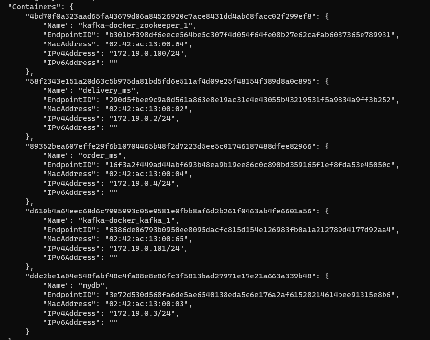

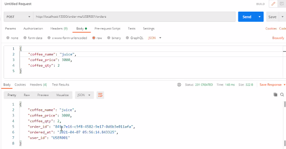

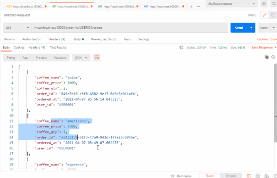

△원래는 이렇게 root의 mydb와 연동되어 기존 데베 내용이 다 출력되었어야 함...

하지만 나는 로컬의 mysql에 mydb를 생성해버리는 과오를 저질렀기 때문에 새롭게 올라간 데이터베이스만 보인다ㅠㅠ

```CREATE DATABASE mydb;```

꼭...해주자...

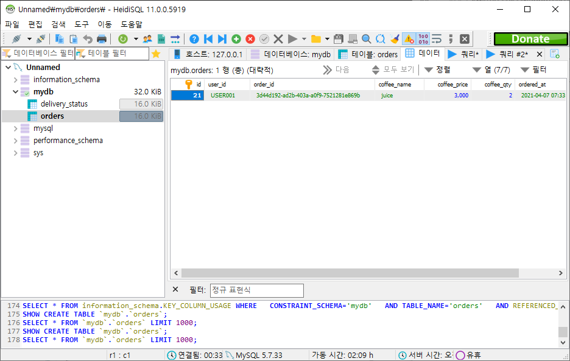


하이디에서도 도케에서 옮겨졌는지 확인해보기

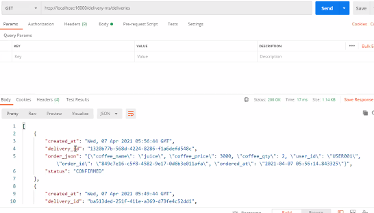

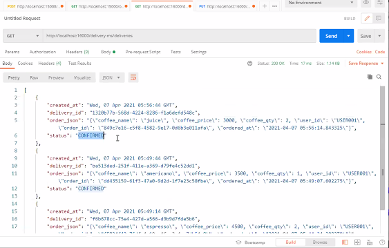

딜리버리 아이디 복사하고 

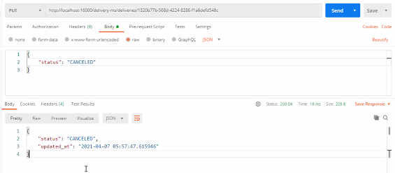

확인해보기

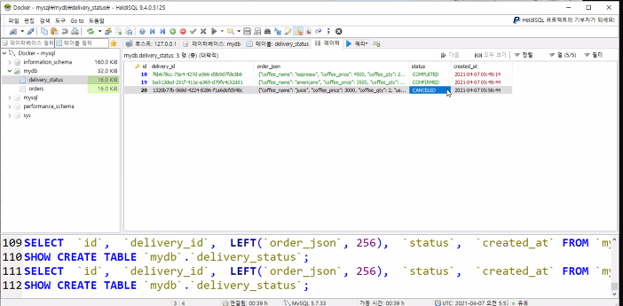

얘두확인

하..............


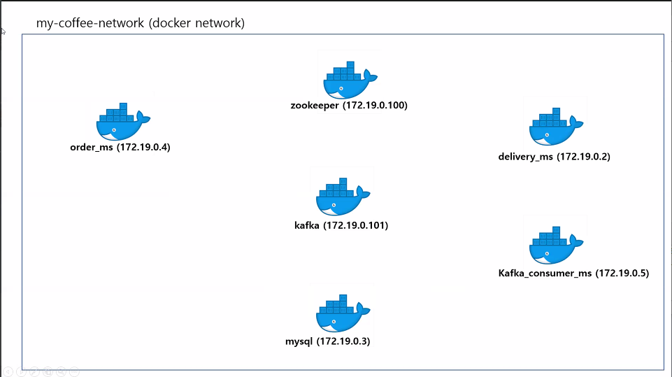

현상태

zookeeper와 카프카에 토픽이 들어가있음!

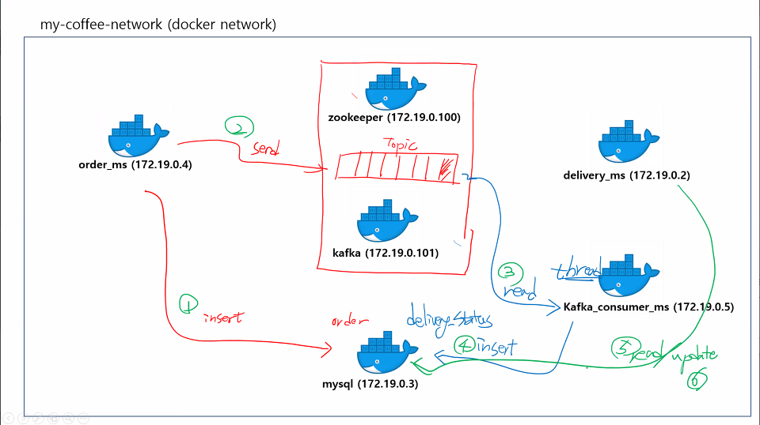

오더에서 mysql로 들어가면 정보가 들어간다


데이터베이스와 카프카ip 부분만 수정해준다

쿠버네티스가 되면 하나의 파드로 만든다!


내부적으로 움직이는 것이기 때문에 포트번호 오픈할 필요 없음

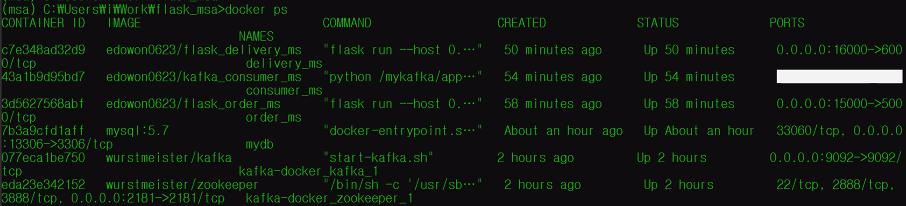

ㅋ...

대충 확인한걸로 치자...

이따 집가서 다시 해봐야겠당...

