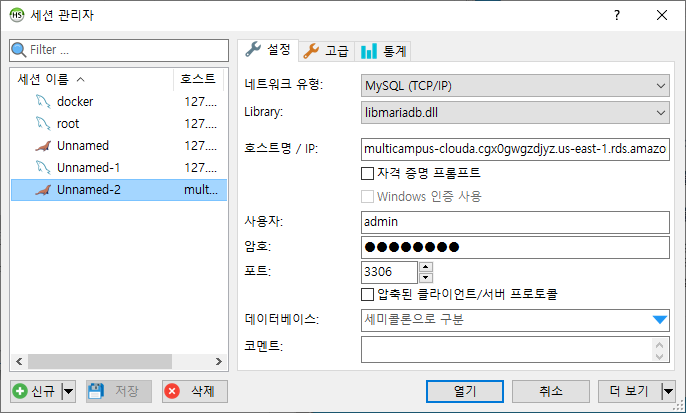
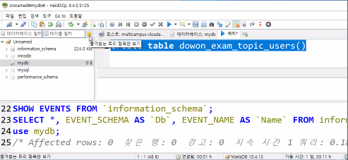
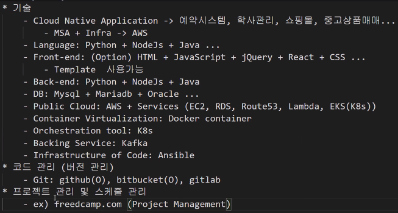
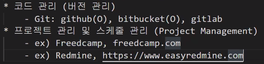
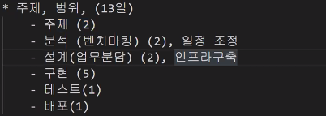

```
Mysql(또는 MariaDB) 데이터베이스에 다음과 같은 내용의 테이블을 생성하고 Kafka Source Connect와 Kafka Sink Connect를 이용하여 AWS의 RDS로 복사하는 작업으로 하려한다. Kafka Source Connect와 Kafka Sink Connect를 작성하고 해당 스크립트를 제출하시오. 
-      테이블 명: users
-      컬러명: id(int), user_id(varchar), name(varchar)
 
Kafka Source Connect
-      name: [본인의 영문 이름]_source_connect
-      Connector class: io.confluent.connect.jdbc.JdbcSourceConnector
-      Connection url: [Localhost의 mydb]
-      Connection user: [Localhost DB의 사용자 ID]
-      Connection password: [Localhost DB의 사용자 패스워드]
-      Topic prefix name: [본인의 영문 이름]_exam_topic_

Kafka Sink Connect
-      name: [본인의 영문 이름]_sink_connect
-      Connector class: io.confluent.connect.jdbc.JdbcSinkConnector
-      Connection url: multicampus-clouda.cgx0gwgzdjyz.us-east-1.rds.amazonaws.com
-      Connection db: mydb
-      Connection user: admin
-      Connection password: test1357
```

카프카-카프카커넥트는 로컬에서









