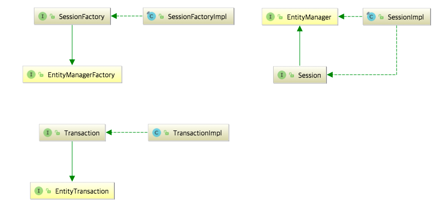
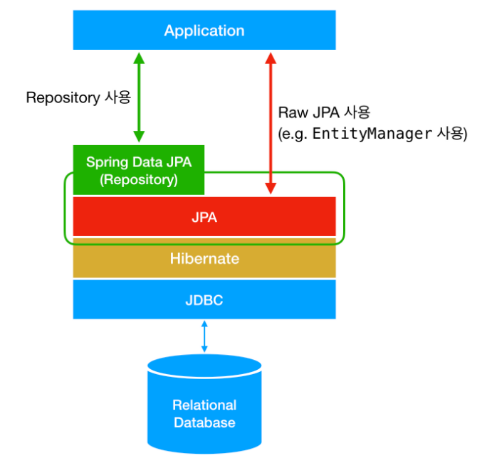

https://dbjh.tistory.com/77

https://suhwan.dev/2019/02/24/jpa-vs-hibernate-vs-spring-data-jpa/

# JPA란?

> Java Persistence API의 약자로, **자바 어플리케이션에서 관계형 데이터베이스를 사용하는 방식을 정의한 인터페이스**

-  JPA는 특정 기능을 하는 **라이브러리가 아니다**.
-  JPA 역시 자바 어플리케이션에서 **관계형 데이터베이스를 어떻게 사용해야 하는지를 정의하는 한 방법**일 뿐
- JPA는 단순히 명세이기 때문에 구현이 없다
- JPA는 반복적인 CRUD SQL을 처리
- JPA는 매핑된 관계를 이용해서 SQL을 생성하고 실행
- SQL아닌 **객체 중심으로 개발**할 수 있음
- JPA는 **수정 메소드를 제공하지 않는다**

## Hibernate

- Hibernate는 **JPA라는 명세의 구현체** **:point_right:라이브러리**

위와 같은 구조를 가지고 있음

-  JPA의 핵심인 `EntityManagerFactory`, `EntityManager`, `EntityTransaction`을 Hibernate에서는 각각 `SessionFactory`, `Session`, `Transaction`으로 상속받고 각각 `Impl`로 구현하고 있음을 확인할 수 있음
-  **JPA를 사용하기 위해서 반드시 Hibernate를 사용할 필요가 없다**

## SpringJPA

- Spring Data JPA는 **Spring에서 제공하는 모듈 중 하나**로, 개발자가 JPA를 더 쉽고 편하게 사용할 수 있도록 도와준다
- **JPA를 한 단계 추상화시킨 `Repository`라는 인터페이스를 제공함으로써 이루어짐**
- 규칙대로 메소드를 입력하면, Spring이 알아서 **해당 메소드 이름에 적합한 쿼리를 날리는 구현체를 만들어서 Bean으로 등록**

> **Spring Data JPA의 `Repository`의 구현에서 JPA를 사용하고 있음**

- JPA, Hibernate,Spring JPA의 관계를 정리한 그림

- `findBy(컬럼 이름)`

  - 컬럼에서 키워드를 넣어 찾음
  - 정확하게 키워드가 일치하는 데이터만 검색

- `findBy(컬럼 이름)Containing`

  - 컬럼에서 키워드가 포함된 것을 찾음
  - 키워드가 포함된 모든 데이터 검색

  
