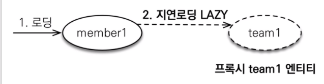

- 비즈니스 로직에서 단순히 멤버 로직만 사용하는데 함께 조회하면, 아무리 연관관계가 걸려있다고 해도 손해이다.

JPA는 이 문제를 지연로딩 LAZY를 사용해서 프록시로 조회하는 방법으로 해결 한다.

- 로딩되는 시점에 Lazy 로딩 설정이 되어있는 **Team 엔티티는 프록시 객체로 가져온다**.

- 제 객체를 사용하는 시점에(Team을 사용하는 시점에) 초기화가 된다. DB에 쿼리가 나간다

  - getTeam()으로 Team을 조회하면 **프록시 객체가 조회**가 된다.

    getTeam().getXXX()으로 팀의 필드에 접근 할 때, 쿼리가 나간다.

- 부분 비즈니스 로직에서 Member와 Team을 같이 사용한다면?

  - 이런 경우 LAZY 로딩을 사용한다면, SELECT 쿼리가 따로따로 2번 나간다.
  - 네트워크를 2번 타서 조회가 이루어 진다는 이야기이다. 손해다.
  - 이때는 **즉시 로딩(EAGER) 전략을 사용해서 함께 조회**하면 된다.

  

  출처: https://ict-nroo.tistory.com/132 [개발자의 기록습관]

org.springframework.beans.factory.BeanCreationException: Error creating bean with name 'entityManagerFactory' defined in class path resource [org/springframework/boot/autoconfigure/orm/jpa/HibernateJpaConfiguration.class]: Invocation of init method failed; nested exception is javax.persistence.PersistenceException: [PersistenceUnit: default] Unable to build Hibernate SessionFactory; nested exception is org.hibernate.MappingException: Could not instantiate id generator [entity-name=org.kosta.pawPadSmell.entity.MemberDTO]

2021-12-17 16:16:35.703 ERROR 95412 --- [  restartedMain] j.LocalContainerEntityManagerFactoryBean : Failed to initialize JPA EntityManagerFactory: [PersistenceUnit: default] Unable to build Hibernate SessionFactory; nested exception is org.hibernate.MappingException: Could not instantiate id generator [entity-name=org.kosta.pawPadSmell.entity.MemberDTO]