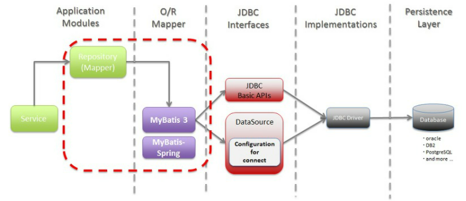

## MyBatis

> 개발자가 지정한 SQL, 저장프로시저 그리고 몇가지 고급 매핑을 지원하는 퍼시스턴스 프레임워크

- DBC로 처리하는 상당부분의 코드와 파라미터 **설정 및 결과 매핑을 대신해줌**
- 데이터베이스 레코드에 원시타입과 Map 인터페이스 그리고 자바 POJO 를 설정해서 매핑하기 위해 XML과 애노테이션을 사용할 수 있음
- **SQL을 별도의 파일로 분리해서 관리**하게 해줌
- SQL을 그대로 이용하면서 **JDBC코드 작성의 불편함도 제거**해주고 **도메인 객체나 VO객체를 중심으로 개발이 가능**하다는 장점이 있음

### 	특징

- 쉬운 접근성과 **코드의 간결함**
- SQL문과 프로그래밍 **코드의 분리**
- **다양한 프로그래밍 언어로 구현가능**



### Mybatis 주요 컴포넌트의 역할

- MyBatis 설정파일`SqlMapConfig.xml` : 데이터베이스의 접속 주소 정보나 Mapping 파일의 경로 등의 고정된 환경정보를 설정
- `SqlSessionFactoryBuilder` : MyBatis 설정 파일을 바탕으로 SqlSessionFactory를 생성한다.
- `SqlSessionFactory` : SqlSession을 생성한다.
- `SqlSession` : 핵심적인 역할을 하는 클래스로서 SQL 실행이다 트랙잭션 관리를 실행한다. SqlSession 오브젝트는 Thread-Safe 하지 않으므로 thread마다 필요에 따라 생성한다.
- Mapping 파일(`user.xml`) : SQL문과 OR Mapping을 설정한다.

-----


## Thymeleaf

>  뷰 템플릿 엔진

- 컨트롤러가 전달하는 데이터를 이용하여 동적으로 화면을 구성
- html 태그를 기반으로 하여 **동적인 View**를 제공
- `th:속성`을 이용하여 데이터를 바인딩
- 예시 - `${name}` 은 서버에서 전달한 데이터
- `src/main/resources` 하위의 `templates` 폴더 아래 `.html` 파일 위치
  - `templates` 폴더 아래에 있을 경우 **자동으로 path가 지정되어 호출할 수 있음**
- **템플릿 엔진, th:xx 형식**으로 속성을 html 태그에 추가하여 값이나 처리 등을 페이지에 심을 수 있음

:point_right: `<span th:text="${eventFvrDtl.winRnkg}"></span>`이런 형식으로 사용

- `th:if`는 **if**, `th:unless`는 **else 표현**이다.

- `th:value`는 태그 안의 **value** 이다.

  

  ```html
  <th:block th:if="${eventPtcpPsbOrdData != null && #lists.size(eventPtcpPsbOrdData.eventPtcpOrdInfoList) > 0}">
  
    <input type="hidden" id="ibx_TotalPurAplAmt" th:value="${totalPurAplAmt}"/>
  
  </th:block>
  
  <th:block th:unless="${eventPtcpPsbOrdData != null && #lists.size(eventPtcpPsbOrdData.eventPtcpOrdInfoList) > 0}">
  
    <input type="hidden" id="ibx_TotalPurAplAmt" value="0"/>
  
  </th:block> 
  ```

  