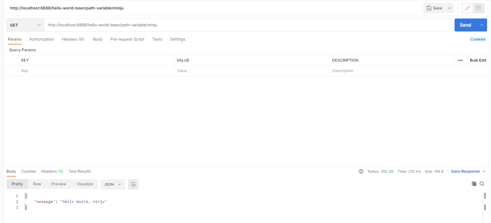
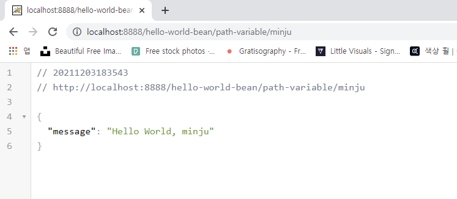

API url은 클라이언트에게 호출됨

프로그램 간에서 사용되는 약속

- 정해진 url이 호출되지 않으면 page not found 나옴

- 가변 변수 사용해서 호출해보자!

- ```java
     @GetMapping(path = "/hello-world-bean/path-variable/{name}")
      public HelloWorldBean helloWorldBean(@PathVariable(value="name") String name){
          return new HelloWorldBean("Hello World");
      }
  ```

  - 위에 `{name}`이 파라미터로 들어오니 `String name`을 매개변수로 설정

    - 혹시 다른 값을 넣고 싶다면 `@PathVariable(value="name")` 이렇게 넣어주면 된다

    - @PathVariable(value="name") -> 이건 그냥 임시로 넣은 것 지금은 같은 값이니 필요 없다!

    - 전달되어진 name값을 추가

    - ```java
      package com.example.restfulwebservice;
      
      import org.springframework.web.bind.annotation.GetMapping;
      import org.springframework.web.bind.annotation.PathVariable;
      import org.springframework.web.bind.annotation.RestController;
      
      @RestController
      public class HelloWorldController {
          // /hello-world (endpoint)
          @GetMapping(path = "/hello-world")
          public String helloWorld(){
              return "Hello World";
      
          }
          //alt+enter
          @GetMapping(path = "/hello-world-bean")
          public HelloWorldBean helloWorldBean(){
              return new HelloWorldBean("Hello World");
          }
          @GetMapping(path = "/hello-world-bean/path-variable/{name}")
          public HelloWorldBean helloWorldBean(@PathVariable(value="name") String name){
              return new HelloWorldBean(String.format("Hello World, %s", name));
          }
      }
      
      ```

      



성공적으로 적용된걸 확인 가능함!



크롬에서도 확인!