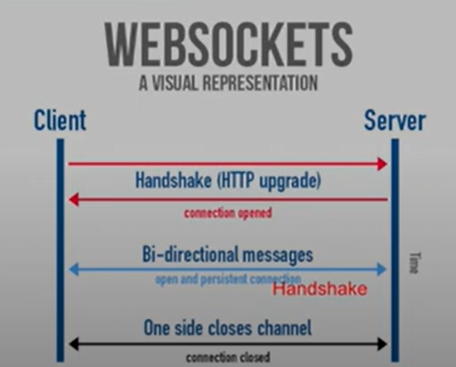

### WebSocket

> 사용자의 브라우저와 서버 사이의 인터렉티브 통신 세션을 설정할 수 있게 하는 고급기술
>
> 

- 보안이 필요한 곳에서는 wss를 사용
- 정해진 기간이 아닌 서버와 클라이언트가 계속 붙어 실시간성 구현 가능
- polling, long polling
- Full duplex

### SockJS

- nodeJS 에서 나온것
- I8부터 다 됨
- 브라우저의 기본적인 소켓 사용
- 기본적으로 제공됨
- 웹소켓은 아니지만 웹소켓과 유사하다

### STOMP

- Streaming Text Oriented Messaging Protocol
- 토픽 구독방식
- Spring only, publish&subscribe
- sub protocol over SockJS -> Custom Format for Message
- Use stomp js library