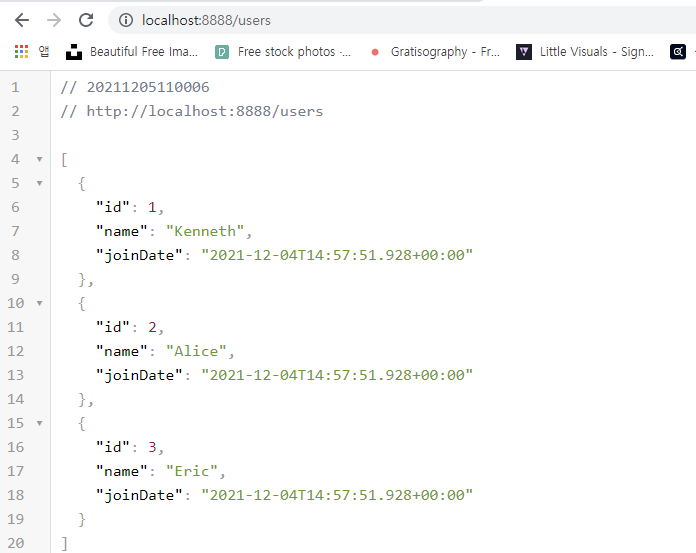
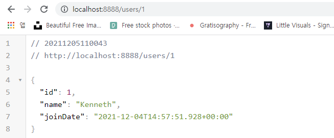
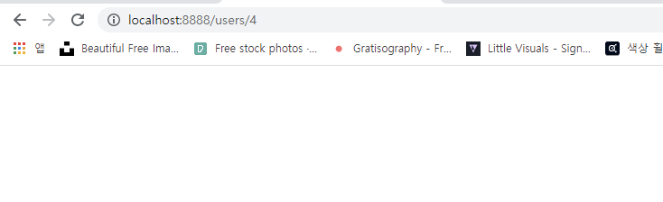

`main/java/com/example/restfulservice/user/User.java`

```java
package com.example.restfulwebservice.user;

import lombok.AllArgsConstructor;
import lombok.Data;

import java.util.Date;

@Data
@AllArgsConstructor //전체 모든 필드에 대해 파라미터로 갖는 생성자
public class User {
    private Integer id;
    private String name;
    public Date joinDate;

}

```

`main/java/com/example/restfulservice/user/UserDaoService.java`

```java
package com.example.restfulwebservice.user;

import org.springframework.stereotype.Service;

import java.util.ArrayList;
import java.util.Date;
import java.util.List;

@Service
public class UserDaoService {
    private static List<User> users = new ArrayList<>();
    private static int usersCount=3;
    static {
        users.add(new User(1, "Kenneth", new Date())); //버전별로 입력내용이 조금 달라지니 확인해보자!
        users.add(new User(2, "Alice",new Date()));
        users.add(new User(3, "Eric",new Date()));
    }
    public List<User> findAll(){
        return users;
    }
    public User save(User user){
        if(user.getId()==null){
            user.setId(++usersCount);
        }
        users.add(user);
        return user;
    }
    public User findOne(int id){//id값 전달되면
        for(User user: users){//사용자 목록에서
            if(user.getId()==id){//id값이 일치하는 것을 찾아 반환
                return user;
            }
        }
        return null;
    }
}

```

`main/java/com/example/restfulservice/user/UserController.java`

```java
package com.example.restfulwebservice.user;

import org.springframework.web.bind.annotation.GetMapping;
import org.springframework.web.bind.annotation.PathVariable;
import org.springframework.web.bind.annotation.RestController;

import java.util.List;

@RestController
public class UserController {
    private UserDaoService service;

    public UserController(UserDaoService service){
        this.service=service;
    }
    @GetMapping("/users")
    public List<User> retrieveAllUsers(){
        return service.findAll();
    }


    //GET /users/1 or users/10 -> 1/10도 String으로 전달됨//@PathVariable으로 int값 선언하면 자동매핑됨
    @GetMapping("/users/{id}")
    public User retrieveUser(@PathVariable int id){
        return service.findOne(id);
    }


}

```


```
2021-12-04 23:57:51.925 DEBUG 8616 --- [  restartedMain] o.s.b.f.s.DefaultListableBeanFactory     : Creating shared instance of singleton bean 'userController'
2021-12-04 23:57:51.928 DEBUG 8616 --- [  restartedMain] o.s.b.f.s.DefaultListableBeanFactory     : Creating shared instance of singleton bean 'userDaoService'
2021-12-04 23:57:51.929 DEBUG 8616 --- [  restartedMain] o.s.b.f.s.DefaultListableBeanFactory     : Autowiring by type from bean name 'userController' via constructor to bean named 'userDaoService'
```

- bean으로서 UserController 등록된 것 확인
- `'userController' via constructor to bean named 'userDaoService'`
  - 생성자 전달 값에 dao전달되었음 확인 가능
  - 의존성 주입 된 것 확인



잘 들어왔음을 확인 할 수 있다



- id값 넣으면 개별 사용자 잘 나옴

- 

아무것도 검색 안되면 null값 반환 제대로 됨

