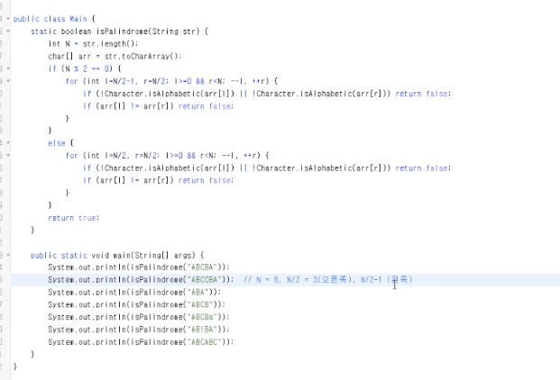

위치 값이 중요한 경우에는 인덱스 쓰면 안됨



중간에 왔을 때 인덱스의 크기 비교 해보고 종료 조건

- Exceptional case를 머릿속으로 미리 그려봐야 함
- 스스로 검증해볼 수 있어야 함

# List

- array는 어떤 엘리먼트든 간에 한 번에 접근 가능
- 특정 인덱스에 접근하는 시간 1
- 안쓰는 메모리는 자바에서 알아서 지워준다
- array 길이는 N/ 새로운 array 길이가 N+1 이라고 할 때, N에서 N+1으로 옮길 때, 공간과 시간 복잡도는 N이다


- List
- addfirst(), addLast()
  - space, time(1)


- 추가가 자주 되거나 제거가 자주 되는 조건이라면 list
- 인덱싱을 자주 하면 array
- 자바의 linkedlist - first/last만 추가/제거 가능
  - 간혹 중간에 추가해야 하는 것은 자신이 직접 구현하라는 뜻!


doubly linked list

- 얘를 쓸 일이 좀 더 많음

- ```java
  class DoublyLinkedList{
  	int value;
  	ListNode prev,next;
  }
  ```

circular linked list

- 얘는 잘 안쓴다...


- linkedlist도 for문 돌 수 있게 지원해준다
  - iterator 사용
  - hasNext도 iterator와 비슷
  - 개념적으로 불편...
  - 특정 값을 넣으려면 템플릿 타입을 맞춰줘야 해서 불편하다

()

숙제: addLast() 구현하기

```java
class ListNode {
    int value;
    ListNode next;
}
void addLast(ListNode node){
    ListNode newhead = new ListNode(100);
    newhead.head = node.tail;
}
```

------

substring: string이 하나 있을때 그 string으로 만들 수 있는 작은 연속 집합

큐: 헤더는 추가만 가능 / 삭제는 마지막에서만!
