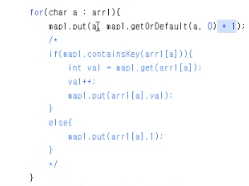
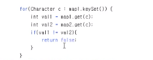

```java
// "static void main" must be defined in a public class.
public class Main {
    public static void main(String[] args) {
        Boolean ans1 = isPermutation("AABBA", "BBABA");
        System.out.println(ans1);
        Boolean ans2 = isPermutation("godd", "ddog");
        System.out.println(ans2);
        Boolean ans3 = isPermutation("cat", "ddog");
        System.out.println(ans3);
    }
    static Boolean isPermutation(String str1, String str2){
        HashMap<Character,Integer> map1 = new HashMap();
        HashMap<Character,Integer> map2 = new HashMap();
        char[] arr1 = str1.toCharArray();
        char[] arr2 = str2.toCharArray();
        if(arr1.length==arr2.length){
        for(int a=0; a<arr1.length; a++){
            if(map1.containsKey(arr1[a])){
                int val = map1.get(arr1[a]);
                val++;
                map1.put(arr1[a],val);
            }
            else{
                map1.put(arr1[a],1);
            }
        }
 // str1번에 대한 정보를 HashMap에 저장

        for(int b=0; b<arr2.length; b++){
            if(map2.containsKey(arr2[b])){
                int val2 = map2.get(arr2[b]);
                val2++;
                map2.put(arr2[b],val2);
            }
            else{
                map2.put(arr2[b],1);
            }
            if(!map1.containsKey(arr2[b])){
                return false;
            }
        }
//str2번에 대한 정보를 HashMap에 저장- 없는 단어가 있으면 return false

        for( int c =0; c<arr2.length; c++){
            int val1 = map1.get(arr2[c]);
            int val2 = map2.get(arr2[c]);
            if(val1 != val2){
                return false;
            }
        }
//두 HashMap을 비교하여 각 값이 같지 않으면 return false;
     return true;
    }
          return false;
}
}
```

- map.getOrDefault: 키 값이 없으면 디폴트 값을 넣는다
- char a: arr1 : arr1 대해 for문 돈다


- ```java
      for(int a=0; a<arr1.length; a++){
          if(map1.containsKey(arr1[a])){
              int val = map1.get(arr1[a]);
              val++;
              map1.put(arr1[a],val);
          }
          else{
              map1.put(arr1[a],1);
          }
      }
  ```

  - 



---------

숙제

- Inorder:
  - 1)  2-3-1-5-4-7-8-6-9
  - 2) D-B-H-E-A-F-J-I-C-G
- Preorder
  - 1) 1-2-3-4-5-6-7-8-9
  - 2) A-B-D-E-H-C-F-I-J-G
- Postorder
  - 1)  3-2-5-8-7-9-6-4-1
  - 2) D-H-E-B-J-I-F-G-C-A