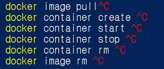
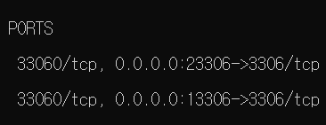

# 도커

> 컨테이너 기반의 오픈소스 가상화 플랫폼

- VM vs Docker

  - **VM**

    - 호스트OS 위에 게스트OS를 가상화 하여 사용하는 방식

    - 호스트 OS의 리소스 분할/OS 위에 OS 설치

      => 속도저하

  - **Docker container**

    - 호스트 OS 공유

    - 여러 개의 컨테이너가 서로 영향X 독립적 실행

      => 가볍다

  - **프로세스 격리**가 가장 큰 차이점

- Image
  - 이미지는 **컨테이너 실행에 필요한 파일과 설정값등을 포함하고 있는 것**으로 상태값을 가지지 않고 고정
  - 이미지 경로
    - url 방식으로 관리
    - 태그 붙여서 사용
- Container
  - 이미지를 실행한 상태

- 레이어 사용
  - 최소한의 용량 사용

-------------------

- **docker** container create ubuntu:16.04
  - 우분투 16.04 버전을 컨테이너로 새로 만든다(이미지 있을 경우에)
- **docker** container start <container id>
  - 해당 컨테이너id 실행

- **docker** container ls
  - 컨테이너 목록 형성

- **docker** container rm  <container id>
  - 컨테이너 id값 삭제

- **docker** run ubuntu:16.04
  - 이미지가 없으면 pull해서 실행까지 해놓는다
  - 
    - 이렇게
- 
  - 이미지/컨테이너가 없는 상태에서 컨테이너 런을 하게되면
  - it :interactive옵션/tele type write 인터렉티브한tty를 만들어서 터미널을 만들어놓고 쓰겠다.
  - bash shell을 쓰겠다
  - 
  - 이런 결과창이 뜬다! 컨테이너에 접속하게 되었음
    - exit를 누르면 종료된다

- **docker** container run ***-t*** ubuntu:16.04 /bin/bash
  - 터미널 옵션만 가지고 접속한다
  - 명령어 타이핑이 안됨
    - 이럴땐 ctrl+c

- **docker** container run ***-i*** ubuntu:16.04 /bin/bash
  - 여기엔 입력은 가능하다
  - 하지만 터미널로 명령이 전달되지 않는다
    - 이 때도 ctrl+c

- docker container rm -f <container id>
  - 강제삭제
  - 권하진 않는다

- docker container run --rm -it ubuntu:16.04 /bin/bash

  - 컨테이너가 스탑이 되면 자동으로 삭제된다

    

- docker container run -d -p 3306:3306 -e MYSQL_ALLOW_EMPTY_PASSWORD=true --name mysql mysql:5.7
  - docker: Error response from daemon: Conflict. The container name "/mysql" is already in use by container "83bcb0769f27671c2f7fd6fd94f34fce2942436171b3298253810500bb527867". You have to remove (or rename) that container to be able to reuse that name.
    - 하나는 포트 충돌/ 다른 하나는 이름 중복
    - 윈도우 검색에 서비스 앱 켜서 MySQL 을 찾아.-> 우클릭 속성 -> 시작 유형(E): (자동 -> 사용안함) -> 서비스 상태 중지
    - 
    - 여기 이름을 바꿔주거나
- exec 작동중인 컨테이너에 명령어 실행
- docker exec -it <container id> bin/bash
  
- container id로 접속
  
- mysql -h127.0.0.1 -uroot -p
  
  - mysql 실행하면 무조건 루트폴더가 생긴다
- 현재 데이터베이스 시스템에 데이터가 얼마나 있는지 본다
  
  - show databases;

- docker container run -d -p 13306:3306 -e MYSQL_ALLOW_EMPTY_PASSWORD=true --name mysql mysql:5.7
- 같은 포트 사용하지 않도록 위와 아래처럼..sql 두 개를 만드려면 이렇게 로컬포트 번호를 다르게 해주면 된다

- docker container run -d -p 23306:3306 -e MYSQL_ALLOW_EMPTY_PASSWORD=true --name mysql_client mysql:5.7

- 한번에 mysql로 들어가기

