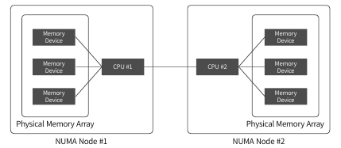

- NUMA
  - 불균일 기억 장치 접근(Non-Uniform Memory Access)
  - 멀티프로세서 시스템ㅇ서 사용되고 있는 **컴퓨터 메모리 설계 방법**중 하나
  - 메모리에 접근하는 시간이 **메모리와 프로세서간의 상대적인 위치에 따라 달라짐**

- Pysical Memory Array는 하나의 CPU 소켓에 함께 할당된 물리 메모리의 그룹 의미
- NUMA라는 개념 이용해서 각**각의 CPU가 사용할 수 있는 로컬 메모리 제공**
- 그림: 2개의 CPU 소켓이 있는 서버
  - Pysical memory Array도 2개

- 디스크 정보 확인
  - `df -h`

## 시스템 상태 살피기

`top -b -n 1`

- VIRT

  - task가 사용하고 있는 virtual memory 의 전체 용량
  - 프로세스에 할당된 가상 메모리 전체의 크기

- RES

  - 현대 task 가 사용하고 있는 물리 메모리의 양을 의미
  - VIRT 중 실제로 메모리에 올려서 사용하고 있는 물리 메모리의 크기

- SHR

  - 다른 프로세스와 공유하고 있는 shared memory 의 양을 의미
  - ex) 라이브러리

  

