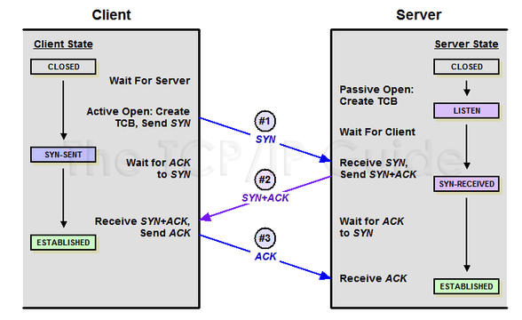
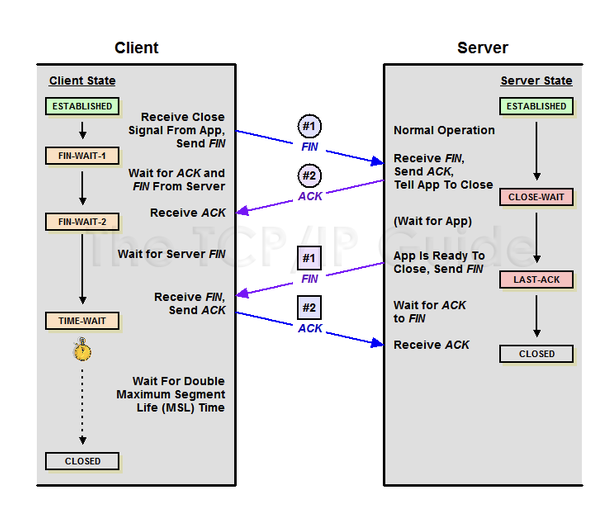
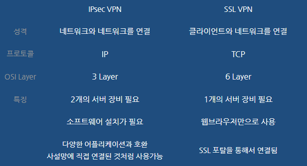
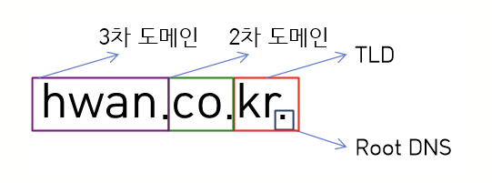
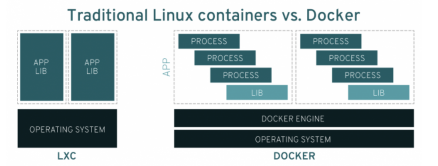

1. ## 리눅스

   > 1991년 9월 17일 [리누스 토르발스]가 처음 출시한 [운영 체제 커널]인 [리눅스 커널]에 기반을 둔 [오픈 소스][유닉스 계열][운영 체제] 계열
[]
- 우분투와 센토스 차이점
  - 우분투: 업데이트 빠르고 안정적
  - 센토스: 가벼운 것, 서버용 - 데비안 계열에서 지원하지 않을 때 사용, 레드햇

- 데비안과 레드햇
  - 데비안: 패키지 설치와 업그레이드 등 패키지 관리가 편리
  - 레드햇: **GUI (그래픽 사용자 인터페이스)를 제공**하면서 초보자도 쉽게 설치 가능
    -  독자적인 패키지 관리 도구인 RPM과 YUM은 **초보자에게 보다 쉬운 설치, 관리, 업그레이드**

2. ## 클라우드

- **IaaS** : 업무에 필요한 서버나 하드웨어 자원을 사용

  **PaaS** : 소프트웨어를 개발할 플랫폼을 제공

  **SaaS** : 기업에서 사용하는 소프트웨어를 클라우드 사업자에게 빌려서 사용

3. ## 네트워크

- TCP/UDP 차이점

  - TCP

    >  인터넷상에서 데이터를 메세지의 형태로 보내기 위해 IP와 함께 사용하는 프로토콜

    - 연결형 서비스로 가상 회선 방식을 제공한다.
    - **3-way handshaking**과정을 통해 연결을 설정하고 **4-way handshaking**을 통해 해제한다
    - 흐름 제어 및 혼잡 제어.
    - 높은 신뢰성을 보장한다.
    - UDP보다 속도가 느리다.
    - 전이중(Full-Duplex), 점대점(Point to Point) 방식.

    > TCP는 연속성보다 신뢰성있는 전송이 중요할 때에 사용하는 프로토콜

    

  - UDP

    > 데이터를 **데이터그램 단위로 처리하는 프로토콜**

    - 데이터그램이란 **독립적인 관계를 지니는 패킷**
      - 패킷: 데이터를 보내기 위한 경로배정(라우팅)을 효율적으로 하기 위해 나누는 **데이터의 여러 개의 조각**
    - 비연결형 서비스로 데이터그램 방식을 제공한다
    - 정보를 주고 받을 때 정보를 보내거나 받는다는 신호절차를 거치지 않는다.
    - UDP헤더의 CheckSum 필드를 통해 최소한의 오류만 검출한다.
    - **신뢰성이 낮다**
    - **TCP보다 속도가 빠르다**

- 3-way handshaking

  > 양쪽 모두 데이타를 전송할 준비가 되었다는 것을 보장하고, 실제로 데이타 전달이 시작하기전에 한쪽이 다른 쪽이 준비되었다는 것을 알수 있도록 한다.

  

  - **[STEP 1]**

    A클라이언트는 B서버에 접속을 요청하는 SYN 패킷을 보낸다. 이때 A클라이언트는 SYN 을 보내고 SYN/ACK 응답을 기다리는SYN_SENT 상태가 되는 것이다.

     

    **[STEP 2]** 

    B서버는 SYN요청을 받고 A클라이언트에게 요청을 수락한다는 ACK 와 SYN flag 가 설정된 패킷을 발송하고 A가 다시 ACK으로 응답하기를 기다린다. 이때 B서버는 SYN_RECEIVED 상태가 된다.

     

    **[STEP 3]**

    A클라이언트는 B서버에게 ACK을 보내고 이후로부터는 연결이 이루어지고 데이터가 오가게 되는것이다. 이때의 B서버 상태가 ESTABLISHED 이다.

    위와 같은 방식으로 통신하는것이 신뢰성 있는 연결을 맺어 준다는 TCP의 3 Way handshake 방식이다.

    

- 4- way handshaking

  > 4-Way handshake는 세션을 종료하기 위해 수행되는 절차

  **[STEP 1]**

  클라이언트가 연결을 종료하겠다는 FIN플래그를 전송한다.

  

  **[STEP 2]** 

  서버는 일단 확인메시지를 보내고 자신의 통신이 끝날때까지 기다리는데 이 상태가 **TIME_WAIT**상태다.

   

  **[STEP 3]**

  서버가 통신이 끝났으면 연결이 종료되었다고 클라이언트에게 FIN플래그를 전송한다.

   

  **[STEP 4]**

  

  클라이언트는 확인했다는 메시지를 보낸다.

  

- **VPN**

  - 가상사설망

  - Virtual Private Network

    

  1. **SSL VPN**

     - Secure Socket Layer VPN의 약자

     - **응용계층을 보호하는 프로토콜**

     - 넷스케이프에서 개발한 보안 통신 프로토콜

     - 웹서버와 브라우저 간에 **보안 터널생성**

     - **인증 암호화 무결성 지원**

     - 대부분의 브라우저 및 SSL VPN 클라리언트에서 구현

     - 포트 443을 통해 HTTPS://통신(TCP443)

     - 기본포트는 변경가능하다.

     - **장점**
       -  사용자컴퓨터의 보안성을 체크한 다음 VPN서버에 접속함
         - 사용자가 설정 작업을 수행할 필요가 없다.
         -  표준 웹 브라우저가 있는 곳이라면 어디서든 사용할 수 있다.
         -  OS가 독립적이다.
         -  서버에서 클라이언트 프로그램 배포하며, 원격지PC에설치후 바로 이용가능하다.
         -  원격지에서도 내부에 PC가 있는것처럼 파일공유 등 이 가능하다.
         -  VPN서버의 공인IP로 외부와 통신할수있다.

     > 표면 계층에서 동작한다는 것은
     >
     > 아래 처럼 SSL VPN터널을 통해 이동하는 패킷은 **데이터 부분만 암호화**

  

  

  2. **IPSecVPN**

  - IPsec 암호화 기술은 인터넷을 통해 **데이터의 안전한 전송을 위해 VPN을 만드는데 사용**됩니다.

    기능

    - 기밀성(Confidentiality): packets encrypted before transmission
    - 무결성(Integrity): authenticates packets at the destination peer to ensure that data has not been tampered during transmission
    - 인증(Authentication): peers authenticate source of all IPSEC protected packets
    - 리플레이방지(Anti-replay): prevents capture and replay of packets
    - 

- DHCP

  > 호스트의 IP주소와 **각종 TCP/IP 프로토콜의 기본 설정을 클라이언트에게 자동적으로 제공**해주는 프로토콜

  - 네트워크에 사용되는 IP주소를 **DHCP서버가 중앙집중식으로 관리하는 클라이언트/서버 모델**을 사용

    

- DNS 

  > 도메인 이름 시스템(DNS)은 사람이 읽을 수 있는 도메인 이름(예: www.amazon.com)을 머신이 읽을 수 있는 IP 주소(예: 192.0.2.44)로 변환

  - 

4. ## 도커

- 리눅스 컨테이너와의 차이점

  - 리눅스 컨테이너: 전체 애플리케이션을 **하나로 실행**
  - 도커: 애플리케이션이 **개별 프로세스로 세분화**되도록 하며 이를 수행할 수 있는 툴을 제공

  